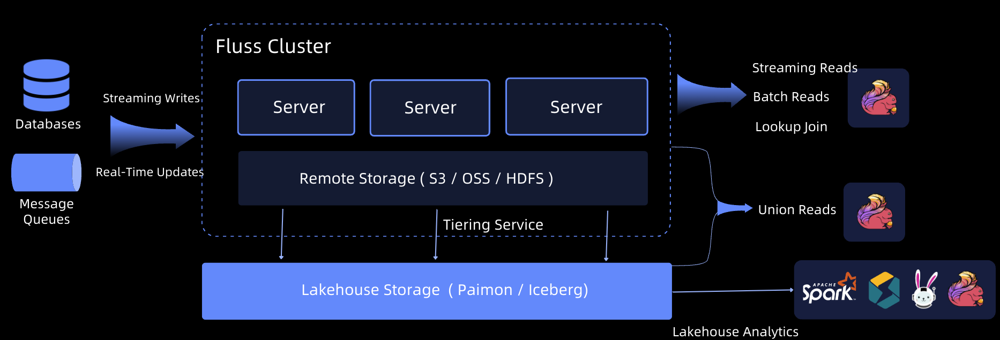
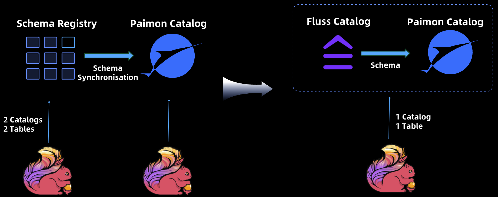
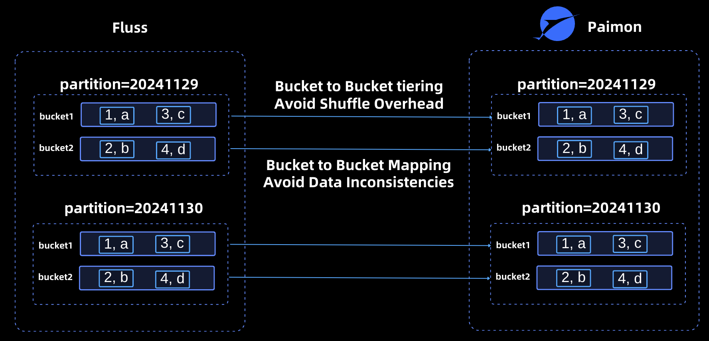
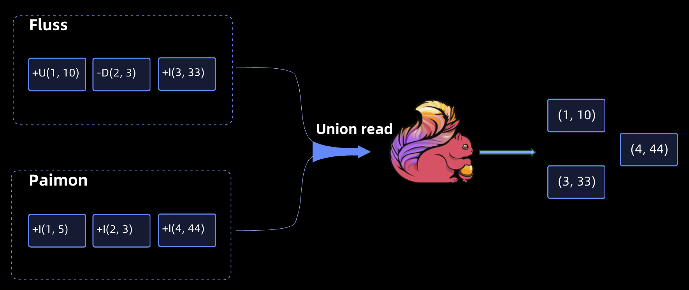
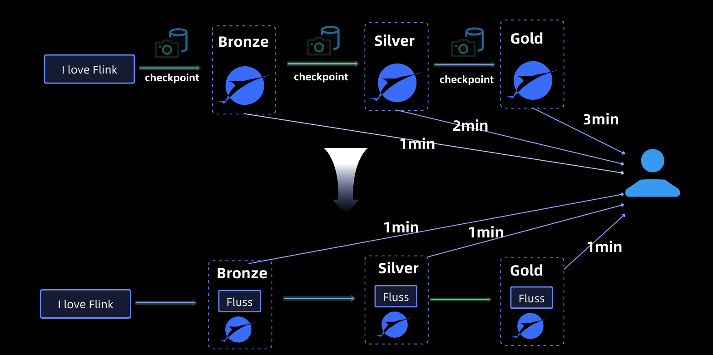
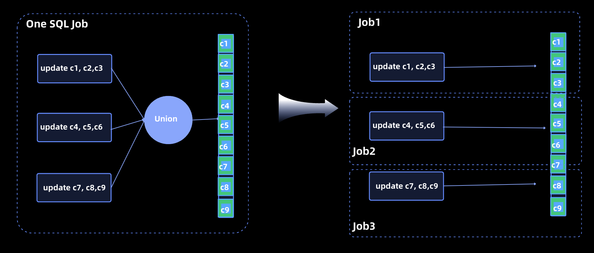

The unification of Lakehouse and streaming storage represents a major trend in the future development of modern data lakes and streaming storage systems. Designed specifically for real-time analytics, Fluss has embraced a unified Streaming and Lakehouse architecture from its inception, enabling seamless integration into existing Lakehouse architectures. 

Fluss is designed to address the demands of real-time analytics with the following key capabilities:
- **Real-Time Stream Reading and Writing:** Supports millisecond-level end-to-end latency.
- **Columnar Stream:** Optimizes storage and query efficiency.
- **Streaming Updates:** Enables low-latency updates to data streams.
- **Changelog Generation:** Supports changelog generation and consumption.
- **Real-Time Lookup Queries:** Facilitates instant lookup queries on primary keys.
- **Streaming & Lakehouse Unification:** Seamlessly integrates streaming and lakehouse storage for unified data processing.

<!-- truncate -->

### Fluss Unified Streaming & Lakehouse Architecture

The Fluss architecture is designed to provide millisecond-level end-to-end latency, ensuring high-performance real-time data writing and reading. A core component of this architecture is the **Tiering Service**, which continuously offloads data in Fluss into a standard lakehouse format, such as `Apache Paimon` or `Apache Iceberg`. This tiering ensures that external query engines can directly analyze data in the Lakehouse format, enabling efficient batch and real-time analytics.
In this architecture:
- **Latest Data in Fluss:** Fluss stores the most recent, high-fidelity data for real-time analytics. 
- **Historical Data in Paimon:** Older data is compacted and stored in Apache Paimon for large-scale historical analysis.

By leveraging Apache Flink, the integration of Fluss and Paimon supports Union Reads, which combine real-time data in Fluss with historical data in Paimon. This enables analytical queries with second-level freshness, allowing businesses to benefit from up-to-date insights while maintaining access to extensive historical datasets.

The Streaming/Lakehouse unification design of Fluss provides:
- **Unified Architecture:** Simplifies the Lakehouse ecosystem by combining the strengths of streaming and Lakehouse storage. 
- **Enhanced Real-Time Capabilities:** Millisecond-level latency ensures data is always fresh for critical use cases. 
- **Seamless Compatibility:** Native support for standard lakehouse formats ensures interoperability with existing analytics engines. 
- **Optimized Data Management:** Combines real-time and historical data seamlessly for comprehensive analytics workflows.

Fluss is **a next-generation approach to streaming storage, purpose-built to complement Lakehouse architectures** and drive the adoption of a streaming and Lakehouse unification across industries.

### Unified metadata


In traditional architectures, streaming storage systems like Kafka and Lakehouse storage solutions like Apache Paimon operated as distinct entities, each maintaining its own metadata. For computing engines such as Apache Flink, this separation presented two significant challenges:
1. **Dual Catalogs:** Users were required to create and manage two separate catalogs—one for streaming storage and another for lake storage. 
2. **Manual Switching:** Accessing data involved manually switching between catalogs to determine whether to query stream storage or lake storage, resulting in operational complexity and inefficiencies.

### Unified Access in Fluss
In the Fluss, although Fluss and Paimon still maintain independent metadata, they expose a unified catalog and a single table abstraction to the computing engine, such as Apache Flink. This unified approach offers several key advantages:
- **Simplified Data Access:** Users can seamlessly access both Lakehouse storage (Paimon) and streaming storage (Fluss) through a single catalog, eliminating the need to manage or switch between separate catalogs. 
- **Integrated Querying:** The unified table abstraction allows direct access to real-time data in Fluss and historical data in Paimon. For scenarios requiring both, users can leverage `Union Reads`, combining data from Fluss and Paimon to enable comprehensive analytics with second-level data freshness. 
- **Operational Efficiency:** By presenting a cohesive interface, the architecture reduces operational complexity, making it easier for users to work with real-time and historical data within a single workflow.

This unified approach streamlines the interaction between computing engines and storage layers, enhancing both usability and productivity while supporting the high-performance demands of modern analytics workflows.

###  Alignment of Data Distribution


In the Fluss, the data distribution between Fluss and Lakehouse storage (e.g., Apache Paimon) is strictly aligned. Fluss supports partitioned tables and buckets, and its bucketing algorithm is fully consistent with Paimon’s. This ensures that a given piece of data is always allocated to the same bucket in both systems, creating a one-to-one correspondence between Fluss buckets and Paimon buckets.
This strong consistency in data distribution provides two significant benefits:

#### 1. Elimination of Shuffle Overhead During Tiering
When tiering data from Fluss into Paimon format:
- A Fluss bucket (e.g., bucket1) can be tiered directly into the corresponding Paimon bucket (bucket1). 
- There is no need to read data from a Fluss bucket, calculate which Paimon bucket each piece of data belongs to, and then write it to the appropriate Paimon bucket.

By bypassing this intermediate redistribution step, the architecture avoids costly shuffle overhead, significantly improving compaction efficiency.

#### 2. Prevention of Data Inconsistencies
Data consistency is maintained through the use of an identical bucketing algorithm in both Fluss and Paimon. This algorithm calculates the bucket assignment for each piece of data as follows:
> bucket_id = hash(row) % bucket_num

By employing the same hash function and algorithm, Fluss and Paimon ensure consistent bucket assignment. If differing algorithms were used, inconsistencies would arise. For example:
- For a primary key table, a data row a might be assigned to bucket1 in Fluss but to bucket2 in Paimon. 
- During tiering, if rows were mistakenly placed in bucket1 in Paimon (per Fluss’s assignment), users would fail to locate the data in Paimon due to the mismatch.

By maintaining strong alignment in data distribution, the architecture eliminates this risk, ensuring data consistency across Fluss and Paimon while simplifying compaction workflows. This alignment underscores the robustness and efficiency of the Fluss unification design.
### Streaming Reading: More Efficient Data Tracing

In the Fluss, historical data resides in Lakehouse storage, while real-time data is maintained in Fluss. During streaming reads, this architecture enables a seamless combination of historical and real-time data access:

- **Historical Data Access:** Fluss retrieves historical data directly from the Lakehouse storage, leveraging its inherent advantages, such as:
   - **Efficient Filter Pushdown:** Enables query engines to apply filtering conditions at the storage layer, reducing the amount of data read and improving performance. 
   - **Column Pruning:** Allows retrieval of only the necessary columns, optimizing data transfer and query efficiency. 
   - **High Compression Ratios:** Minimizes storage overhead while maintaining fast retrieval speeds.
- **Real-Time Data Access:** Fluss concurrently reads the latest real-time data from its own storage, ensuring up-to-the-millisecond freshness.

By combining the strengths of Lakehouse storage for efficient historical data retrieval and Fluss for real-time streaming data, this architecture delivers a highly performant and scalable solution for streaming read scenarios. This integration ensures that users benefit from low-latency data freshness and optimized query performance across both historical and real-time datasets.
### Batch Reading: Data Freshness in Seconds


Historical data is stored in the Lakehouse, and real-time data is stored in Fluss. In batch reading scenarios, computing engines (such as Flink) can perform union reading of data in Fluss and lake storage to achieve analysis of data freshness in seconds.

### Apache Flink and Fluss

Fluss exposes a unified API to Flink users, allowing them to choose whether to use union reads or read-only reads on the Lakehouse, using the following SQL:
```sql
SELECT * FROM orders
```
This reads the complete data of the orders table and Flink will union read the data in Fluss and the Lakehouse.
If the user only needs to read data on the data lake, you can add the `$lake` suffix after the table to be read. The SQL is as follows
```sql

-- analytical queries
SELECT COUNT(*), MAX(t), SUM(amount) 
FROM orders$lake

-- query system tables
SELECT * FROM orders$lake$snapshots
```
For scenarios where data on a data lake is read-only, Fluss inherits all the optimizations and capabilities of the lake format as a Flink source, such as runtime filters, system table queries, and time travel.

## Benefits Of The Unified Architecture
Next, using Apache Paimon as an example, we will illustrate the advantages of using Fluss to build a unified architecture. We will highlight how Fluss enhances the capabilities of Paimon, creating a unified solution that combines the strengths of both systems for efficient real-time and historical data processing.

### Second-level Timeliness

In Apache Paimon, data visibility is traditionally determined by the Flink checkpoint interval, which typically operates at one minute-level granularity. However, by integrating Fluss with Paimon to build unfiied architecture, this dependency is eliminated.

With this unification, data becomes visible immediately upon entering Fluss, significantly improving data timeliness to second-level latency. This enhancement ensures that real-time insights can be derived more quickly, meeting the demands of time-sensitive applications while maintaining seamless access to both historical and real-time data.

### Consistent Data Freshness Across All Layers

In the process of building a data warehouse, it is common to organize and manage data by layering, such as Bronze, Silver and Gold following the medallion architecture. As data flows through these layers, maintaining data freshness becomes a critical consideration.

When Paimon is used as the sole storage solution for each layer, data visibility depends on the Flink checkpoint interval. This introduces cumulative delays:
- The changelog for a given layer becomes visible only after the completion of a Flink checkpoint. 
- As this changelog propagates to subsequent layers, the data freshness delay increases with each checkpoint interval.

For example, with a Flink checkpoint interval of 1 minute:
- The Bronze layer experiences 1-minute delay. 
- The Silver layer adds another 1-minute delay, totaling 2 minutes. 
- The Gold layer adds yet another 1-minute delay, resulting in a cumulative 3-minute delay.

With Fluss and Paimon though we get:
- **Immediate Data Visibility:** Data in Fluss becomes visible immediately upon ingestion, without waiting for a Flink checkpoint to complete. The changelog is instantly transferred to the next layer. 
- **Consistent Data Freshness:** The data freshness across all layers is consistent and measured in seconds, eliminating cumulative delays.

Additionally, if the Fluss Tiering Service is configured with a tiering cycle of 1 minute, the data delay for Paimon storage at each layer is limited to 1 minute, regardless of the number of layers. This ensures:
- **Real-Time Data Processing:** Layers can propagate and process data with minimal delay. 
- **Optimized Streaming & Lakehouse Unification:** The architecture balances the strengths of real-time and batch-oriented storage.

This integration significantly improves the performance and usability of layered data warehouses, enabling faster insights and better responsiveness to real-time demands.

### More efficient and higher throughput changelog generation
In Apache Paimon, there are currently two commonly used methods for generating changelogs (excluding the Input Producer, which requires more stringent data source requirements and is not considered here):
#### Lookup Changelog Producer
   - **Advantages:** Offers high timeliness for generating changelogs. 
   - **Challenges:** Consumes significant computational resources, leading to higher operational costs. 
#### Full Compaction Producer:
   - **Advantages:** Does not require additional resource consumption, as changelogs are generated during the Full Compaction process. 
   - **Challenges:** Suffers from poor timeliness, as changelog generation is delayed until a Full Compaction is triggered, which typically occurs after several checkpoints.
   
#### Fluss and Paimon: Optimizing Changelog Generation
The Fluss and Paimon architecture strikes a balance between timeliness and performance in changelog generation:
- **Changelog Timeliness:** Fluss generates changelogs in seconds, ensuring near real-time visibility of data changes. 
- **Efficient Conversion:** The Fluss Tiering Service efficiently writes Fluss changelogs directly into the Paimon changelog format. This conversion process is highly optimized, avoiding resource-intensive operations such as lookups. Instead, it relies on direct read-and-write operations, significantly reducing overhead.

#### Key Benefits of Fluss and Paimon Changelog Generation
1. **Improved Timeliness:** Near real-time changelog generation ensures data freshness and faster insights. 
2. **Resource Efficiency:** By eliminating the need for computationally expensive operations, the architecture reduces resource consumption while maintaining high performance. 
3. **Seamless Integration:** The direct compatibility between Fluss changelogs and Paimon changelog formats simplifies the process, enhancing system efficiency and reducing operational complexity.

This architecture provides an elegant solution for use cases that demand both low-latency data updates and optimized resource utilization, making it a robust choice for modern data processing needs.

### Enabling Multi-Writer Support for Paimon Partial Updates
Partial updates are a critical feature in Apache Paimon, particularly for managing large, wide tables. However, in the current Paimon architecture, performing partial updates on wide tables presents significant challenges:
- **Single Writer Limitation:** To ensure consistency, all partial updates to a table must be consolidated into a single SQL job. This requires using a UNION statement to combine all partial update operations into a single pipeline, ensuring only one writer is responsible for updating the table.
- **Operational Complexity:** Consolidating all updates into one job makes it difficult to manage and tune individual update operations, leading to challenges in scalability and flexibility.

With Fluss and Paimon integration these limitations are eliminated



- **Intermediate Synchronization via Fluss:** All updates pass through Fluss, which serves as an intermediary layer to synchronize changes with Paimon. 
- **Support for Concurrent Updates:** Fluss enables concurrent updates from multiple SQL jobs, removing the need to consolidate updates into a single job. 
- **Fine-Grained Job Management:** With the ability to execute multiple independent SQL jobs for updating any number of columns in a wide table, users can perform job-level tuning and management, improving operational efficiency and flexibility.

This enables organizations to unlock several key advantages:
- **High Real-Time Performance:** Lakehouse storage achieves second-level data freshness, meeting the demands of real-time data applications. 
- **Unified Streaming and Lakehouse Processing:** Data is written once into the architecture and can seamlessly support both batch and streaming use cases, reducing duplication of effort. 
- **Lower Operational Costs:** Simplified maintenance and reduced complexity of partial updates, lower storage costs by minimizing data duplication and reduced computational costs by eliminating redundant processing pipelines.

The Fluss and Paimon architecture offers a robust solution for managing partial updates in wide tables while delivering significant improvements in performance, scalability, and operational efficiency.

All the above highlight the power of a unified streaming and Lakehouse architecture in modern data systems, ensuring real-time capabilities with streamlined workflows.

## Future plans
The Fluss community is actively working to enhance the streaming and Lakehouse unification capabilities, focusing on the following key areas.
### Expanding Union Read Ecosystem
Currently, Union Read functionality is integrated with Apache Flink, enabling seamless querying of real-time and historical data. Moving forward, the community plans to extend this capability to support additional query engines, such as Apache Spark and StarRocks, further broadening its ecosystem compatibility and adoption.

### Diversifying Lake Storage Formats
At present, Fluss supports Apache Paimon as its primary lake storage. To meet diverse user requirements, the community aims to add support for more lake formats, including **Apache Iceberg** and **Apache Hudi**, thereby providing flexibility and interoperability with a wider range of Lakehouse ecosystems.

### Optimizing Arrow-to-Parquet Conversion
Fluss leverages Apache Arrow as its storage format, while many Lakehouse formats, such as Paimon, Iceberg, and Hudi, utilize parquet for storage. The Apache Arrow community has developed a mature and efficient solution for converting Arrow data to Parquet. In the future, Fluss will integrate these advancements to enable high-performance Arrow-to-Parquet conversions, significantly reducing the computational overhead of the tiering service and enhancing overall efficiency.