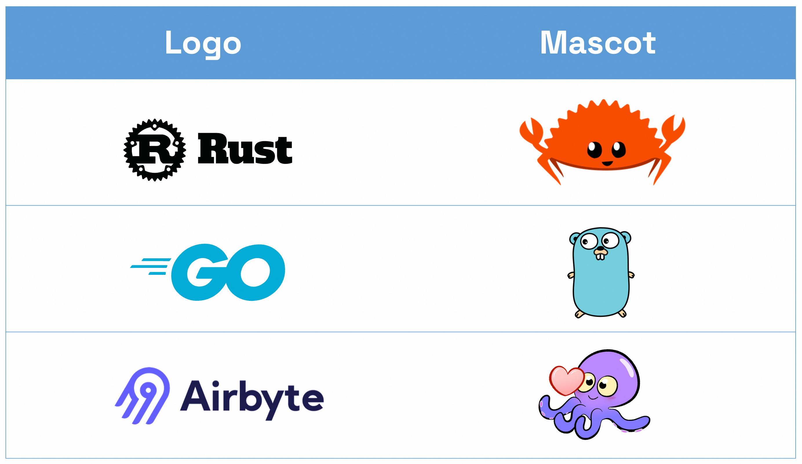
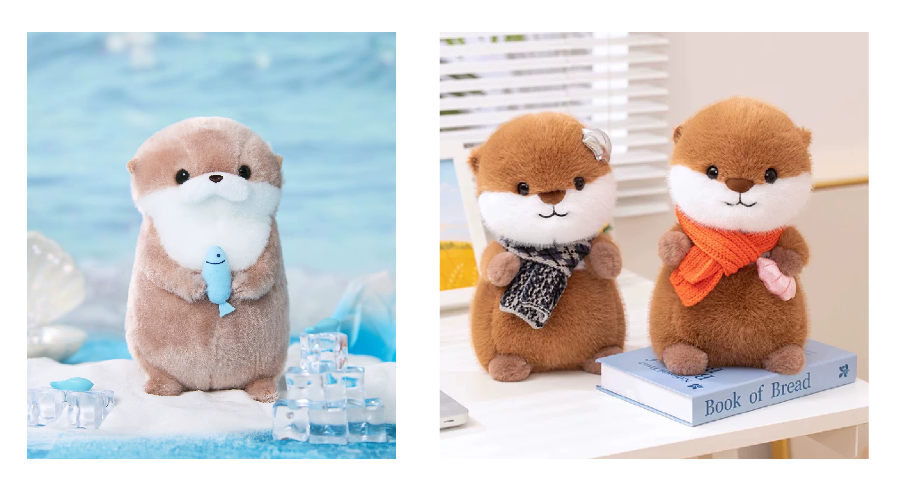
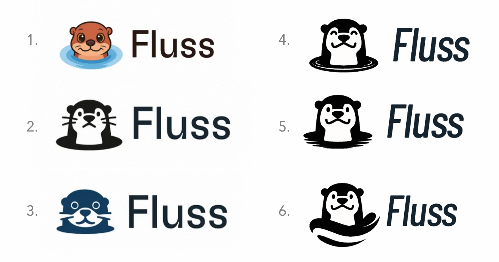
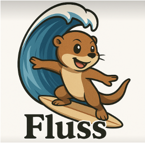
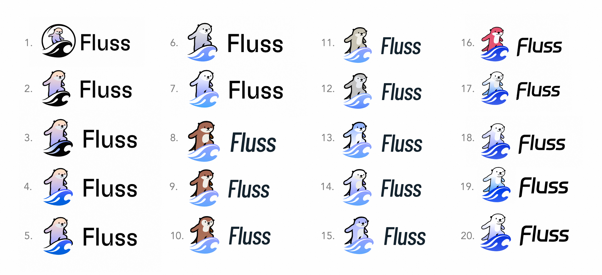
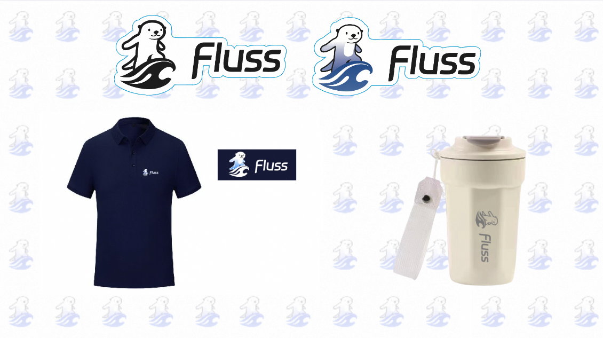

## Introducing the Little Otter

Today is [World Otter Day](https://www.otter.org/world-otter-day), and we are thrilled to introduce the little otter to the Fluss community! 🎉

Since open-sourced half a year ago, many community members and friends have asked us:
"When will Fluss get a logo?" After more than a month of careful design work and over 30 iterations, we’re excited to finally unveil the official Fluss logo — a surfing otter! 🦦🌊

<!-- truncate -->

I don't want to interpret the symbolic meaning behind the Logo in a rigid way. Instead, I’d like to share the story behind its design — how we defined the direction and iterated step by step toward the final version. This process involved numerous subjective decisions made by the team. You might prefer one of the discarded versions, or disagree with some of the design choices. However, we want to share the journey with our community, and we hope it can also serve as a reference or inspiration for other open-source projects when designing their logos.

## Logo symbolism: what do we want to convey?
[Fluss](https://github.com/apache/fluss) is an open-source streaming storage system designed for analytical workloads, with the goal of serving as a real-time data layer for Lakehouse architectures. Therefore, ***fluidity*** is the first key message we want to convey.

Secondly, Fluss’s vision is to **"Bring better analytics to data streams, and bring better freshness to data Lakehouses"**. This requires the ability to adapt to multiple data lake formats and support a variety of query engines and compute engines. So, ***adaptability*** is the second core idea we want to convey.

Additionally, as an open-source project planning to be donated to the Apache Software Foundation, building an open, diverse, and collaborative community has always been one of our core goals. In line with this value, we wanted the brand to express ***friendliness***, which ultimately led us to choose animal as the logo design direction.

We have also considered using abstract graphics for logo design. However, we noticed that many open-source projects that start with abstract logos, eventually introduce animal mascots to convey the friendliness of the community. These mascots not only play an important role in community outreach but also often replace the main logo in many contexts, becoming more representative visual symbols — such as Go’s gopher, Rust’s crab, and Airbyte’s octopus. Animal images are easier to get closer to users and easier to spread and extend. For example, the small squirrel of the Flink community, not only becomes a symbol of the project but also inspires a wide range of community gifts.

Therefore, we made clear the direction in the early stage of Fluss Logo design: use an Animal image to convey our concept of **fluidity**, **adaptability**, and **friendliness**. The project name "Fluss" comes from the German word for "river" (Fluss), and we also hope that this animal has a close relationship with the river. Combined with these characteristics, the first animal that comes to our mind is the **otter**. The otter is an animal that lives in rivers and is known for its flexible swimming posture and strong adaptability. At the same time, because of its smart and lovely appearance, it is widely used in many kinds of dolls and cartoon images, is a symbol of affinity. This fits exactly the idea Fluss conveys.

## Design iterations for more than 30 versions

After clarifying the design direction and core values of Fluss Logo, we began to communicate with the design team in depth and launched multiple rounds of iteration. However, in the early versions of the design, we still couldn’t find the right feel — something was missing: the fluidity.

Therefore, we used ChatGPT to find inspiration, and tried a variety of prompt words, and this picture with a surfing wave quickly caught our eyes: dynamic, energy, speed, and flow, which is what we want! Although this otter looks like a Jerry rat... our design team quickly got our idea.

Based on the core elements of “otter” + “surfing”, we started a new round of design, and we iterated more than 20 versions based on this and finally evolved to the version you see today.

Subsequently, we also made many variations of the logo to adapt to different environments and background colors.

## Get feedback from community users

Designing a logo is a highly subjective process. But for an open-source project, the goal isn't to please the founding team — it's to resonate with the community. That’s why we've always valued community feedback and used it to guide our iterations.

Some of the community feedback I loved very much:

- "The Fluss otter seems to be a sibling to Flink's squirrel."
- "I see Paimon in it!"
- "It's soooo cute!"

Give it some ❤️ via ⭐ on GitHub if you like it as well!
https://github.com/apache/fluss

## Community Egg

At the time of the Fluss logo release, we also submitted an [incubation proposal](https://lists.apache.org/thread/osg23opm9x95xm318160808r984k0wk9) to the Apache Software Foundation, thanks to the strong support from our incubation mentors Yu Li, tison, Jingsong Lee, Becket Qin, and Jean-Baptiste. We're confident that Fluss will soon become one of the Apache projects.

In parallel, we’ve designed and launched a series of Fluss community gifts, including stickers, t-shirts, and coffee cups. These items will be available at upcoming community events — stay tuned and pick your swags!

