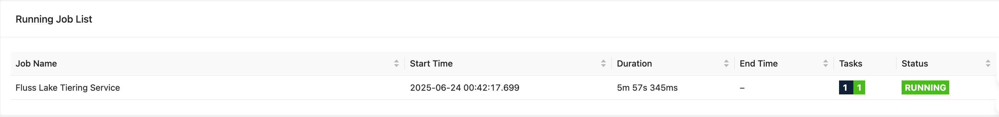
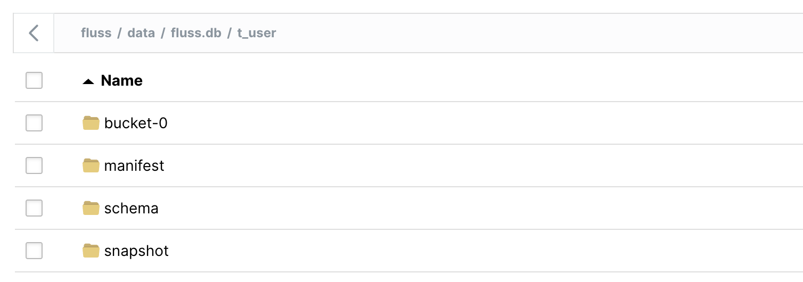

<!--
 Licensed to the Apache Software Foundation (ASF) under one
 or more contributor license agreements.  See the NOTICE file
 distributed with this work for additional information
 regarding copyright ownership.  The ASF licenses this file
 to you under the Apache License, Version 2.0 (the
 "License"); you may not use this file except in compliance
 with the License.  You may obtain a copy of the License at

      http://www.apache.org/licenses/LICENSE-2.0

 Unless required by applicable law or agreed to in writing, software
 distributed under the License is distributed on an "AS IS" BASIS,
 WITHOUT WARRANTIES OR CONDITIONS OF ANY KIND, either express or implied.
 See the License for the specific language governing permissions and
 limitations under the License.
-->

# Hands-on Fluss Lakehouse with Paimon S3

Fluss stores historical data in a lakehouse storage layer while keeping real-time data in the Fluss server. Its built-in tiering service continuously moves fresh events into the lakehouse, allowing various query engines to analyze both hot and cold data. The real magic happens with Fluss's union-read capability, which lets Flink jobs seamlessly query both the Fluss cluster and the lakehouse for truly integrated real-time processing.


In this hands-on tutorial, we'll walk you through setting up a local Fluss lakehouse environment, running some practical data operations, and getting first-hand experience with the complete Fluss lakehouse architecture. By the end, you'll have a working environment for experimenting with Fluss's powerful data processing capabilities.

## Integrate Paimon S3 Lakehouse

For this tutorial, we'll use **Fluss 0.7** and **Flink 1.20** to run the tiering service on a local cluster. We'll configure **Paimon** as our lake format and **S3** as the storage backend. Let's get started:

### Minio Setup

1. Install Minio object storage locally.

   Check out the official [guide](https://min.io/docs/minio/macos/index.html) for detailed instructions.

2. Start the Minio server

   Run this command, specifying a local path to store your Minio data:
   ```
   minio server /tmp/minio-data
   ```

3. Verify the Minio WebUI.

   When your Minio server is up and running, you'll see endpoint information and login credentials:

   ```
   API: http://192.168.2.236:9000  http://127.0.0.1:9000
      RootUser: minioadmin
      RootPass: minioadmin

   WebUI: http://192.168.2.236:61832 http://127.0.0.1:61832
      RootUser: minioadmin
      RootPass: minioadmin
   ```
   Open the WebUI link and log in with these credentials.

4. Create a `fluss` bucket through the WebUI.

   


### Fluss Cluster Setup

1. Download Fluss

   Grab the Fluss 0.7 binary release from the [Fluss official site](https://fluss.apache.org/downloads/).

2. Add Dependencies

   Download the `fluss-fs-s3-0.7.0.jar` from the [Fluss official site](https://fluss.apache.org/downloads/) and place it in your `<FLUSS_HOME>/lib` directory.

   Next, download the `paimon-s3-1.0.1.jar` from the [Paimon official site](https://paimon.apache.org/docs/1.0/project/download/) and add it to `<FLUSS_HOME>/plugins/paimon`.

3. Configure the Data Lake

   Edit your `<FLUSS_HOME>/conf/server.yaml` file and add these settings:

   ```yaml
   data.dir: /tmp/fluss-data
   remote.data.dir: /tmp/fluss-remote-data

   datalake.format: paimon
   datalake.paimon.metastore: filesystem
   datalake.paimon.warehouse: s3://fluss/data
   datalake.paimon.s3.endpoint: http://localhost:9000
   datalake.paimon.s3.access-key: minioadmin
   datalake.paimon.s3.secret-key: minioadmin
   datalake.paimon.s3.path.style.access: true
   ```

   This configures Paimon as the datalake format with S3 as the warehouse.

4. Start Fluss

   ```bash
   <FLUSS_HOME>/bin/local-cluster.sh start
   ```

### Flink Cluster Setup

1. Download Flink

   Download the Flink 1.20 binary package from the [Flink downloads page](https://flink.apache.org/downloads/).

2. Add the Fluss Connector

   Download `fluss-flink-1.20-0.7.0.jar` from the [Fluss official site](https://fluss.apache.org/downloads/) and copy it to:

   ```
   <FLINK_HOME>/lib
   ```

3. Add Paimon Dependencies

   - Download `paimon-flink-1.20-1.0.1.jar` and `paimon-s3-1.0.1.jar` from the [Paimon official site](https://paimon.apache.org/docs/1.0/project/download/) and place them in `<FLINK_HOME>/lib`.
   - Copy these Paimon plugin jars from Fluss into `<FLINK_HOME>/lib`:

   ```
   <FLUSS_HOME>/plugins/paimon/fluss-lake-paimon-0.7.0.jar
   <FLUSS_HOME>/plugins/paimon/flink-shaded-hadoop-2-uber-2.8.3-10.0.jar
   ```

4. Increase Task Slots

   Edit `<FLINK_HOME>/conf/config.yaml` to increase available task slots:

   ```yaml
   numberOfTaskSlots: 5 
   ```

5. Start Flink

   ```bash
   <FLINK_HOME>/bin/start-cluster.sh
   ```

6. Verify

   Open your browser to `http://localhost:8081/` and make sure the cluster is running.

### Launching the Tiering Service

1. Get the Tiering Job Jar

   Download the `fluss-flink-tiering-0.7.0.jar`.

2. Submit the Job

   ```bash
   <FLINK_HOME>/bin/flink run \
       <path_to_jar>/fluss-flink-tiering-0.7.0.jar \
       --fluss.bootstrap.servers localhost:9123 \
       --datalake.format paimon \
       --datalake.paimon.metastore filesystem \
       --datalake.paimon.warehouse s3://fluss/data \
       --datalake.paimon.s3.endpoint http://localhost:9000 \
       --datalake.paimon.s3.access-key minioadmin \
       --datalake.paimon.s3.secret-key minioadmin \
       --datalake.paimon.s3.path.style.access true
   ```

3. Confirm Deployment

   Check the Flink UI for the **Fluss Lake Tiering Service** job. Once it's running, your local tiering pipeline is good to go.

   

## Data Processing

Now let's dive into some actual data processing. We'll use the Flink SQL Client to interact with our Fluss lakehouse and run both batch and streaming queries.

1. Launch the SQL Client

   ```bash
   <FLINK_HOME>/bin/sql-client.sh
   ```

2. Create the Catalog and Table

   ```sql
   CREATE CATALOG fluss_catalog WITH (
       'type' = 'fluss',   
       'bootstrap.servers' = 'localhost:9123'
   );

   USE CATALOG fluss_catalog;

   CREATE TABLE t_user (
       `id` BIGINT,
       `name` string NOT NULL,
       `age` int,
       `birth` DATE,
       PRIMARY KEY (`id`) NOT ENFORCED
   )WITH (
       'table.datalake.enabled' = 'true',
       'table.datalake.freshness' = '30s'
   );
   ```

3. Write Some Data

   Let's insert a couple of records:

   ```sql
   SET 'execution.runtime-mode' = 'batch';
   SET 'sql-client.execution.result-mode' = 'tableau';

   INSERT INTO t_user(id,name,age,birth) VALUES
   (1,'Alice',18,DATE '2000-06-10'),
   (2,'Bob',20,DATE '2001-06-20');
   ```

4. Union Read

   Now run a simple query to retrieve data from the table. By default, Flink will automatically combine data from both the Fluss cluster and the lakehouse:

   ```sql
   Flink SQL> select * from t_user;
   +----+-------+-----+------------+
   | id |  name | age |      birth |
   +----+-------+-----+------------+
   |  1 | Alice |  18 | 2000-06-10 |
   |  2 |   Bob |  20 | 2001-06-20 |
   +----+-------+-----+------------+
   ```

   If you want to read data only from the lake table, simply append `$lake` after the table name:

   ```sql
   Flink SQL> select * from t_user$lake;
   +----+-------+-----+------------+----------+----------+----------------------------+
   | id |  name | age |      birth | __bucket | __offset |                __timestamp |
   +----+-------+-----+------------+----------+----------+----------------------------+
   |  1 | Alice |  18 | 2000-06-10 |        0 |       -1 | 1970-01-01 07:59:59.999000 |
   |  2 |   Bob |  20 | 2001-06-20 |        0 |       -1 | 1970-01-01 07:59:59.999000 |
   +----+-------+-----+------------+----------+----------+----------------------------+
   ```

   Great! Our records have been successfully synced to the data lake by the tiering service.

   Notice the three system columns in the Paimon lake table: `__bucket`, `__offset`, and `__timestamp`. The `__bucket` column shows which bucket contains this row. The `__offset` and `__timestamp` columns are used for streaming data processing.

5. Streaming Inserts

   Let's switch to streaming mode and add two more records:

   ```sql
   Flink SQL> SET 'execution.runtime-mode' = 'streaming';

   Flink SQL> INSERT INTO t_user(id,name,age,birth) VALUES
   (3,'Catlin',25,DATE '2002-06-10'),
   (4,'Dylan',28,DATE '2003-06-20');
   ```

   Now query the lake again:

   ```sql
   Flink SQL> select * from t_user$lake;
   +----+----+--------+-----+------------+----------+----------+----------------------------+
   | op | id |   name | age |      birth | __bucket | __offset |                __timestamp |
   +----+----+--------+-----+------------+----------+----------+----------------------------+
   | +I |  1 |  Alice |  18 | 2000-06-10 |        0 |       -1 | 1970-01-01 07:59:59.999000 |
   | +I |  2 |    Bob |  20 | 2001-06-20 |        0 |       -1 | 1970-01-01 07:59:59.999000 |


   Flink SQL> select * from t_user$lake;
   +----+----+--------+-----+------------+----------+----------+----------------------------+
   | op | id |   name | age |      birth | __bucket | __offset |                __timestamp |
   +----+----+--------+-----+------------+----------+----------+----------------------------+
   | +I |  1 |  Alice |  18 | 2000-06-10 |        0 |       -1 | 1970-01-01 07:59:59.999000 |
   | +I |  2 |    Bob |  20 | 2001-06-20 |        0 |       -1 | 1970-01-01 07:59:59.999000 |
   | +I |  3 | Catlin |  25 | 2002-06-10 |        0 |        2 | 2025-07-19 19:03:54.150000 |
   | +I |  4 |  Dylan |  28 | 2003-06-20 |        0 |        3 | 2025-07-19 19:03:54.150000 |

   ```

   The first time we queried, our new records hadn't been synced to the lake table yet. After waiting a moment, they appeared.

   Notice that the `__offset` and `__timestamp` values for these new records are no longer the default values. They now show the actual offset and timestamp when the records were added to the table.

6. Inspect the Paimon Files

   Open the Minio WebUI, and you'll see the Paimon files in your bucket:

   

   You can also check the Parquet files and manifest in your local filesystem under `/tmp/minio-data`:

   ```
   /tmp/minio-data ❯ tree .
   .
   └── fluss
       └── data
           ├── default.db__XLDIR__
           │         └── xl.meta
           └── fluss.db
               └── t_user
                   ├── bucket-0
                   │         ├── changelog-1bafcc32-f88a-42a6-bc92-d3ccf4f62d4c-0.parquet
                   │         │         └── xl.meta
                   │         ├── changelog-f1853f1c-2588-4035-8233-e4804b1d8344-0.parquet
                   │         │         └── xl.meta
                   │         ├── data-1bafcc32-f88a-42a6-bc92-d3ccf4f62d4c-1.parquet
                   │         │         └── xl.meta
                   │         └── data-f1853f1c-2588-4035-8233-e4804b1d8344-1.parquet
                   │             └── xl.meta
                   ├── manifest
                   │         ├── manifest-d554f475-ad8f-47e0-a83b-22bce4b233d6-0
                   │         │         └── xl.meta
                   │         ├── manifest-d554f475-ad8f-47e0-a83b-22bce4b233d6-1
                   │         │         └── xl.meta
                   │         ├── manifest-e7fbe5b1-a9e4-4647-a07a-5cc71950a5be-0
                   │         │         └── xl.meta
                   │         ├── manifest-e7fbe5b1-a9e4-4647-a07a-5cc71950a5be-1
                   │         │         └── xl.meta
                   │         ├── manifest-list-8975f7d7-9fec-4ac9-bb31-12be03d297d0-0
                   │         │         └── xl.meta
                   │         ├── manifest-list-8975f7d7-9fec-4ac9-bb31-12be03d297d0-1
                   │         │         └── xl.meta
                   │         ├── manifest-list-8975f7d7-9fec-4ac9-bb31-12be03d297d0-2
                   │         │         └── xl.meta
                   │         ├── manifest-list-bba1f130-e7ab-4f5e-8ce3-928a53524136-0
                   │         │         └── xl.meta
                   │         ├── manifest-list-bba1f130-e7ab-4f5e-8ce3-928a53524136-1
                   │         │         └── xl.meta
                   │         └── manifest-list-bba1f130-e7ab-4f5e-8ce3-928a53524136-2
                   │             └── xl.meta
                   ├── schema
                   │         └── schema-0
                   │             └── xl.meta
                   └── snapshot
                       ├── LATEST
                       │         └── xl.meta
                       ├── snapshot-1
                       │         └── xl.meta
                       └── snapshot-2
                           └── xl.meta

   28 directories, 19 files
   ```

7. View Snapshots

   You can also check the snapshots from the system table by appending `$lake$snapshots` after the Fluss table name:

   ```sql
   Flink SQL> select * from t_user$lake$snapshots;

   +-------------+-----------+----------------------+-------------------------+-------------+----------+
   | snapshot_id | schema_id |          commit_user |             commit_time | commit_kind | ...      |
   +-------------+-----------+----------------------+-------------------------+-------------+----------+
   |           1 |         0 | __fluss_lake_tiering | 2025-07-19 19:00:41.286 |      APPEND | ...      |
   |           2 |         0 | __fluss_lake_tiering | 2025-07-19 19:04:38.964 |      APPEND | ...      |
   +-------------+-----------+----------------------+-------------------------+-------------+----------+
   2 rows in set (0.33 seconds)
   ```

## Summary

In this guide, we've explored the Fluss lakehouse architecture and set up a complete local environment with Fluss, Flink, Paimon, and S3. We've walked through practical examples of data processing that showcase how Fluss seamlessly integrates real-time and historical data. With this setup, you now have a solid foundation for experimenting with Fluss's powerful lakehouse capabilities on your own machine.