## Streaming Storage More Suitable for Real-Time OLAP
### Introduction
The Data Development Team of Taobao has built a new **generation of real-time data warehouse** based on Apache Fluss.
Fluss solves the problems of redundant data transfer, difficulties in data profiling, and challenges in large scale stateful workload operations and maintenance.
By combining columnar storage with real-time update capabilities, Fluss supports column pruning, key-value point lookups, Delta Join, and seamless lake–stream integration, thereby **cutting I/O and compute overhead** while enhancing job stability and profiling efficiency.

Already deployed on Taobao’s A/B-testing platform for critical services such as search and recommendation, the system proved its resilience during the 618 Grand Promotion: 
**it handled tens of millions of requests with sub-second latency**, lowered resource usage by **30%**, and removed more than 100 TB from state storage. 
Looking ahead, the team will continue to extend Fluss within a **Lakehouse architecture** and broaden its use across **AI-driven** workloads.
<!-- truncate -->

### Business Background


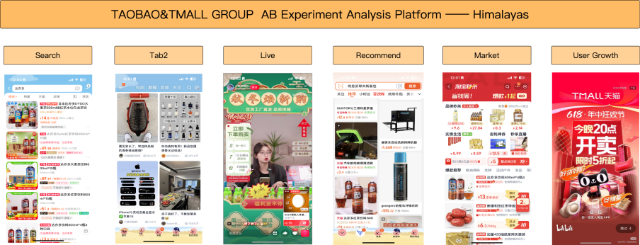

Taobao A/B testing Analysis Platform, mainly focuses on A/B data of Taobao's C-end algorithms, aiming to promote scientific decision-making activities through the construction of generalized A/B data capabilities. 
Since its inception in **2015** , it has continuously and effectively supported the analysis of Taobao's algorithm A/B data for **10 years** . 
Currently, it is applied to **over 100** A/B testing scenarios across various business areas, including **search, recommendation, content,** **user growth**, and **marketing**.


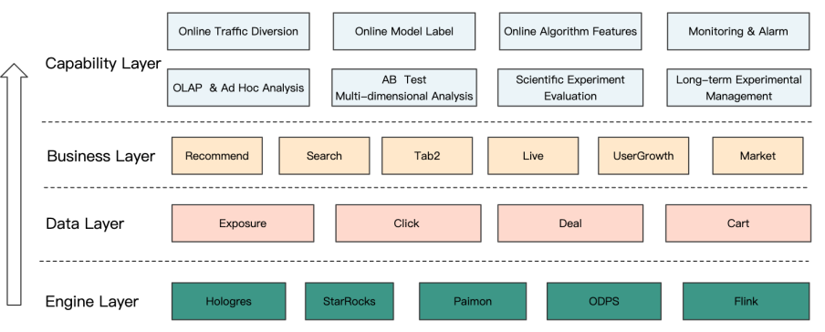


Taobao provides the following capabilities:

- **A/B Data Public Data Warehouse:** Serves various data applications of downstream algorithms, including: `online traffic splitting`, `distribution alignment`, `general features`, `scenario labels`, and other application scenarios.

- **Scientific Experiment Evaluation:** Implement mature scientific evaluation solutions in the industry, conduct long-term tracking of the effects of A/B testing, and help businesses obtain real and reliable experimental evaluation results.

- **Multidimensional Ad Hoc OLAP Self-Service Analysis:** Through mature data solutions, it supports multidimensional and ad hoc OLAP queries, serving data effectiveness analysis across all clients, businesses, and scenarios.


## Business Pain Points

Currently, the real-time data warehouse of Taobao is based on technology stacks such as Flink, message queue, OLAP engine, etc., where the message queue is TT (Kafka-like architecture MQ) within Taobao, and the OLAP engine is Alibaba Cloud Hologres.


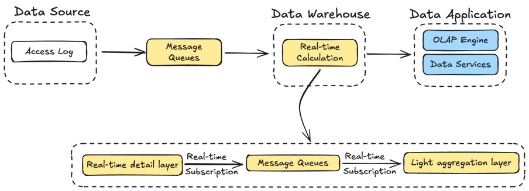


After ingesting access log data from the message queue, we execute business logic within Apache Flink. 
However, as SQL complexity increases - particularly in the presence of `ORDER BY` and `JOIN` operations - the resulting retraction streams significantly expand. 

This leads to a substantial increase in Flink state size, which in turn drives up the consumption of compute resources.
Such scenarios introduce notable challenges in both job development and ongoing maintenance. Additionally, the development lifecycle for these real-time jobs tends to be considerably longer compared to equivalent offline solutions.

Currently, the message queue still has some limitations, and the main problems encountered are as follows:

### Redundant Data Transfer
In traditional data warehouse environments, **write-once**, **read-many** is the prevailing access pattern, where each downstream consumer typically reads only a subset of the available data. 
For example, in the exposure job for Taobao, the message queue provides 44 fields per record, yet the job only requires 13 of them. 
However, due to the row-based nature of the message queue storage format, all 44 fields must still be read and transmitted during consumption.

This results in significant **I/O inefficiency; approximately 70% of the network throughput** is wasted on reading unused columns. 
Consumers bear the full cost of data transfer, even though only a fraction of the data is relevant to their processing logic. 
This contributes to **excessive resource utilization**, especially at scale.

Attempts at Optimization with Flink
To mitigate this, we explored column pruning within **Apache Flink** by explicitly defining the schema in the Source and introducing a UDF to drop unused columns early in the pipeline. 
While this approach aimed to reduce data ingestion costs, its **practical impact was minimal**.
The performance gains were negligible, and the added complexity in pipeline design and maintenance introduced new operational challenges.

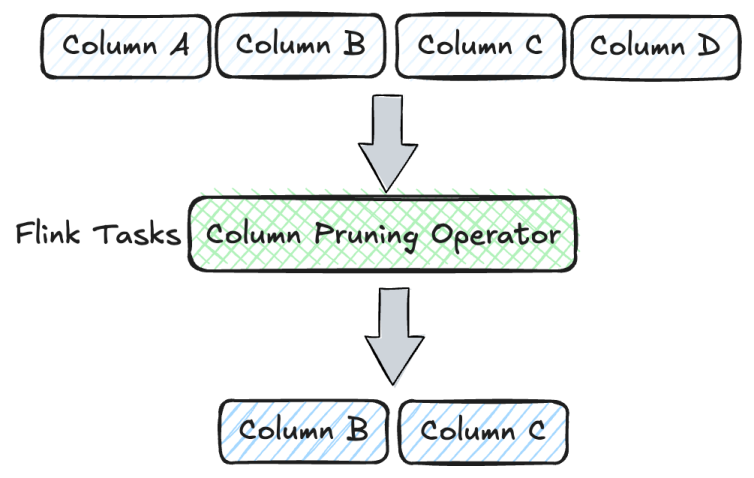

### Challenges In Data Profiling & Debugging 

#### Message queues are not designed for random access or key-value lookups

In modern data warehouse architecture, **data profiling is a foundational capability**, essential for tasks such as issue diagnosis, anomaly detection, and case-specific troubleshooting. To meet these needs, two distinct data profiling approaches for message queues have been evaluated in production environments.

While each method offers unique benefits, **both exhibit trade-offs and limitations** that prevent them from fully addressing the breadth of business requirements. Neither approach provides a comprehensive solution for profiling within the constraints and characteristics of message queue systems, such as their lack of random access and stateless consumption model.

| Query Type                           | Query Method                                                                              | Advantages                | Disadvantages                                                                               |
|--------------------------------------|-------------------------------------------------------------------------------------------|---------------------------|---------------------------------------------------------------------------------------------|
| Sampling query                       | Randomly query according to time slices.                                                  | High timeliness           | Unable to query the specified data.                                                         |
| Synchronize additional storage query | Synchronize the data in the message queue to additional storage and then perform queries. | Can query specified data  | 1. Additional synchronization, storage, and query resources. 2. Has a synchronization delay |


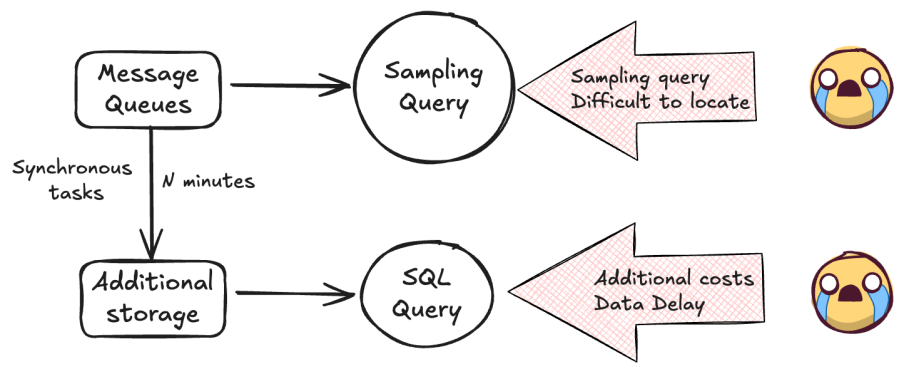


#### Challenges with State Visibility in Flink

In e-commerce analytics, identifying the **first and last user interaction channels within the same day** is a critical metric for evaluating both **user acquisition performance** and **channel effectiveness**. 
To ensure accurate computation of this metric, the processing engine must perform **sorting and deduplication**, which inherently requires **materializing all relevant upstream data into Flink State**.

However, Flink’s managed state is inherently opaque;it functions as a high-performance internal component designed for scalability and fault tolerance, but it does not provide native visibility or introspection tools. This "black-box" nature of state introduces substantial challenges when attempting to **debug**, **verify**, or **modify** streaming jobs, especially in production environments. The lack of transparency significantly complicates tasks such as validating correctness, understanding intermediate state contents, or troubleshooting unexpected outcomes.

As a result, teams may encounter **increased operational overhead** and **longer development cycles**, particularly when dealing with stateful streaming jobs that require precise control over historical data.

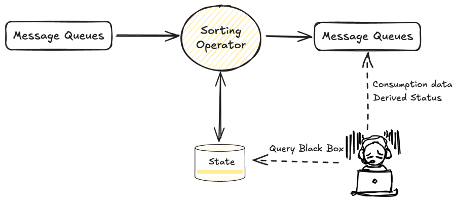


### Operational Challenges of Large Flink State in Stateful Jobs

In many Flink jobs, maintaining intermediate result sets in state is essential to support operations such as sorting and joining. When modifying a job, Flink attempts to reuse the previous state by validating the updated execution plan against the existing state schema. If the plan verification succeeds, the job can resume from the latest checkpoint. However, if the verification fails, the system is forced to **reinitialize the entire state from scratch (epoch 0)**, a process that is both **time-consuming** and **operationally intensive**.


In our current scenario, each incoming record triggers updates to both Sort State and Join State. These states have grown significantly in size, with the sort operator's state reaching up to **90 TB** and the join operator's state peaking at **10 TB**. Managing such large-scale state introduces a number of serious challenges:
* **High infrastructure costs** due to the volume of state data.
* **Increased risk of checkpoint timeouts**, especially under load.
* **Degraded job stability**, with failures more likely during recovery or scaling events.
* **Slow job restart and recovery times**, making operational troubleshooting difficult.
* **Development inefficiency**, as state schema changes often require full state resets.

This highlights the need for **more efficient state management strategies**, such as state compaction, state TTLs, or alternative storage architectures, to support large-scale, high-throughput streaming workloads with minimal operational burden.


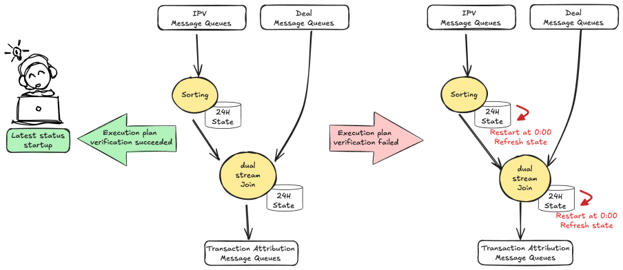

## Apache Fluss Key Advantages

### What is Apache Fluss?

> Fluss Official Documentation: [https://fluss.apache.org/](https://fluss.apache.org/)

> GitHub: [https://github.com/apache/fluss](https://github.com/apache/fluss)


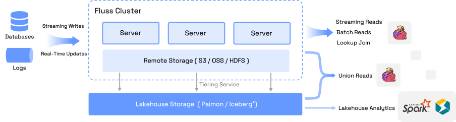


Fluss, developed by the Flink team, is the next-generation stream storage for stream analysis, a stream storage built for real-time analysis. Fluss innovatively integrates columnar storage format and real-time update capabilities into stream storage, and is deeply integrated with Flink to help users build a streaming data warehouse with high throughput, low latency, and low cost. It has the following core features:

* **Real-time reads and writes:** Supports millisecond-level streaming read and write capabilities. 
* **Columnar pruning:** Store real-time stream data in columnar format. Column pruning can improve read performance by 10 times and reduce network costs. 
* **Streaming Update:** Supports real-time streaming updates for large-scale data. Supports partial column updates to achieve low-cost wide table stitching. 
* **CDC Subscription:** Updates will generate a complete Change Log (CDC), and by consuming CDC through Flink streaming, real-time data flow across the whole-pipeline of the data warehouse can be achieved. 
* **Real-time Lookup Queries:** Supports high-performance primary key point query and can be used as a dimension table association for real-time processing links. 
* **Unified Lake and Stream:** Seamlessly integrates Lakehouse and provides a real-time data layer for Lakehouse. This not only brings low-latency data to Lakehouse analytics but also endows stream storage with powerful analytical capabilities.


### Table Types

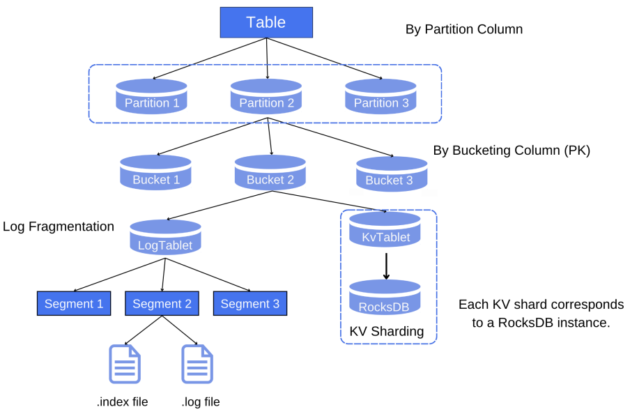


**Type:** Divided into log tables and primary key tables. Log tables are columnar MQs that only support insert operations, while primary key tables can be updated according to the primary key and specified merge engine.

**Partition:** Divides data into smaller, more manageable subsets according to specified columns. Fluss supports more diverse partitioning strategies, such as Dynamic create partitions. For the latest documentation on partitioning, please refer to: [https://fluss.apache.org/docs/table-design/data-distribution/partitioning/](https://fluss.apache.org/docs/table-design/data-distribution/partitioning/) . Note that the partition type must be of String type and can be defined via the following SQL:

```SQL
CREATE TABLE temp(
  dt STRING
) PARTITIONED BY (dt)
WITH (
  'table.auto-partition.num-precreate' = '2', -- Create 2 partitions in advance
  'table.auto-partition.num-retention' = '2', -- Keep the first 2 partitions
  'table.auto-partition.enabled' = 'true' -- Automatic partitioning
);
```

**Bucket:** The smallest unit of read and write operations. For a primary key table, the bucket to which each piece of data belongs is determined based on the hash value of the primary key of each piece of data. For a log table, the configuration of column hashing can be specified in the with parameter when creating the table; otherwise, it will be randomly scattered.

#### Log Table

The log table is a commonly used table in Fluss, which writes data in the order of writing, only supports insert operations, and does not support update/delete operations, similar to MQ systems such as Kafka and TT. For the log tables, currently most of the data will be uploaded to a remote location, and only a portion of the data will be stored locally. For example, a log table has 128 buckets, only 128 \* 2 (number of segments retained locally) \* 1 (size of one segment) \* 3 (number of replicas) GB = 768 GB will be stored locally. The table creation statement is as follows:

```SQL
CREATE TABLE `temp` (
  second_timestamp  STRING
  ,pk               STRING
  ,assist           STRING
  ,user_name        STRING
)
with (
  'bucket.num' = '256', -- Number of buckets
  'table.log.ttl' = '2d', -- TTL setting, default 7 days
  'table.log.arrow.compression.type', = 'ZSTD' -- Compression mode, currently added by default
  'client.writer.bucket.no-key-assigner' = 'sticky' -- Bucket mode
);
```

In Fluss, the log table is stored in Apache Arrow columnar format by default. This format stores data column by column rather than row by row, thereby enabling **column pruning**. This ensures that only the required columns are consumed during real-time consumption, thereby reducing IO overhead, improving performance, and reducing resource usage.

#### PrimaryKey Table

Compared to the log table, the primary key table supports insert, update, and delete operations, and different merge methods are implemented by specifying the Merge Engine. It should be noted that `bucket.key` and `partitioned.key` need to be subsets of `primary.key`, and if this KV table is used for DeltaJoin, `bucket.key` needs to be a prefix of `primary.key`. The table creation statement is as follows:

```SQL
CREATE TABLE temp (
  ,pk               STRING
  ,user_name        STRING
  ,item_id          STRING
  ,event_time       BIGINT
  ,dt               STRING
  ,PRIMARY KEY (user_name,item_id,pk,dt) NOT ENFORCED
) PARTITIONED BY (dt)
WITH (
  'bucket.num' = '512',
  'bucket.key' = 'user_name,item_id',
  'table.auto-partition.enabled' = 'true',
  'table.auto-partition.time-unit' = 'day',
  'table.log.ttl' = '1d', -- Binlog retain 1 day.
  'table.merge-engine'='versioned', -- Take the last piece of data
  'table.merge-engine.versioned.ver-column' = 'event_time', -- Sort field
  'table.auto-partition.num-precreate' = '2', -- Create 2 partitions in advance
  'table.auto-partition.num-retention' = '2', -- Keep the first 2 partitions
  'table.log.arrow.compression.type' = 'ZSTD'
);
```

Among them, merge-engine supports versioned and first\_row; after using versioned, it is necessary to limit the ver-column for sorting, currently only supporting types such as INT, BIGINT, and TIMESTAMP, and not supporting STRING; after using first\_row, it only supports retaining the first record of each primary key and does not support sorting by column.

### Core Functions

#### Tailorable Columnar Storage

Fluss is a column-based streaming storage, with its underlying file storage adopting the Apache Arrow IPC streaming format. This enables Fluss to achieve efficient column pruning while maintaining millisecond-level streaming read and write capabilities.

A key advantage of Fluss is that column pruning is performed at the server level, and **only the necessary columns are transferred to the Client**. This architecture not only improves performance but also reduces network costs and resource consumption.


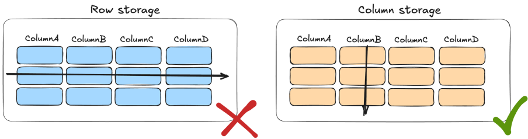


#### Fluss Key-Value Storage Architecture and Benefits
Fluss’s **Key-Value (KV) storage engine** is built atop a high-performance **log-structured table**, where a KV index is constructed directly over the log stream. This index leverages an **LSM-tree (Log-Structured Merge Tree)** design, enabling high-throughput real-time updates and partial record modifications—making it particularly well-suited for building and maintaining wide tables at scale.

One of the standout advantages of this architecture is that the **changelog** produced by the KV store is **natively consumable by Apache Flink**. Unlike traditional message queues or log-based systems that require expensive post-processing and deduplication, Fluss’s integration avoids these overheads entirely. This results in **significant reductions in compute cost**, **latency**, and **complexity** across the data pipeline.

Fluss’s built-in KV index supports **low-latency primary key lookups**, making it ideal for operational queries, streaming joins, and dimension table enrichment. Beyond real-time ingestion and processing, Fluss also supports **ad-hoc data exploration**, with efficient execution of queries involving operations like `LIMIT` and `COUNT`. This allows users to **debug** and **inspect live data** within Fluss quickly and interactively;without requiring a separate query engine or offline process.

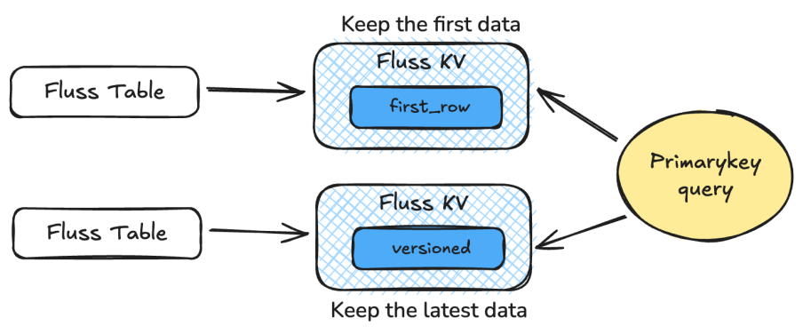


#### Dual-Stream Join → Delta Join

In Flink, Dual-Stream Join is a very fundamental function, often used to build wide tables. However, it is also a function that often gives developers headaches. This is because Dual-Stream Join needs to maintain the full amount of upstream data in State, which results in its state usually being very large. This brings about many problems, including high costs, unstable jobs, checkpoint timeouts, slow restart recovery, and so on.

Fluss has developed a brand-new Flink join operator implementation called Delta Join, which fully leverages Fluss's streaming read and Prefix Lookup capabilities. Delta Join can be simply understood as "**dual-sided driven dimension table join**". When data arrives on the left side, it performs a point query on the right table based on the Join Key; when data arrives on the right side, it performs a point query on the left table based on the Join Key. Throughout the process, it does not require state like a dimension table join, but implements semantics similar to a Dual-Stream Join, meaning that any data update on either side will trigger an update to the associated results.


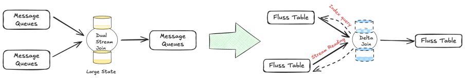


#### Lake-Stream Integration

In the Kappa architecture, due to differences in production pipelines, data is stored separately in streams and lakes, resulting in cost waste. At the same time, additional data services need to be defined to unify data consumption. The goal of lake-stream integration is to enable **Lakehouse data**" and **streaming data** to be stored, managed, and consumed as a unified whole, thereby avoiding data redundancy and metadata inconsistency issues.


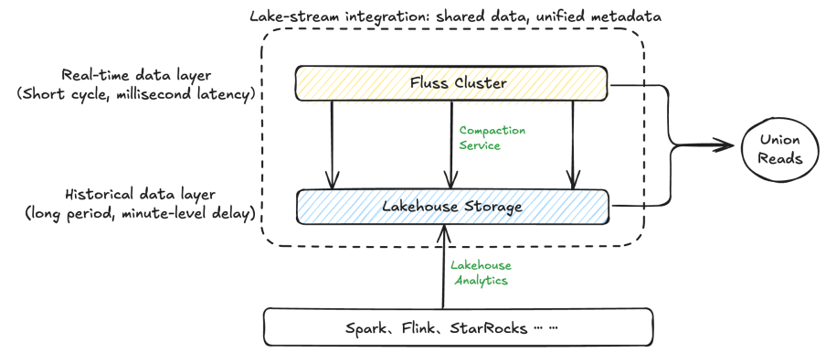


Fluss introduces **Union Reads** to fully support the unified data access layer required by **Kappa architecture** principles. This functionality enables seamless access to both real-time streaming data and historical batch data through a consistent abstraction, ensuring a **fully managed, end-to-end unified data service**.

To maintain alignment between streaming and lakehouse storage, Fluss operates a **built-in Tiering Service**. This service automatically transforms raw Fluss data into a lake-friendly format (e.g., columnar files), while **preserving metadata consistency between stream and lake**. This tight integration eliminates the need for external tooling to reconcile stream processing with downstream analytics systems.

Fluss also introduces **partition and bucket alignment mechanisms**, which ensure that data layout remains consistent across streaming and lakehouse layers. These alignment strategies allow for **direct conversion of Arrow files to Parquet** without **triggering network shuffling or repartitioning**, significantly reducing I/O overhead and improving performance across the data pipeline.

Together, these capabilities enable Fluss to function as a **next-generation streaming storage layer**, bridging the gap between low-latency stream processing and scalable lakehouse analytics—while optimizing cost, consistency, and operational simplicity.


## Architecture Evolution and Capability Implementation

### Architecture Evolution

Fluss innovatively integrates columnar storage format and real-time update capabilities into stream storage and deeply integrates with Flink. Based on Fluss's core capabilities, we further enhance the real-time architecture, building a high-throughput, low-latency, and low-cost lakehouse through Fluss. 

The following takes the typical upgrade scenario of the Taobao as an example to introduce the implementation practice of Fluss.

#### Evolution of Regular Jobs


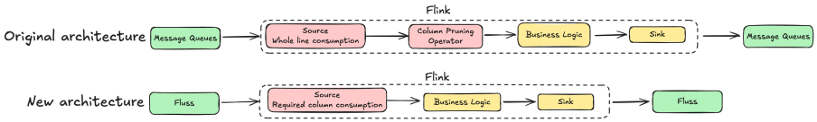

The above is the architecture before and after the job upgrade. For routine jobs such as `Source -> ETL cleaning -> Sink`, since the message queue is row-based storage, when consuming, Flink first loads the entire row of data into memory and then filters the required columns, resulting in a significant waste of Source IO. 

After upgrading to Fluss, due to the columnar storage at the bottom of Fluss, column pruning in Fluss is performed at the server level, which means that the **data sent to the client has already been pruned**, thus saving a large amount of network costs.

#### Evolution of Sorting Jobs


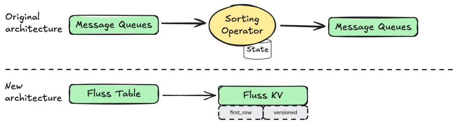


In Flink, the implementation of sorting relies on Flink explicitly computing and using State to store the intermediate state of data. This model incurs significant business overhead and extremely low business reusability. The introduction of Fluss pushes this computation and storage down to the Sink side, and in conjunction with the Fluss Merge Engine, implements different deduplication methods for KV tables. Currently, it supports **FirstRow Merge Engine** (the first row) and **Versioned Merge Engine** (the latest row). The Changelog generated during deduplication can be directly read by Flink streams, saving a large amount of computing resources and enabling the rapid reuse and implementation of data services.

#### Evolution of Dual-Stream Join Jobs


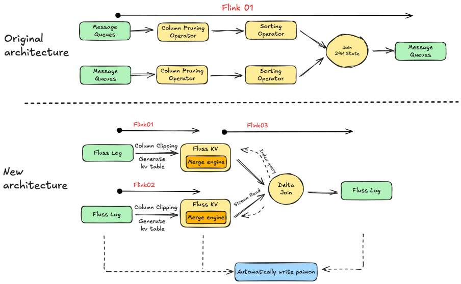


After the Fluss remodeling, the Dual-Stream Join of the Taobao transaction attributed job has been enhanced with the following upgrade points:
* **Column pruning** is truly pre-positioned to Source consumption, avoiding IO consumption of useless columns. 
* **Introduce Fluss KV table & Merge Engines** to implement data sorting and eliminate the dependency on Flink sorting State.
* **Refactor the Dual-Stream Join into FlussDeltaJoin**, using stream reading and index point query, and externalize the Flink Dual-Stream JoinState. 

A comprehensive comparison between traditional Dual-Stream Join and the new Fluss-based architecture reveals the following advantages and disadvantages of the two:


| Job Type                          | Advantages                                                                                                                                      | Disadvantages                                                                                                                                                                                                                                                                                                                 |
|-----------------------------------|-------------------------------------------------------------------------------------------------------------------------------------------------|-------------------------------------------------------------------------------------------------------------------------------------------------------------------------------------------------------------------------------------------------------------------------------------------------------------------------------|
| Traditional MQ & Dual-Stream Join | One job can implement the Join business logic.                                                                                                  | 1. Data is consumed row by row, resulting in wasted IO resources for useless columns.2. The Join State of the dual-stream is too large, making job maintenance difficult.3. State Black box, difficult to probe internal state. 4. If the resource plan does not match after modifying the job, then State needs to be rerun. |
| Fluss & Delta Join                | 1. Consume the required columns and reduce the IO traffic of useless columns.  2. Implemented through Delta Join, state is decoupled from jobs. | 1. Status is traceable, and backfilling efficiency is high.2. Delta Join relies on the point query capability of the Fluss KV table. 3. The number of Flink jobs has increased.                                                                                                                                               |


#### Evolution of Lake Jobs


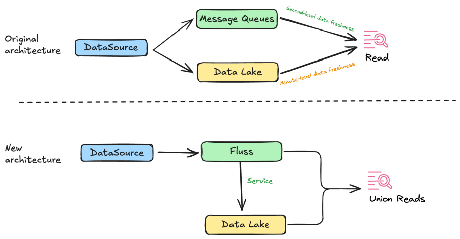


Under the Fluss lake-stream integrated architecture, Fluss provides a **fully managed** unified data service. Fluss and Paimon store stream and lake data respectively, output a Catalog to the computing engine (such as Flink), and the data is output externally in the form of a unified table. Consumers can directly access the data in Fluss and lake storage in the form of Union Read.

### Implementation of Core Competencies

#### Column Pruning Capability

In the job of consuming message queues, consumers typically only consume a portion of the data, but Flink jobs still need to read data from all columns, resulting in significant waste in Flink Source IO. Fundamentally, existing message queues are all row-based storage, and for scenarios that need to process large-scale data, the efficiency of row-based storage format appears insufficient. The underlying storage needs to have powerful Data Skipping capabilities and support features such as column pruning. In this case, Fluss with columnar storage is clearly more suitable.


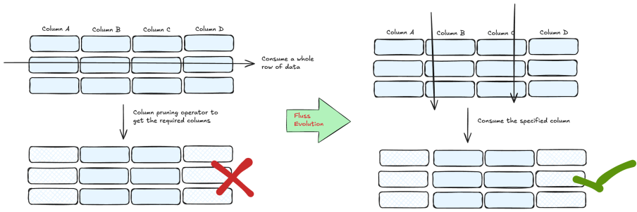


In our real-time data warehouse, 70% of jobs only consume partial columns of Source. Taking the Taobao recommendation clicks job as an example, out of the 43 fields in Source, we only need 13. Additional operator resources are required to trim the entire row of data, wasting more than 20% of IO resources. After using Fluss, it directly consumes the required columns, avoiding additional IO waste and reducing the additional resources brought by Flink column pruning operators. To date, multiple core jobs in the Taobao Search and Recommendation domain have already launched Fluss and have been verified during the Taobao 618 promotion.

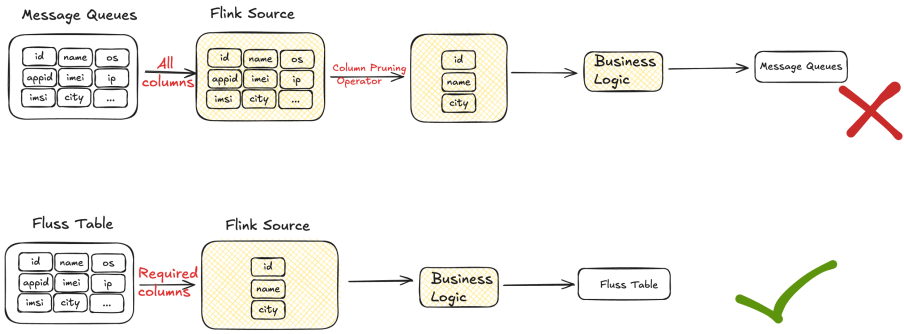


#### Real-time Data Profiling

**Lookup Queries**

Whether troubleshooting issues or conducting data exploration, data queries are necessary. However, the message queue only supports sampling queries in the interface and queries of synchronized data in additional storage. In sampling queries, it is not possible to query specified data; only a batch of output can be retrieved for display and inspection. Using the method of synchronizing additional storage, on the other hand, incurs minute-level latency as well as additional storage and computational costs.


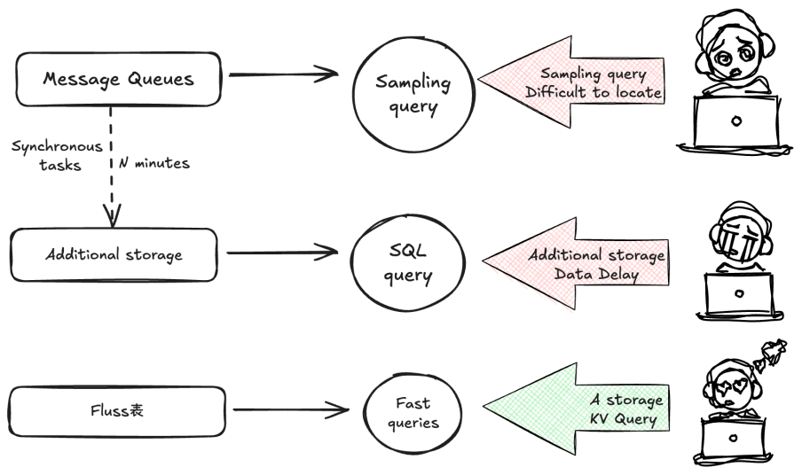


In Fluss KV Table, a KV index is built, so it can support high-performance primary key point queries, directly probe Fluss data through point query statements, and also support query functions such as LIMIT and COUNT to meet daily Data Profiling requirements. An example is as follows:


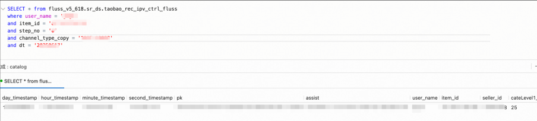


**Flink State Query**

Flink's State mechanism (such as KeyedState or OperatorState) provides efficient state management capabilities, but its internal implementation is a "Black box" to developers. Developers cannot directly query, analyze, or debug the data in State, resulting in a strong coupling between business logic and state management, making it difficult to dynamically adjust or expand. When data anomalies occur, developers can only infer the content in State from the result data, unable to directly access the specific data in State, leading to high costs for troubleshooting.


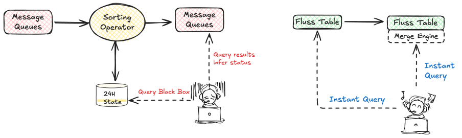


We externalize Flink State into Fluss, such as states for duak-stream join, data deduplication, etc. Based on Fluss's KV index, we provide State exploration capabilities, white-box the internal data of State, and efficiently locate issues.


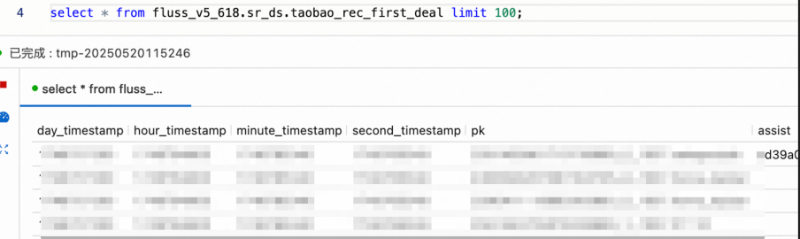


#### Merge Engine & Delta Join

In the current real-time data warehouse, the transaction attribution task is a job that heavily relies on State, with State **reaching up to 100TB** , which includes operations such as sorting and Dual-Stream Join. After consuming TT data, we first perform data sorting and then conduct a Dual-Stream Join to attribute order data.


As shown in the figure, in the first attribution logic implementation of the attribution job, the State of the sorting operator is as high as **90TB** , and that of the Dual-Stream Join operator is **10TB** . Large State jobs bring many problems, including high costs, job instability, long CP time, etc.


**Sorting optimization, Merge Engine**


In the implementation of the Merge Engine, it mainly relies on Fluss's KV table. The Changelog generated by KV can be read by Flink streams without additional deduplication operations, saving Flink's computing resources and achieving business reuse of data. Through Fluss's KV table, the sorting logic in our jobs is implemented, and there is no longer a need to maintain the state of the sorting operator in the jobs.


**Join Optimization, Dual Sides Driving**


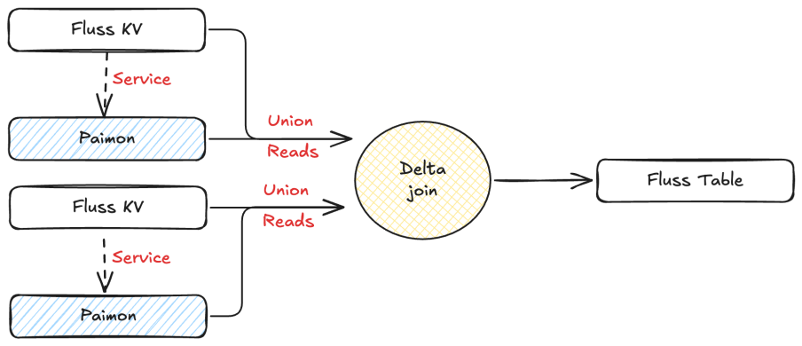


The jobs of Delta Join are as described above. The original job, after consuming data, sorts it according to business requirements, performs Dual-Stream Join after sorting, and saves the state for 24 hours. This results in issues such as long CP time, poor job maintainability, and the need to rerun when modifying the job state. In Fluss, data sorting is completed through the Merge Engine of the KV table, and through Delta Join, the job and state are decoupled, eliminating the need to rerun the state when modifying the job, making the state data queryable, and improving flexibility.

We use the transaction attribution job as an example. It should be noted that both sides of DeltaJoin need to be KV tables.

```SQL
-- Create left table
CREATE TABLE `fluss`.`sr_ds`.`dpv_versioned_merge`(
   pk              VARCHAR,
   user_name       VARCHAR,
   item_id         VARCHAR,
   step_no         VARCHAR,
   event_time      BIGINT,
   dt              VARCHAR,
   PRIMARY KEY (user_name,item_id,step_no,dt) NOT ENFORCED
) PARTITIONED BY (dt) WITH (
    'bucket.num' = '512' ,
    'bucket.key' = 'user_name,item_id',
    'table.auto-partition.enabled' = 'true',
    'table.auto-partition.time-unit' = 'day',
    'table.merge-engine'='versioned', -- Take the last piece of data
    'table.merge-engine.versioned.ver-column' = 'event_time', -- Sort field
    'table.auto-partition.num-precreate' = '2',
    'table.auto-partition.num-retention' = '2',
    'table.log.arrow.compression.type' = 'ZSTD'
);

-- Create right table
CREATE TABLE `fluss`.`sr_ds`.`deal_kv` (
  pk               VARCHAR,
  user_name        VARCHAR,
  item_id          VARCHAR,
  event_time       bigint,
  dt               VARCHAR,
  PRIMARY KEY (user_name,item_id,pk,dt) NOT ENFORCED
) PARTITIONED BY (dt) WITH (
  'bucket.num' = '48',
    'bucket.key' = 'user_name,item_id',
    'table.auto-partition.enabled' = 'true',
    'table.auto-partition.time-unit' = 'day',
    'table.merge-engine' = 'first_row',
    'table.auto-partition.num-precreate' = '2',
    'table.auto-partition.num-retention' = '2',
    'table.log.arrow.compression.type' = 'ZSTD'
);

-- Join logic
select * from dpv_versioned_merge t1
join
select * from deal_kv t2
  on t1.dt = t2.dt 
  and t1.user_name = t2.user_name 
  and t1.item_id = t2.item_id;
```

Some operations are shown in the above code. After migrating from the Dual-Stream Join to Merge Engine & Delta Join, large states were successfully reduced, making the job run more stably and eliminating CP timeouts. Meanwhile, the actual usage of CPU and Memory also decreased.


In addition to resource reduction and performance improvement, there is also an enhancement in flexibility for our benefits. The state of traditional stream-to-stream connections is tightly coupled with Flink jobs, like an opaque "black box". When the job is modified, it is found that the historical resource plan is incompatible with the current job, and the State can only be rerun from scratch, which is time-consuming and labor-intensive. After using Delta Join, it is equivalent to decoupling the state from the job, so modifying the job does not require rerunning the State. Moreover, all data is stored in Fluss, making it queryable and analyzable, thus improving business flexibility and development efficiency.


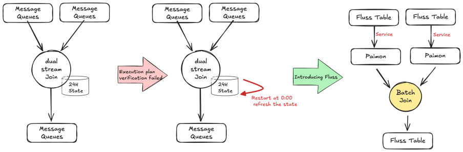


Meanwhile, Fluss maintains a Tiering Service to synchronize Fluss data to Paimon, with the latest data stored in Fluss and historical data in Paimon. Flink can support Union Read, which combines the data in Fluss and Paimon to achieve second-level freshness analysis.


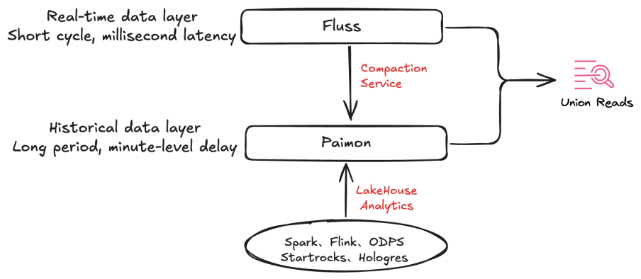


In addition, Data Join also addresses the scenario of backtracking data. In the case of Dual-Stream Join, if a job modification causes the Operating Plan verification to fail, only data backfilling can be performed. During the Fluss backtracking process, the Paimon table archived by the unified lake-stream architecture combined with Flink Batch Join can be used to accelerate data backfilling.

#### Lake-Stream Evolution

Fluss provides high compatibility with Data lake warehouses. Through the underlying service, it automatically converts Fluss data into Paimon format data, enabling real-time data to be ingested into the lake with a single click, while ensuring consistent data partitioning and bucketing on both the lake and stream sides.


After having **lake** and **stream** two levels of data, Fluss has the key characteristic of sharing data. Paimon stores long-period, minute-level latency data; Fluss stores short-period, millisecond-level latency data, and the data of both can be shared with each other.

When performing Fluss stream reads, Paimon can provide efficient backtracking capabilities as historical data. After backtracking to the current checkpoint, the system will automatically switch to stream storage to continue reading and ensure that no duplicate data is read. In batch query analysis, Fluss stream storage can supplement Paimon with real-time data, thereby enabling analysis with second-level freshness. This feature is called Union Read.

## Benefits and Summary

After a period of in-depth research, comprehensive testing, and smooth launch of Fluss, we successfully completed the evolution of the technical architecture based on Fluss as a solution. Among them, we conducted comprehensive tests on core capabilities such as Fluss column pruning and Delta Join to ensure the stability and performance of the solution met the standards.

### Performance Test

#### Read and Write Performance

We tested the read-write and column pruning capabilities of Fluss. Among them, in terms of read-write performance, we conducted tests with the same traffic. While maintaining the input **RPS at 800 w/s** and the output **RPS at 44 w/s** , we compared the actual CPU and Memory usage of Flink jobs. The details are as follows:

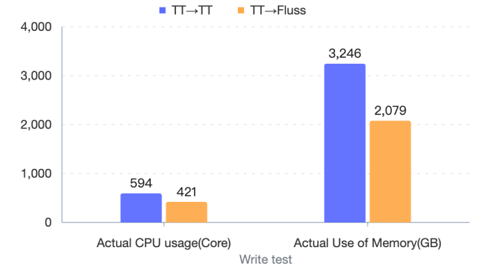


#### Column Pruning Performance

Regarding column pruning capabilities, we also tested TT, Fluss, and different numbers of columns in Fluss to explore the consumption of CPU, Memory, and IO. With the input **RPS maintained at 25 w/s**, the specific test results are as follows:


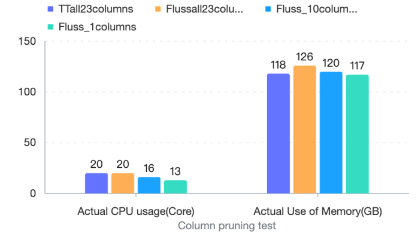

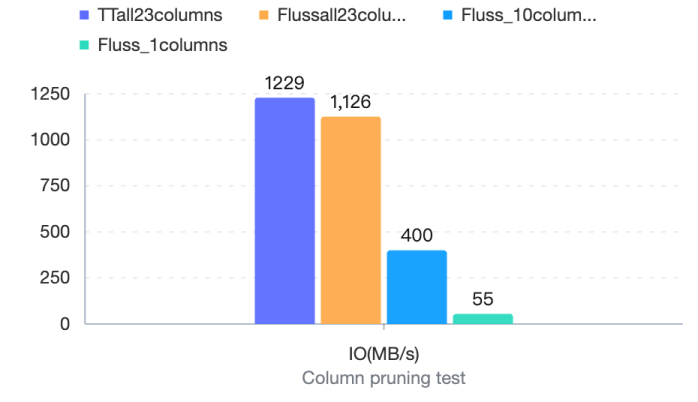


At this point, we will find a problem: as the number of columns decreases (a total of 13 columns out of 43 columns are consumed), IO does not show a linear decrease. After verification, the storage of each column in the source is not evenly distributed, and the storage of some required columns **accounts for 72%** . It can be seen that the input IO traffic **decreases by 20%** , which is consistent with the expected proportion of the storage of the read columns.

#### Delta Join Performance

We also tested and compared the resources and performance of the above **Dual-Stream Join and Fluss Delta Join** , and under the condition of maintaining the **input RPS of the left table at 68,000/s** and the **input RPS of the right table at 1,700/s** , all jobs ran for 24 hours.


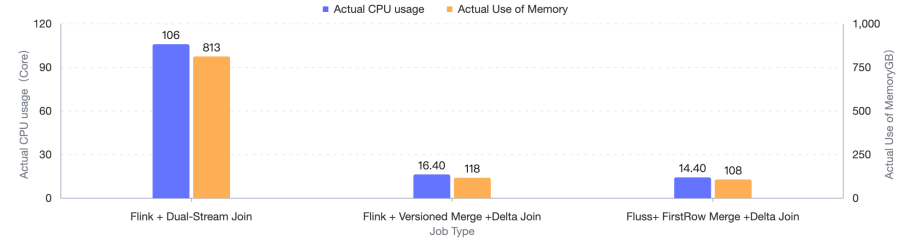

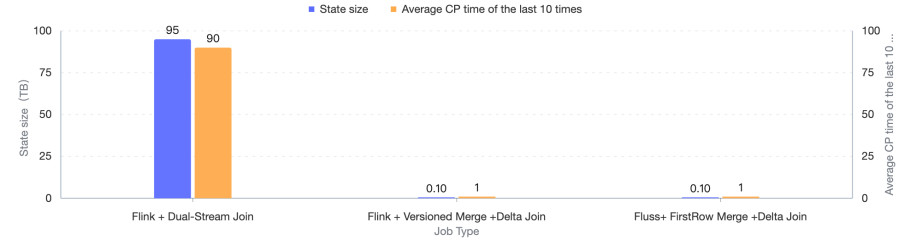


After actual testing, after migrating from the Dual-Stream Join to Merge Engine + Delta Join, it successfully **reduced 95TB** of large state, making the job run more stably and significantly shortening the CP time. Meanwhile, the actual usage of CPU and Memory also **decreased by more than 80%** .

#### Data Backfilling Performance

Since Delta Join **does not need to maintain state** , it can use batch mode **Batch Join** to catch up. After catching up, it switches back to stream mode Delta Join. During this process, a small amount of data will be reprocessed, and the end-to-end consistency is ensured through the idempotence update mechanism of the result table. We **performed a test comparison on the data catch-up of the above** Dual-Stream Join and Batch Join **for one day (24H).**


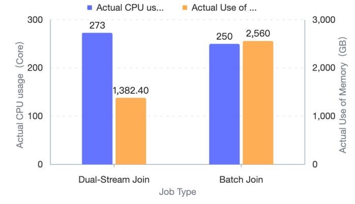

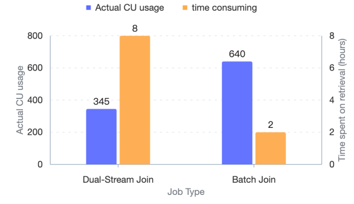


After actual testing, the batch mode Batch Join backtracking for one day (24H) takes **70%+ less time** compared to the Dual-Stream Join backtracking.

### Summary

Fluss has core features such as columnar pruning, streaming updates, real-time point queries, and lake-stream integration. At the same time, it innovatively integrates columnar storage format and real-time update capabilities into stream storage, and deeply integrates with Flink and Paimon to build a lake warehouse with high throughput, low latency, and low cost. Just as the original intention of Fluss: **Real-time stream storage for analytics.**

After nearly three months of exploration, Fluss has been implemented in **Taobao's core search and recommendation scenarios** , built a unified lake-stream A/B data warehouse, and continuously served internal business through Taobao's A/B Experiment Platform. In practical applications, the following results have been achieved:

- **Scenarios are widely implemented:** covering core Taobao business such as search and recommendation, and successfully passing the test of Taobao's 618 Grand Promotion **,** with peak traffic reaching tens of millions and average latency **within 1 second** .

- **Column Pruning Resource Optimization** : The column pruning feature has been implemented in all Fluss real-time jobs. When the consumption of columnar storage accounts for 75% of the source data, the average IO **is reduced by 25%** , and the average job resource consumption **is reduced by 30%** .

- **Big State job optimization:** Taking transaction attribution job as an example, the Delta Join & Merge Engine is applied to reconstruct the first and last attribution. State is externally implemented, and the actual usage of CPU and Memory is **reduced by 80% +** . The state of Flink is **decoupled** from the job, and the **100TB +** big state is successfully reduced, making the job more stable.

- **Data Profiling:** Implemented capabilities including message queue profiling and State profiling, supports query operators such as LIMIT and COUNT, achieved white-boxing of State for sorting and Dual-Stream Join, with higher flexibility and more efficient problem location.


## Planning


In the upcoming work, we will develop a new generation of lakehouse data architecture and continue to explore in Data & AI scenarios.

- **Scenario Inclusiveness:** In the second-level data warehouse, switch the whole-pipeline and all scenarios of the consumption message queue to the Fluss pipeline. Based on the Fluss lake-stream capabilities, provide corresponding Paimon minute-level data.

- **AI Empowerment:** Attempt to implement scenarios of MultiModal Machine Learning data pipelines, Agents, and model pre-training, and add AI-enhanced analytics.

- **Capability Exploration:** Explore more Fluss capabilities and empower business operations, optimizing more jobs through Fluss Aggregate Merge Engine and Partial Update capabilities.


## References

[1] [Fluss Official Documentation](https://fluss.apache.org/)

[2] [Fluss: Next-Generation Stream Storage Designed for Real-Time Analysis](https://mp.weixin.qq.com/s?__biz=MzU3Mzg4OTMyNQ==&mid=2247512207&idx=1&sn=e25320a020d7b20e25be8fd614e9f46b&chksm=fd383ecdca4fb7dbf9a37e9c3840699ba8b1b2c57868db028f995c3bc7bcf6a0340e396d87c4&scene=178&cur_album_id=3764887437743669257&search_click_id=#rd)
