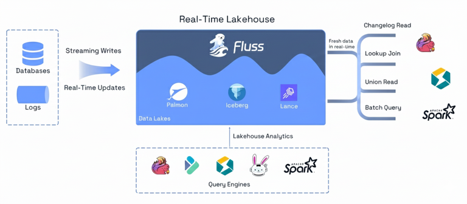
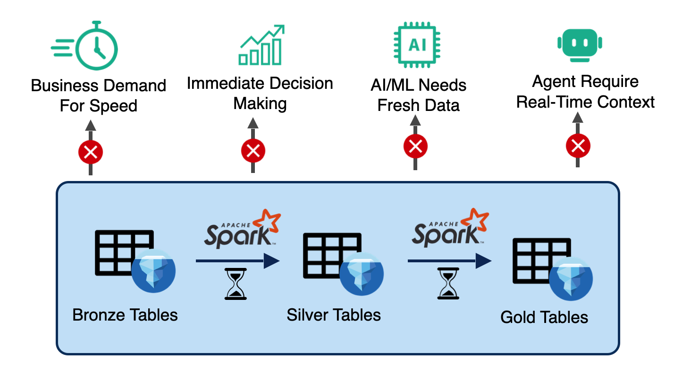
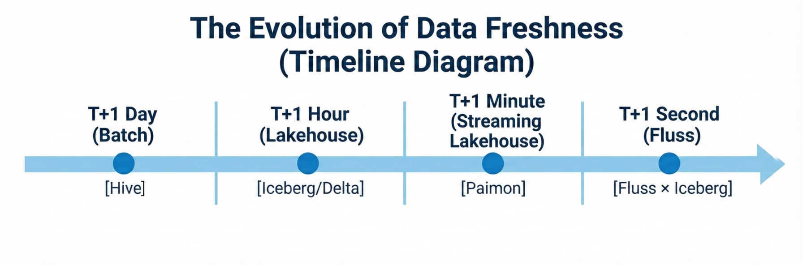
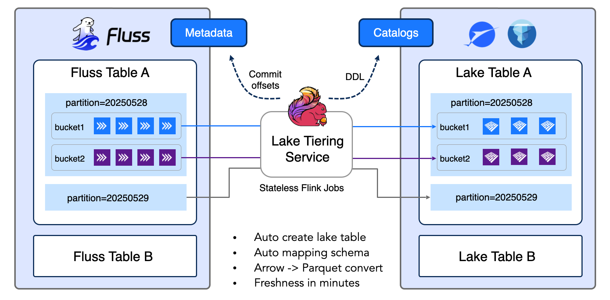
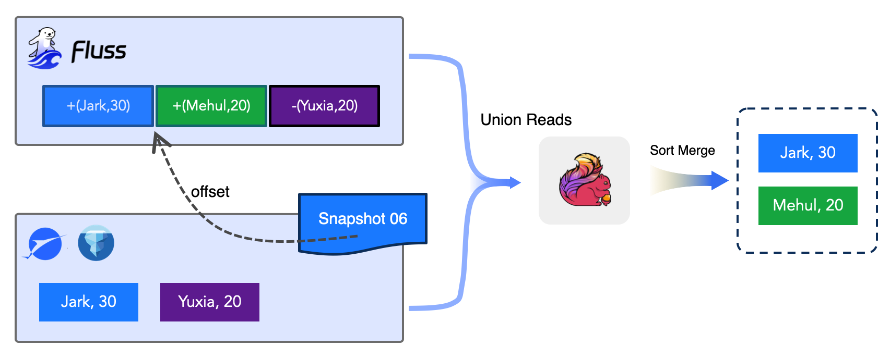
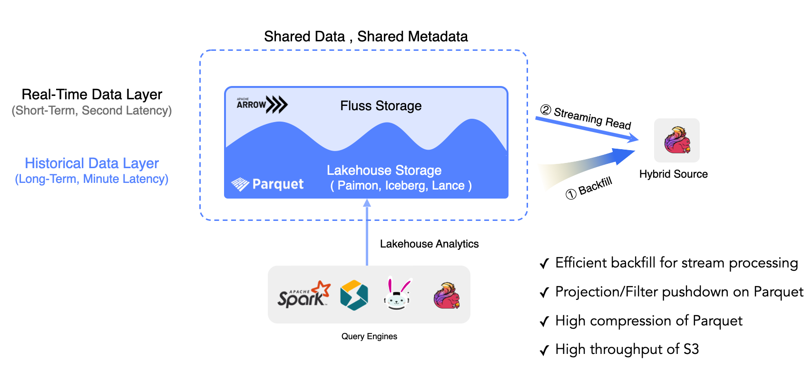
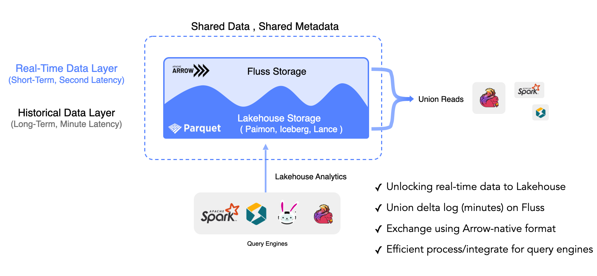

As software and data engineers, we've witnessed Apache Iceberg revolutionize analytical data lakes with ACID transactions, time travel, and schema evolution. Yet when we try to push Iceberg into real-time workloads such as sub-second streaming queries, high-frequency CDC updates, and primary key semantics, we hit fundamental architectural walls. This blog explores how Fluss × Iceberg integration works and delivers a true real-time lakehouse.

Apache Fluss represents a new architectural approach: the **Streamhouse** for real-time lakehouses. Instead of stitching together separate streaming and batch systems, the Streamhouse unifies them under a single architecture. In this model, Apache Iceberg continues to serve exactly the role it was designed for: a highly efficient, scalable cold storage layer for analytics, while Fluss fills the missing piece: a hot streaming storage layer with sub-second latency, columnar storage, and built-in primary-key semantics.

After working on Fluss–Iceberg lakehouse integration and deploying this architecture at a massive scale, including Alibaba's 3 PB production deployment processing 40 GB/s, we're ready to share the architectural lessons learned. Specifically, why existing systems fall short, how Fluss and Iceberg naturally complement each other, and what this means for finally building true real-time lakehouses.



<!-- truncate -->

## The Real-Time Lakehouse Imperative

### Why Real-Time Lakehouses Matter Now

Four converging forces are driving the need for sub-second data infrastructure:

**1. Business Demand for Speed:** Modern businesses operate in real-time. Pricing decisions, inventory management, and fraud detection all require immediate response. Batch-oriented systems with T+1 day or even T+1 hour latency can't keep up with operational tempo.

**2. Immediate Decision Making:** Operational analytics demands split-second insights. Manufacturing lines, delivery logistics, financial trading, and customer service all need to react to events as they happen, not hours or days later.

**3. AI/ML Needs Fresh Data:** Here's the critical insight: **You can't build the next TikTok recommender system on traditional lakehouses, which lack real-time streaming data for AI.** Modern AI applications—personalized recommendations, real-time content ranking, and dynamic ad placement—require continuous model inference on fresh data.

**4. Agentic AI Requires Real-Time Context:** AI agents need immediate access to the current system state to make decisions. Whether it's autonomous trading systems, intelligent routing agents, or customer service bots, agents can't operate effectively on stale data.



### The Evolution of Data Freshness

**Traditional Batch Era (T+1 day):** Hive-based data warehouses, daily ETL jobs run overnight, next-day readiness acceptable for reporting.

**Lakehouse Era (T+1 hour):** Modern lakehouse formats (Iceberg, Delta Lake, Hudi), hourly micro-batch processing, better for near-real-time dashboards.

**Streaming Lakehouse Era (T+1 minute):** Streaming integration with lakehouses (Paimon), minute-level freshness through continuous ingestion, suitable for operational analytics.

**The Critical Gap - Second-Level Latency:** File-system-based lakehouses inherently face minute-level latency as their practical upper limit. This isn't a limitation of specific implementations; it's fundamental. File commits, metadata operations, and object storage consistency guarantees create unavoidable overhead.

Yet critical use cases demand sub-second to second-level latency: search and recommendation systems with real-time personalization, advertisement attribution tracking, anomaly detection for fraud and security monitoring, operational intelligence for manufacturing/logistics/ride-sharing, and Gen AI model inference requiring up-to-the-second features. The industry needs a **hot real-time layer** sitting in front of the lakehouse.


## What is Fluss × Iceberg?

### The Core Concept: Hot/Cold Unified Storage

The Fluss architecture delivers millisecond-level end-to-end latency for real-time data writing and reading. Its **Tiering Service** continuously offloads data into standard lakehouse formats like Apache Iceberg, enabling external query engines to analyze data directly. This streaming/lakehouse unification simplifies the ecosystem, ensures data freshness for critical use cases, and combines real-time and historical data seamlessly for comprehensive analytics.

**Unified Data Locality:** Fluss aligns partitions and buckets across both streaming and lakehouse layers, ensuring consistent data layout. This alignment enables direct Arrow-to-Parquet conversion without network shuffling or repartitioning, dramatically reducing I/O overhead and improving pipeline performance.
Think of your data as having two thermal zones:

**Hot Tier (Fluss):** Last 1 hour of data, NVMe/SSD storage, sub-second latency, primary key indexed (RocksDB), streaming APIs, Apache Arrow columnar format. High-velocity writes, frequent updates, sub-second query latency requirements.

**Cold Tier (Iceberg):** Historical data (hours to years), S3/HDFS object storage, minute-level latency, Parquet columnar format, ACID transactions, analytical query engines. Infrequent updates, optimized for analytical scans, stored cost-efficiently.

Traditional architectures force you to maintain **separate systems** for these zones: Kafka/Kinesis for streaming (hot), Iceberg for analytics (cold), complex ETL pipelines to move data between them, and applications writing to both systems (dual-write problem).


**Fluss × Iceberg unifies these as tiered storage with Kappa architecture:** Applications write once to Fluss. A stateless Tiering Service (Flink job) automatically moves data from hot to cold storage based on configured freshness (e.g., 30 seconds, 5 minutes). Query engines see a single table that seamlessly spans both tiers—eliminating the dual-write complexity of Lambda architecture.


### Why This Architecture Matters

**Single write path:** Your application writes to Fluss. Period. No dual-write coordination, no consistency headaches across disconnected systems.

**Automatic lifecycle management:** Data naturally flows from hot → cold based on access patterns and configured retention. Freshness is configurable in minutes via table properties.

**Auto Table creation:** Support both append & primary key table, with mapping schema and unified data locality via partitioning.

**Auto Table Maintenance:** Enable with a single flag (table.datalake.auto-maintenance=true). The tiering service automatically detects small files during writes, applies bin-packing compaction to merge them into optimal sizes.

**Query flexibility:** Run streaming queries on hot data (Fluss), analytical queries on cold data (Iceberg), or union queries that transparently span both tiers.



## What Iceberg Misses Today

Apache Iceberg was architected for batch-optimized analytics. While it supports streaming ingestion, fundamental design decisions create unavoidable limitations for real-time workloads.

### Gap 1: Metadata Overhead Limits Write Frequency

Every Iceberg commit rewrites `metadata.json` and manifest list files. For analytics with commits every 5-15 minutes, this overhead is negligible. For streaming with high-frequency commits, it becomes a bottleneck.

**The Math:** Consider a streaming table with 100 events/second, committing every second:
- Each commit adds a manifest list entry
- After 1 hour: **3,600 manifest lists**
- After 1 day: **86,400 manifest lists**
- `metadata.json` grows to megabytes
- Individual commit latency stretches to multiple seconds

**Compounding Factor:** The problem compounds with partitioning. A 128-partition table with per-partition commits can generate thousands of metadata operations per second. **Metadata becomes the bottleneck, not data throughput.**

**Real-World Evidence - Snowflake's acknowledgment:** Their Iceberg streaming documentation explicitly warns about this, setting `MAX_CLIENT_LAG` defaults to 30 seconds (versus 1 second for native tables). The metadata overhead makes sub-second latency impractical.

### Gap 2: Polling-Based Reads Create Latency Multiplication

Iceberg doesn't have a push-based notification system. Streaming readers poll for new snapshots.

**Latency Breakdown:**
```
1. Writer commits snapshot              → 0ms
2. Metadata hits S3 (eventual consistency) → 0-5,000ms
3. Reader polls (5-10s interval)        → 5,000-10,000ms
4. Reader discovers snapshot            → 5,000-15,000ms
5. Reader fetches data files from S3    → 5,100-15,500ms
   ────────────────────────────────────────────────────
   Total end-to-end latency: 5+ to 15+ seconds
```

Compare this to a push model where producers write and consumers immediately receive notifications. End-to-end latency drops to **single-digit milliseconds**.

For real-time dashboards, fraud detection, or operational analytics requiring sub-second freshness, this polling latency is a non-starter.

### Gap 3: Primary Key Support Is Declarative, Not Enforced

Iceberg V2 tables accept PRIMARY KEY declarations in DDL:

```sql
CREATE TABLE users (
  user_id BIGINT,
  email STRING,
  created_at TIMESTAMP,
  PRIMARY KEY (user_id)  -- This is a hint, not a constraint
);
```

However, Iceberg **does not enforce** primary keys:
- ❌ No uniqueness validation on write
- ❌ No built-in deduplication
- ❌ No indexed lookups (point queries scan entire table)

**The Consequence:** For CDC workloads, you must implement deduplication logic in your streaming application (typically using Flink state). For tables with billions of rows, this state becomes enormous—**50-100+ TB in production scenarios**.

### Gap 4: High-Frequency Updates Create Write Amplification

Iceberg supports updates via Merge-On-Read (MOR) with delete files:

**Equality deletes:** Store all column values for deleted rows. For CDC updates (`-U` records), this means writing full row content to delete files before writing the updated version. For wide tables (50+ columns), this **doubles the write volume**.

**Position deletes:** More efficient but require maintaining file-level position mappings. For streaming updates scattered across many files, position deletes proliferate rapidly.

**The Small File Problem:** Streaming workloads naturally create many small files. Production teams report cases where **500 MB of CDC data exploded into 2 million small files** before compaction, slowing queries by **10-100x**.

## How Fluss Fills These Gaps

### Solution 1: Log-Indexed Streaming Storage with Push-Based Reads

**Addresses:** Gap 1 (Metadata Overhead) & Gap 2 (Polling-Based Reads)

Fluss reimagines streaming storage using **Apache Arrow IPC columnar format** with **Apache Kafka's battle-tested replication protocol**.

**How it solves metadata overhead:**

Iceberg's metadata bottleneck occurs when you commit frequently. Fluss sidesteps this entirely:

1. **High-frequency writes go to Fluss**—append-only log segments with no global metadata coordination
2. **Iceberg receives batched commits**—the tiering service aggregates minutes of data into single, well-formed Parquet files
3. **Configurable freshness**—`table.datalake.freshness = '1min'` means Iceberg sees ~1 commit per minute, not thousands

**Result:** Iceberg operates exactly as designed: periodic batch commits with clean manifest evolution. The streaming complexity stays in Fluss.

**How it solves polling latency:**

- **Push-based real-time:** Consumers receive millisecond-latency push notifications when new data arrives. No polling intervals.
- **End-to-end latency:** Sub-second, typically single-digit milliseconds
- Real-time queries hit Fluss directly; they don't wait for Iceberg snapshots

### Solution 2: Primary Key Tables with Native Upsert Support

**Addresses:** Gap 3 (Primary Key Not Enforced) & Gap 4 (Update Write Amplification)

Fluss provides first-class primary key semantics using an LSM tree architecture:

```
┌─────────────────────────────────────────────────┐
│ Primary Key Table (e.g., inventory)             │
├─────────────────────────────────────────────────┤
│ KV Tablet (RocksDB - current state):            │
│ ┌─────────────────────────────────────┐         │
│ │ sku_id=101 → {quantity: 50, ...}    │         │
│ │ sku_id=102 → {quantity: 23, ...}    │         │
│ └─────────────────────────────────────┘         │
│                                                 │
│ Log Tablet (changelog - replicated 3x):         │
│ ┌─────────────────────────────────────┐         │
│ │ +I[101, 100, ...]  // Insert        │         │
│ │ -U[101, 100, ...] +U[101, 50, ...]  │ Update  │
│ │ -D[102, 23, ...]   // Delete        │         │
│ └─────────────────────────────────────┘         │
│                                                 │
│ Features:                                       │
│ - Enforced uniqueness (PK constraint)           │
│ - 500K+ QPS point queries (RocksDB index)       │
│ - Pre-deduplicated changelog (CDC)              │
│ - Read-your-writes consistency                  │
│ - Changelog Read for streaming consumers        │
│ - Lookup Join for dimensional enrichment        │
└─────────────────────────────────────────────────┘
```

**How it works:**

When you write to a primary key table, Fluss:

1. Reads current value from RocksDB (if exists)
2. Determines change type: `+I` (insert), `-U/+U` (update), `-D` (delete)
3. Appends changelog to replicated log tablet (WAL)
4. Waits for log commit (high watermark)
5. Flushes to RocksDB
6. Acknowledges client

**Guarantees:** Read-your-writes consistency—if you see a change in the log, you can query it. If you see a record in the table, its change exists in the changelog.

**Critical Capabilities:**

- **Point queries by primary key** use RocksDB index, achieving **500,000+ QPS on single tables** in production
- This replaces external KV stores (Redis, DynamoDB) for dimension table serving
- **CDC without deduplication:** The changelog is already deduplicated at write time
- Downstream Flink consumers read pre-processed CDC events with **no additional state required**

**Tiering Primary Key Tables to Iceberg:**

When tiering PK tables, Fluss:
1. First writes the snapshot (no delete files)
2. Then writes changelog records
3. For changelog entries (`-D` or `-U` records), Fluss writes equality-delete files containing all column values

This design enables Iceberg data to serve as Fluss changelog—complete records can be reconstructed from equality-delete entries for downstream consumption.

### Solution 3: Unified Ingestion with Automatic Tiering

**Addresses:** All gaps by offloading real-time complexity from Iceberg

**Architecture Flow:**

```
Application
    │
    ├─→ Fluss Table (single write)
         │
         ├─→ Real-time consumers (Flink, StarRocks, etc.)
         │   - Sub-second latency
         │   - Column-projected streaming reads
         │   - Primary key lookups
         │
         └─→ Tiering Service (Flink job, automatic)
              └─→ Apache Iceberg
                  - Parquet files
                  - Atomic commits
                  - Historical analytics
```

**Tiering Service Architecture:**

Stateless Flink jobs: Multiple jobs register with the Fluss Coordinator Server. The coordinator assigns tables to jobs via an in-memory queue. Each job processes one table at a time, commits results, and requests the next table.

**Key Capabilities:**

- **Auto-create lake table:** Automatically provisions the corresponding Iceberg table
- **Handles both table types seamlessly:** append-only Log Tables for event streams and Primary Key Tables with full upsert/delete support
- **Auto mapping schema:** Translates Fluss schema to Iceberg schema with system columns
- **Arrow → Parquet conversion:** Transforms columnar Arrow batches to Parquet format
- **Freshness in minutes:** Configurable via `table.datalake.freshness` property

**Benefits:**

- **Elastic scaling:** Deploy 3 jobs for 3x throughput, stop idle jobs to reclaim resources
- **No single point of failure:** Job failure doesn't block all tables
- **Load balancing:** Automatic distribution based on sync lag

**Integrated Compaction:**

While tiering data, the service optionally performs bin-packing compaction:
1. Scans manifests to identify small files in the current bucket
2. Schedules background rewrite (small files → large files)
3. Waits for compaction before committing
4. Produces atomic snapshot: new data files + compacted files

**Configuration:** `table.datalake.auto-maintenance=true`

**Result:** Streaming workloads avoid small file proliferation without separate maintenance jobs.

### Solution 4: Union Read for Seamless Query Across Tiers

**Enables:** Querying hot + cold data as a single logical table

The architectural breakthrough enabling a real-time lakehouse is **client-side stitching with metadata coordination**. This is what makes Fluss truly a **Streaming Lakehouse**—unlocking real-time data to the Lakehouse with union delta log (minutes) on Fluss.

### How Union Read Works



Union Read seamlessly combines hot and cold data through intelligent offset coordination, as illustrated above:

**The Example:** Consider a query that needs records for users Jark, Mehul, and Yuxia:

1. **Offset Coordination:** Fluss CoordinatorServer provides Snapshot 06 as the Iceberg boundary. At this snapshot, Iceberg contains `{Jark: 30, Yuxia: 20}`.

2. **Hot Data Supplement:** Fluss's real-time layer holds the latest updates beyond the snapshot: `{Jark: 30, Mehul: 20, Yuxia: 20}` (including Mehul's new record).

3. **Union Read in Action:** The query engine performs a union read:
    - Reads `{Jark: 30, Yuxia: 20}` from Iceberg (Snapshot 06)
    - Supplements with `{Mehul: 20}` from Fluss (new data after the snapshot)

4. **Sort Merge:** Results are merged and deduplicated, producing the final unified view: `{Jark: 30, Mehul: 20}` (Yuxia's update already in Iceberg).

**Key Benefit:** The application queries a single logical table while the system intelligently routes between Iceberg (historical) and Fluss (real-time) with zero gaps or overlaps.

**Union Read Capabilities:**

- **Query both Historical & Real-time Data:** Seamlessly access cold and hot tiers
- **Exchange using Arrow-native format:** Efficient data transfer between tiers
- **Efficient process/integration for query engines:** Optimized for Flink, StarRocks, Spark

**SQL Syntax (Apache Flink):**

```sql
-- Automatic union read (default behavior)
SELECT * FROM orders WHERE event_time > NOW() - INTERVAL '1' HOUR;
-- Seamlessly reads: Iceberg (historical) + Fluss (real-time)

-- Explicit cold-only read (Iceberg only)
SELECT * FROM orders$lake WHERE order_date < CURRENT_DATE;
```

**Consistency Guarantees:**

The tiering service embeds Fluss offset metadata in Iceberg snapshot summaries:

```json
{
  "commit-user": "__fluss_lake_tiering",
  "fluss-bucket-offset": "[{0: 5000}, {1: 5123}, {2: 5087}, ...]"
}
```
Fluss coordinator persists this mapping. When clients query, they receive the exact offset boundary. Union read logic ensures:

- **No overlaps:** Iceberg handles offsets ≤ boundary
- **No gaps:** Fluss handles offsets > boundary
- **Total ordering preserved** per bucket


## Architecture Benefits

### Cost-Efficient Historical Storage


Automatic tiering optimizes storage and analytics: efficient backfill, projection/filter pushdown, high Parquet compression, and S3 throughput.

### Real-Time Analytics


Union Read delivers sub-second lakehouse freshness: union delta log on Fluss, Arrow-native exchange, and seamless integration with Flink, Spark *, Trino, and StarRocks.


### Key Takeaways

**Single write, two read modes:** Write once to Fluss. Query two ways: $lake suffix for cost-efficient historical batch analysis, or default (no suffix) for unified view with second-level freshness.

**Automatic data movement:** Data automatically tiers from Fluss → Iceberg after configured time (e.g., 1 minute). No manual ETL jobs or data pipelines to maintain. Configurable freshness per table.

**Unified table abstraction:** Applications see a single logical table. Query engine transparently routes to appropriate tier(s). Offset-based coordination ensures no gaps or duplicates.

## Getting Started

This gives you a working streaming lakehouse environment in minutes. Visit: [https://fluss.apache.org/docs/quickstart/lakehouse/](https://fluss.apache.org/docs/quickstart/lakehouse/)

## Conclusion: The Path Forward

Apache Fluss and Apache Iceberg represent a fundamental rethinking of real-time lakehouse architecture. Instead of forcing Iceberg to become a streaming platform (which it was never designed to be), Fluss embraces Iceberg for its strengths—cost-efficient analytical storage with ACID guarantees—while adding the missing hot streaming layer.

The result is a Streamhouse that delivers:

- **Sub-second query latency** for real-time workloads
- **Second-level freshness** for analytical queries (versus T+1 hour)
- **80% cost reduction** by eliminating data duplication and system complexity
- **Single write path** ending dual-write consistency problems
- **Automatic lifecycle management** from hot to cold tiers

For software/data engineers building real-time analytics platforms, the question isn't whether to use Fluss or Iceberg—it's recognizing they solve complementary problems. Fluss handles what happens in the last hour (streaming, updates, real-time queries). Iceberg handles everything before that (historical analytics, ML training, compliance).

### When to Adopt

**Strong signals you need Fluss:**

- Requirement for sub-second query latency on streaming data
- High-frequency CDC workloads (100+ updates/second per key)
- Need for primary key semantics with indexed lookups
- Large Flink stateful jobs (10TB+ state) that could be externalized
- Desire to unify real-time and historical queries
- Tired of maintaining dual infrastructure one for batch, another for real-time

### Next Steps

1. **Explore the documentation:** [fluss.apache.org](https://fluss.apache.org)
2. **Review FIP-3:** Detailed Iceberg integration specification
3. **Try the quickstart:** Deploy locally with Docker Compose
4. **Join the community:** Apache Fluss mailing lists, Slack, and GitHub
5. **Evaluate Iceberg integration:** Production-ready today, same architectural patterns

---

We've covered **what** Fluss × Iceberg is and **how** it works the architecture eliminates dual-write complexity, delivers sub-second freshness, and unifies streaming and batch under a single table abstraction.

But here's the elephant in the room: **Apache Kafka dominates event streaming. Tableflow handles Kafka-to-Iceberg materialization. Why introduce another system?**

**Stay tuned for Part 2 as it tackles this question head-on** by comparing Fluss with existing technologies.
