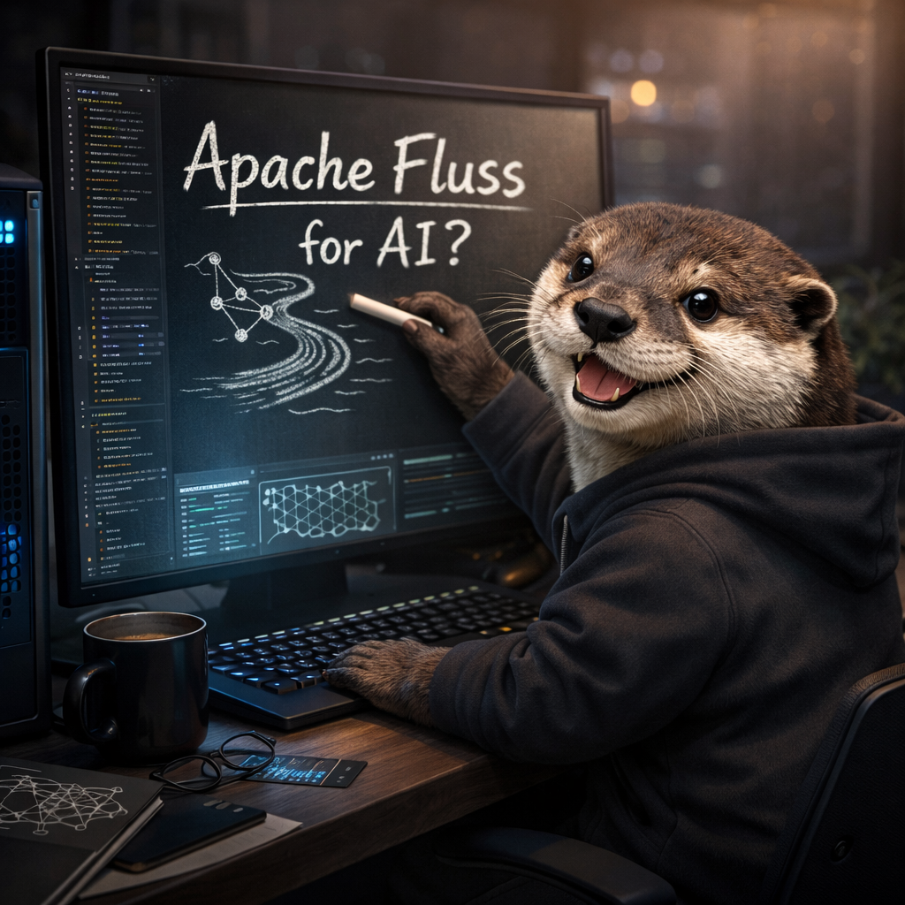
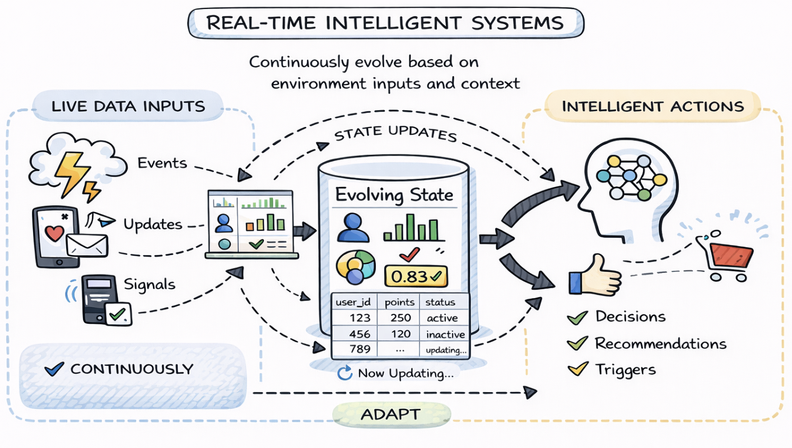
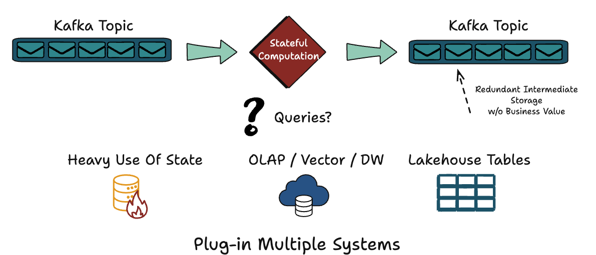
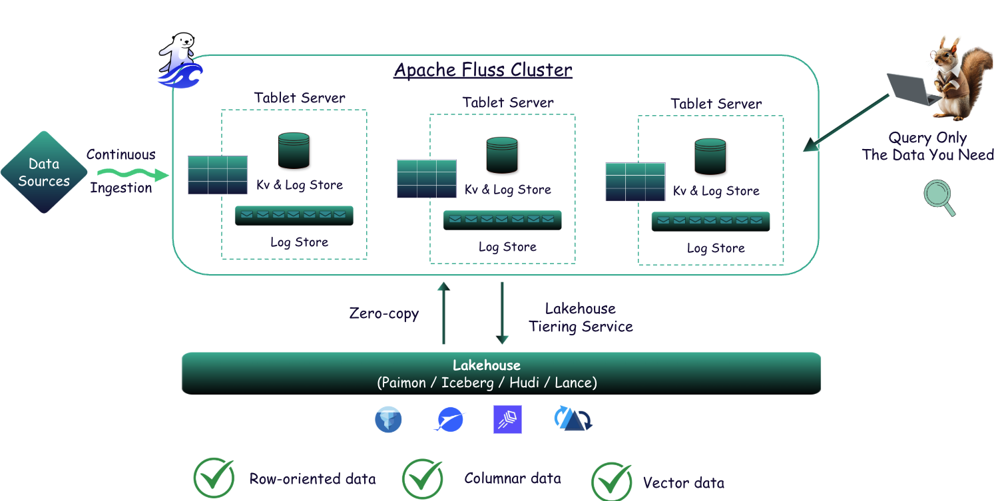
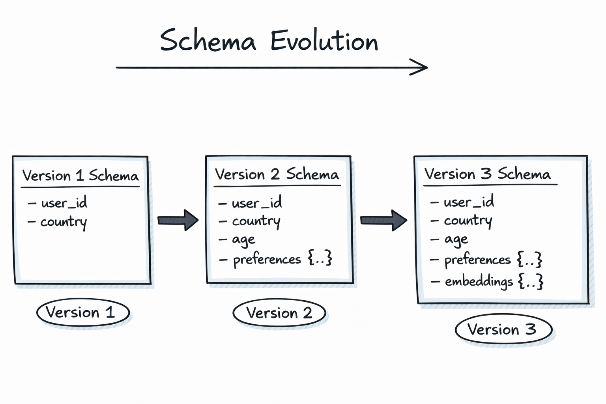
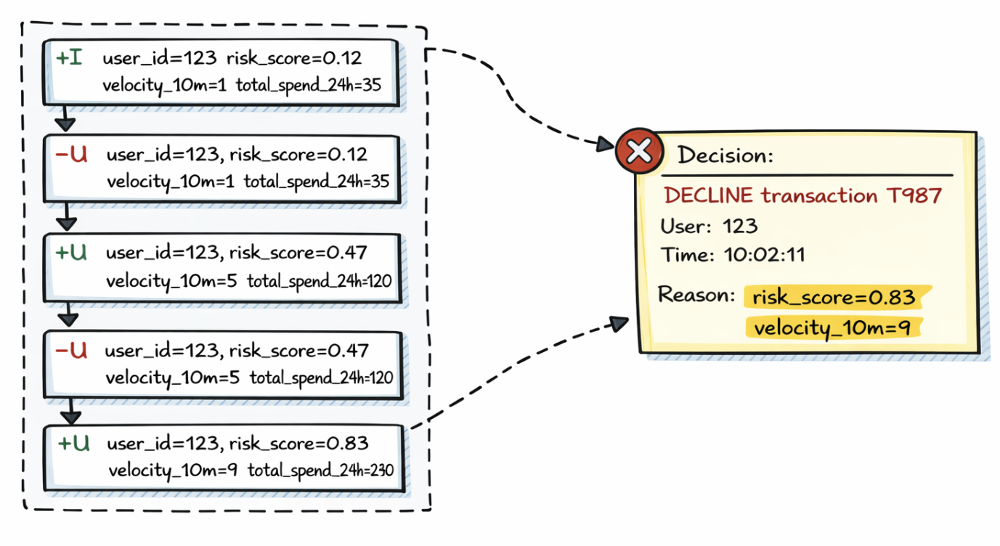

### The Data Foundation for Real-Time Intelligent Systems

**Apache Fluss (Incubating) started as streaming storage for real-time analytics**, built to work closely with stream processors like Apache Flink. 
Its focus has always been on freshness, efficient analytical access, and continuous data, making fast-changing streams directly usable without forcing them 
through batch-oriented systems or log-only pipelines.

Over the last year, Fluss has expanded beyond this original framing. You’ll now see it described as streaming storage for **real-time analytics and AI**. This change reflects how data systems are being used today: more workloads depend on continuously updated data, low-latency access to evolving state, and the ability to reason over context as it changes.

In this context, “AI” does not mean training or serving models inside Fluss. It refers to the class of intelligent systems that rely on fresh features, evolving context, and real-time state to make decisions continuously. Whether those systems use traditional machine learning models, newer AI techniques, or a combination of both, they all depend on the same data foundations.

This shift explains the recent evolution of Apache Fluss. Investments in stateless compute, richer data types with zero-copy schema evolution, and vector support through Lance were driven by a single question: 

> What does a data foundation need to look like to support real-time intelligent systems reliably at scale?

The rest of this post answers that question. We’ll explain what AI means when viewed through the lens of Apache Fluss, and why a streaming-first foundation for features, context, and state is central to building the next generation of intelligent systems.
<!-- truncate -->

### What We Mean by “Real-Time Intelligent Systems”
In this post, when we talk about real-time intelligent systems, we are not referring to a specific class of models or a particular AI technique. We are describing a category of systems defined by how they behave over time and how they interact with data that is constantly changing.

At a minimum, these systems continuously ingest live data: events, updates, interactions, signals, from the world around them. The data never really “stops,” and the system is expected to keep up, processing information as it arrives rather than waiting for periodic batch windows.



They also maintain state that evolves over time. This state might represent user profiles, counters, risk scores, preferences, embeddings, or derived features. Crucially, this state is not static; it is updated incrementally as new data arrives and as past information becomes less relevant or is refined.

On top of that, real-time intelligent systems make decisions repeatedly, not once per day or once per job run. They score, rank, filter, recommend, or trigger actions continuously, and their outputs are expected to adapt as conditions change. The feedback loop between data, state, and decisions is tight and ongoing.

From the perspective of a streaming storage system, this framing matters. The intelligence may come from ML models, rules, LLMs, or agents, but the system itself is fundamentally about data plus state over time. Fresh data, historical context, and continuously updated state are the real inputs and enabling that combination efficiently is where the data foundation becomes critical.

### Where Fluss Came From: Streaming Storage for Real-Time Analytics
To understand why Apache Fluss is evolving in the direction it is today, it helps to look at the architecture patterns it was originally designed to address. Traditional streaming systems were excellent at moving events quickly, but far less effective at making those events easily queryable once they were in motion.

A common architecture emerged as a result: producers write to Kafka, stream processors like Flink consume and process the data, state lives inside the compute layer, and results are pushed out to multiple downstream systems. Analytical queries usually happen later, against an OLAP system or a lakehouse populated asynchronously.

Over time, this led to a familiar but complex stack. Kafka handled transport, Flink handled computation, an operational database stored the latest state, an OLAP engine supported analytics, and a lakehouse stored historical data. Each component solved a real problem, but the same data had to be copied, transformed, and re-ingested at every layer.




This duplication came at a cost. Pipelines became harder to reason about, data freshness varied across systems, and infrastructure costs grew as every
layer maintained its own storage and indexing strategy. Querying **what’s happening now** often meant stitching together multiple systems that were never designed to work as a single whole.

Apache Fluss started as a response to this fragmentation. The core idea was to ingest streaming data once, store it durably, and make it directly queryable in near real time using analytical access patterns. Instead of treating streams as transient transport, Fluss treats them as a durable dataset, one that can serve both continuous processing and real-time analytics without constant data movement.


### The Last Year: Three Big Investments That Changed What Fluss Can Be
Apache Fluss is an open-source project, and its evolution over the last year reflects very deliberate architectural choices rather than a collection of disconnected features. The work we invested in during this period was guided by a single question:
> What kind of data foundation is needed for systems that are continuous, stateful, and expected to evolve over time?

Those investments converged around three major areas. Each one addressed a recurring limitation we observed in real-world streaming architectures, and each one pushed Fluss beyond its original role as “just” streaming storage for real-time analytics. Together, they define the next stage of what Fluss can support.

The first investment focused on how compute and state interact. The second addressed how real systems evolve at the data model level. The third extended Fluss into the vector domain, which has become foundational for many intelligent workloads. While these areas may seem independent at first glance, they reinforce each other at the system level.

Importantly, these changes also influenced how Fluss fits into the broader lakehouse ecosystem. We strengthened its role as a durable, queryable layer that can interoperate with engines like Flink, Spark, DuckDB and soon more; and integrate cleanly with open table formats such as Apache Iceberg, Paimon, and Lance, rather than sitting outside the lakehouse as a special-purpose system.

What follows is a closer look at each of these investments, why they matter individually, and how they collectively move Fluss toward becoming a long-term foundation for real-time intelligent systems.

#### Stateless Compute (Zero-State Streaming)
One of the clearest directions in modern streaming architectures is the separation of compute and state. Over the last year, we invested heavily in stateless stream processing, driven by the idea that **compute should be lightweight and replaceable, while state should be durable and externalized**.

In many traditional streaming systems, state lives inside the stream processor itself. This tightly couples long-lived state with the compute runtime, making recovery slow, scaling expensive, and operational complexity high. Restarting or resizing a job often means rebuilding large amounts of state before the system becomes useful again.

With stateless compute, stream processors focus purely on processing, while durable state is managed externally in Fluss. Compute becomes disposable, while state remains stable and queryable, independent of any single job or runtime.

This separation enables faster recovery, elastic scaling, and significantly simpler operations. It also leads to stronger RTO and RPO characteristics for stateful pipelines, because state is no longer trapped inside ephemeral compute containers.

For real-time intelligent systems, this matters deeply. These systems are continuous by nature and depend on ever-evolving state. Making compute stateless allows teams to evolve logic, scale workloads, and recover from failures without destabilizing the intelligence built on top of that state.

You can find out more [here](https://www.ververica.com/blog/introducing-the-era-of-zero-state-streaming-joins?hs_preview=cdhHvcIE-199898654106).

#### Complex Data Types and Zero-Copy Schema Evolution
Real systems do not stand still, and neither do their data models. Over time, new fields are added, existing structures become more nested, and records that started simple accumulate richer context. If schema evolution is painful, innovation slows or technical debt piles up.

To address this, we invested in support for complex data types and zero-copy schema evolution. This allows Fluss to handle rich, nested structures without forcing users to flatten their data or redesign pipelines every time requirements change.



Zero-copy schema evolution means schemas can evolve without rewriting existing data or triggering large-scale migrations. A record can grow from a few scalar fields to include nested structures, contextual attributes, or even embeddings, while older data remains valid and accessible.

This capability is especially important in environments where Fluss acts as both a streaming store and part of a broader lakehouse architecture. By aligning with open formats and improving interoperability with systems like Apache Iceberg, Fluss can participate in analytical workflows without imposing rigid schema constraints.

For intelligent systems, this flexibility is essential. Features, profiles, and contextual records evolve rapidly, and the data foundation must keep up without breaking pipelines or forcing expensive reprocessing.

**Note:** Schema changes are also propagated downstream to open table formats like Apache Iceberg, Paimon, and Lance, ensuring that data remains accessible and usable across different systems and use cases.
#### Vectors and Lance
Modern intelligent systems increasingly rely on vector embeddings to represent unstructured data such as text, images, audio, and video. These embeddings enable similarity-based queries that are central to use cases like semantic search, recommendation, and content discovery.

Traditionally, vectors are stored in specialized vector databases, separate from streaming systems and lakehouses. That separation introduces yet another silo, along with additional ingestion pipelines and consistency challenges.

Over the last year, we invested in bringing vector support closer to Fluss through integration with Lance. This allows vector data to live alongside structured and streaming data, rather than being isolated in a separate system.

By colocating vectors with the rest of the data foundation, Fluss can support hybrid workloads where structured attributes, streaming signals, and embeddings are all part of the same logical dataset. This also aligns with ongoing lakehouse work, making it easier to integrate vector-aware workloads with analytical engines and table formats like Iceberg.

For real-time intelligent systems, this reduces friction significantly. When vectors are no longer a separate silo, building end-to-end pipelines, from ingestion to feature generation to retrieval, becomes simpler, more consistent, and easier to operate at scale.

You can find a quickstart tutorial [here](https://lancedb.com/blog/fluss-integration/).

### The “Aha” Moment: Real-Time Feature Store and Zero Drift
As these capabilities came together, we started noticing a recurring pattern: teams were increasingly asking for real-time feature store behavior, even when they weren’t explicitly building a “feature store.” The need kept emerging organically once streaming data, durable state, and low-latency access converged in a single system.

At its core, a feature store exists to compute and serve features, the structured inputs consumed by machine learning models. These features might represent recent activity, aggregated behavior, derived metrics, or continuously updated scores that capture how an entity changes over time.

The reason feature stores exist at all is a well-known failure mode in production ML systems. Trainin data is often computed offline using batch pipelines, while inference data is computed online using streaming or request-time logic. Over time, these two paths drift apart in logic, timing, or semantics.

This divergence is commonly referred to as **training–serving skew**. It’s subtle, hard to detect early, and is responsible for a large number of models underperforming in production despite looking correct during training and evaluation.

Once you view the problem through a data foundation lens, the implication becomes clear: eliminating drift is less about adding more tooling and
more about ensuring that **training and serving are built on the same underlying data, with the same semantics**.

### Why Fluss as a Feature Store
Because Fluss stores streaming data durably, it can act as both a historical record and a source of continuously updated state, without splitting the data across separate systems.

From the same dataset, Fluss can support historical scans used for training, as well as latest-state access used for online inference. The data does not need to be duplicated, re-materialized, or reshaped into two different pipelines.

This unification is the critical shift. When training and serving operate on the same dataset, with the same schema and update semantics, drift becomes dramatically easier to avoid. The system enforces consistency by construction rather than by convention.

In practice, this means feature computation logic can be shared or reused, and the gap between **`offline`** and **`online`** feature views shrinks. The distinction still exists at the access level, but not at the data foundation level.

This is why feature-store-like use cases naturally emerge once you build a shared, durable streaming foundation. Fluss doesn’t start as a feature store, but it removes the architectural reasons that feature stores had to exist as separate systems in the first place.

### From Feature Stores to Context Stores
Traditional feature stores focus narrowly on model inputs, structured, derived attributes designed to be stable and predictable. 
That framing works well for many ML pipelines, **but it only captures part of what real-time intelligent systems actually need**.

In practice, these systems depend on context, not just features. 

> Context includes structured features, but also the latest entity state, recent event sequences, historical data for reconstruction, and increasingly, embeddings for semantic understanding.

A context store is therefore broader than a feature store. It provides multiple perspectives on the same underlying data, depending on whether the system is training a model, making a real-time decision, or debugging past behavior.

Apache Fluss fits this model naturally because it can expose multiple views over the same durable streaming dataset. The same data can serve as a feature table, a state store, an event log, or a historical archive, depending on how it is accessed.

This flexibility matters because real-time intelligent systems rarely draw a clean line between features and context. They blend both, and the data foundation needs to support that blend without forcing artificial separation.

### Multi-Modal Data and Unified Access Patterns
Modern intelligent systems work with more than just rows in a table. They combine structured records, semi-structured events, unstructured content, and vector representations derived from that content.

A single real-time decision might depend on a user’s latest profile, their recent actions, the text they just submitted, and embeddings representing both the query and previously consumed content. In many architectures, each of these elements lives in a different system.

Fluss aims to make this feel like a single, coherent foundation by supporting multiple access patterns over the same data. These patterns align with how intelligent systems actually consume information.

Row-oriented access retrieves the latest state for a specific key and is essential for real-time decisions. Column-oriented access scans attributes across many entities and underpins analytics and model training. Vector access enables semantic similarity search and retrieval.

By converging row, column, and vector access on a shared foundation, Apache Fluss reduces system sprawl and conceptual overhead. The intelligence still lives in the models and applications, but the data they depend on finally lives in one place.

### Virtual Tables for Decision Tracking and Auditability
One of the most underestimated requirements of real-time intelligent systems is auditability. When systems make decisions continuously and automatically, it’s no longer enough to know what happened; you need to understand why it happened and what the system knew at the time.

In practice, this means being able to answer questions such as what decision was made, what the system’s state looked like at that moment, which signals influenced the outcome, and how that state evolved leading up to the decision. These questions matter for debugging, trust, and increasingly for regulatory and compliance reasons.

This is where changelogs and virtual tables become foundational. Instead of treating state as something hidden inside a running system, they make state transitions explicit and durable. Every update becomes data that can be queried, replayed, and inspected.

Virtual tables built on changelogs allow systems to treat decisions and state evolution as first-class citizens. Rather than capturing only final outcomes, the system records how it arrived there, step by step, as the data changed.

For real-time intelligent systems, this shifts auditability from an afterthought to a built-in property of the architecture.
#### Changelogs in Action: Tracking AI Decisions Over Time
Consider a real-time system that decides whether to approve or decline transactions. For each user, it maintains a continuously updated decision context containing fields such as risk score, recent activity velocity, total spend, and account state.

Applications compute this context and emit it as a changelog table, where each update is expressed as a semantic change rather than a full overwrite. Changelog events follow a simple model: inserts, updates expressed as retractions plus new values, and deletions.

For example, imagine the following changelog sequence for user_id = 123:
```sql
+I  user_id=123, risk_score=0.12, velocity_10m=1, total_spend_24h=35
-U  user_id=123, risk_score=0.12, velocity_10m=1, total_spend_24h=35
+U  user_id=123, risk_score=0.47, velocity_10m=5, total_spend_24h=120
-U  user_id=123, risk_score=0.47, velocity_10m=5, total_spend_24h=120
+U  user_id=123, risk_score=0.83, velocity_10m=9, total_spend_24h=240
```

Each update captures how the user’s risk profile evolves as new events arrive, rather than hiding those transitions behind a mutable row.

#### Reconstructing the Decision
At a certain point, the system evaluates a transaction and produces a decision.


Because the changelog is stored durably, this decision is no longer opaque. You can reconstruct exactly what the system’s state was at decision time and trace how it reached that state through prior updates.

This makes it possible to answer concrete questions: which signals pushed the risk score higher, when thresholds were crossed, and whether the decision logic behaved as expected under changing conditions.

Importantly, this reconstruction does not rely on logs or ad-hoc instrumentation. It falls naturally out of the data model itself.

### Changelogs as an Audit Trail
Once changelogs are treated as immutable, append-only records, they become a powerful audit trail. Every change is captured, timestamped, and associated with its update semantics and lineage.

The same approach can be applied beyond the decision state. Teams can track changes to training data versions, model predictions, feature definitions, and user profile evolution using the same underlying mechanism.

Instead of asking “why did the system do this?” and hoping logs still exist, the answer lives in the data. What changed, when it changed, how it changed, and which job or model produced the update are all preserved.

For real-time intelligent systems operating at scale, this level of transparency is not just good engineering; it is quickly becoming a baseline requirement.
### Where We’re Going Next

Apache Fluss started as streaming storage for real-time analytics, with a narrow and intentional focus on making continuously changing data queryable as it arrived. That foundation shaped the system’s core assumptions around freshness, durability, and tight integration with stream processing engines.

Over the last year, we invested in capabilities that extend Fluss beyond analytics without abandoning that original focus. Stateless compute and externalized state changed how systems scale and recover. Support for complex data types and zero-copy schema evolution made it possible for data models to grow without constant rewrites. Vector support and Lance integration brought unstructured and semantic data into the same foundation.

At the same time, the direction of the broader industry has become increasingly clear. Intelligent systems depend on shared, real-time context that spans features, state, history, and embeddings. Feature-store-like capabilities are no longer a niche requirement—they are becoming a central building block for systems that operate continuously and adapt over time.

These threads converge on a direction we are committing to: Apache Fluss as a streaming-first foundation that supports real-time analytics, feature and context access, multi-modal data, decision tracking, and explainability. All of this is built on stateless, resilient streaming applications that can evolve without destabilizing the system.

That is what “AI” means in the context of Apache Fluss. Not a model platform, and not a framework, but the data and state foundation that real-time intelligent systems depend on to operate reliably, transparently, and at scale.
