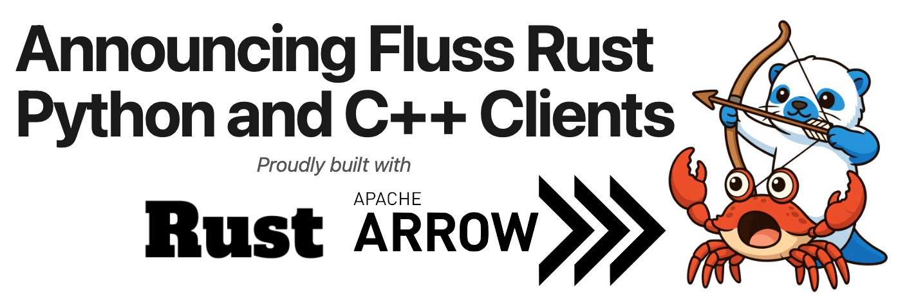

We are excited to announce the release of [fluss-rust clients](https://github.com/apache/fluss-rust) 0.1.0, the first official release of the [Rust](https://clients.fluss.apache.org/user-guide/rust/installation), [Python](https://clients.fluss.apache.org/user-guide/python/installation), and [C++](https://clients.fluss.apache.org/user-guide/cpp/installation) clients for Apache Fluss. This 0.1.0 release represents the culmination of 210+ commits from the community, delivering a feature-rich multi-language client from the ground up.

Under the hood, all three clients share a single Rust core that handles protocol negotiation, batching, retries, and [Apache Arrow](https://arrow.apache.org/)-based data exchange, with thin language-specific bindings on top. This was a deliberate community decision to deliver native performance and feature parity across every language from day one.

## Highlights

### Support for all Fluss table types

- Log Tables - Append-only streaming ingestion with subscription-based polling. Example uses include clickstreams, IoT sensor data, and audit logs. See [log table examples](https://clients.fluss.apache.org/user-guide/rust/example/log-tables)
([Python](https://clients.fluss.apache.org/user-guide/python/example/log-tables), [C++](https://clients.fluss.apache.org/user-guide/cpp/example/log-tables)).
- Primary Key Tables - Upsert, delete, and point lookups by key, with support for partial column updates. Example uses include product catalogs and real-time dashboards backed by data from multiple sources.
See [primary key table examples](https://clients.fluss.apache.org/user-guide/rust/example/primary-key-tables) ([Python](https://clients.fluss.apache.org/user-guide/python/example/primary-key-tables), [C++](https://clients.fluss.apache.org/user-guide/cpp/example/primary-key-tables)).
- Partitioned Tables - Both Log and Primary Key tables support partitioning, with partition-aware reads and writes.
See the [partitioned table examples](https://clients.fluss.apache.org/user-guide/rust/example/partitioned-tables) ([Python](https://clients.fluss.apache.org/user-guide/python/example/partitioned-tables), [C++](https://clients.fluss.apache.org/user-guide/cpp/example/partitioned-tables)).

All table types support idempotent writes and memory-bounded backpressure for reliable production use. The scanner includes parallel, prioritized remote segment fetching for efficient reads over tiered storage. The Python client additionally provides Polars and Pandas specific APIs for seamless integration with dataframe workflows.

### Zero-copy Arrow integration

Leverage your existing Apache Arrow ecosystem. Whether you use Polars, Pandas, DuckDB, DataFusion, or Arrow directly, the clients speak Arrow natively. Log records are represented as Arrow RecordBatches throughout the stack, so data arriving from Fluss can be handed directly to your tools without serialization or conversion.

A batch scanner mode makes this practical at scale: it returns complete RecordBatches to the caller, ready for immediate use. Python users can pass batches straight to Polars or Pandas, C++ applications can feed them into DuckDB, and Rust tools benefit from the same zero-copy path. The Java client does not offer this today because Flink and Spark convert data into their own internal row formats on ingestion. For the native ecosystem, skipping that conversion is where the performance wins are.

### Direct reads from tiered storage

Fluss tiers older log segments to remote storage. When you need to replay or backfill historical data, fluss-rust reads those segments directly from the object store rather than routing them back through the server. This keeps replay workloads off the serving path and avoids paying for data to round-trip through the cluster.

Supported storage backends (enabled via feature flags):

- **storage-fs** — Local filesystem (default)
- **storage-s3** — [Amazon S3](https://aws.amazon.com/s3/)
- **storage-oss** — [Alibaba Object Storage Service](https://www.alibabacloud.com/product/object-storage-service)

A priority-queue-based prefetching system with configurable concurrent downloads keeps sequential scans from stalling on object store round trips.

### Other Features

The release also includes SASL/PLAIN authentication across all three clients, a comprehensive admin API for database and table management, fire-and-forget write batching with configurable bucket assignment strategies, column projection, and more.

### Getting Started

- Rust: fluss-rs [installation guide](https://clients.fluss.apache.org/user-guide/rust/installation).
- Python: pyfluss [installation guide](https://clients.fluss.apache.org/user-guide/python/installation).
- C++: fluss-cpp [installation guide](https://clients.fluss.apache.org/user-guide/cpp/installation).

### What's Next

This is the first release of fluss-rs, pyfluss and fluss-cpp, and the community is actively working on expanding capabilities. Areas of future development include additional language bindings, additional storage backends, enhanced compression support, and expanded ecosystem integrations.

### Thank You, Contributors

This release would not have been possible without the efforts of our contributors. Thank you to everyone who submitted code, reported issues, reviewed pull requests, and helped shape the project:

[AlexZhao](https://github.com/zhaohaidao), [Andrea Bozzo](https://github.com/AndreaBozzo), [Anton Borisov](https://github.com/fresh-borzoni), [Arnav Panjla](https://github.com/Arnav-panjla), [Chase Naples](https://github.com/cnaples79), [Evan](https://github.com/binary-signal), [Jark Wu](https://github.com/wuchong), [Junbo Wang](https://github.com/beryllw), [Junfan Zhang](https://github.com/zuston), [Kaiqi Dong](https://github.com/charlesdong1991), [Karan Pradhan](https://github.com/KaranPradhan266), [Keith Lee](https://github.com/leekeiabstraction), [Kelvin Wu](https://github.com/Kelvinyu1117), [Miao](https://github.com/lemorage), [Nikhil Negi](https://github.com/niknegi), [Pavlos-Petros Tournaris](https://github.com/pavlospt), [Prajwal Banakar](https://github.com/Prajwal-banakar), [SkylerLin](https://github.com/linguoxuan), [Yang Guo](https://github.com/gyang94), [Yuxia Luo](https://github.com/luoyuxia), [naivedogger](https://github.com/naivedogger), and [tison](https://github.com/tisonkun).

### Getting Involved

The Apache Fluss community welcomes contributions!

- Client GitHub: https://github.com/apache/fluss-rust
- Client Documentation: https://clients.fluss.apache.org
- Website: https://fluss.apache.org/
- Mailing List: https://fluss.apache.org/community/welcome/#mailing-lists
- Slack: https://apache-fluss.slack.com