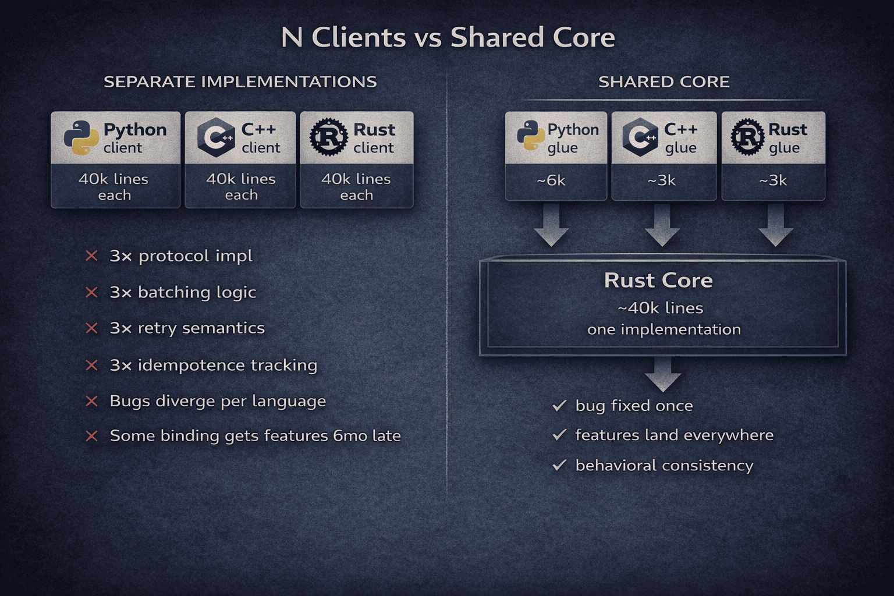
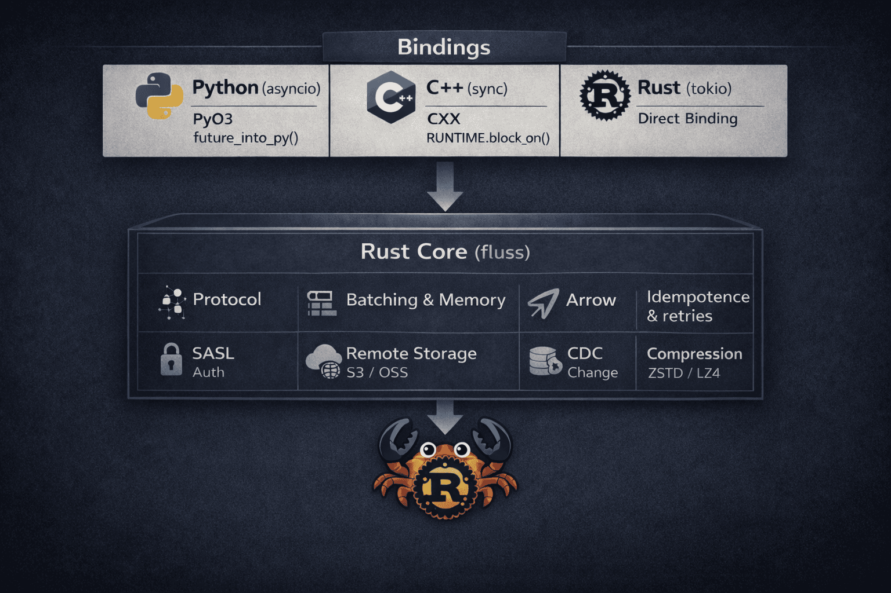
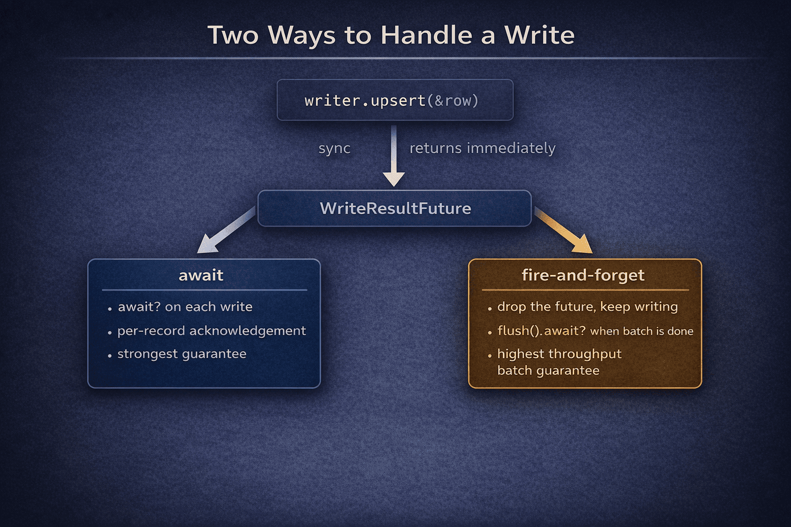
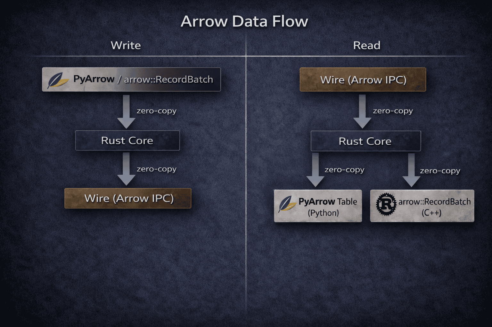
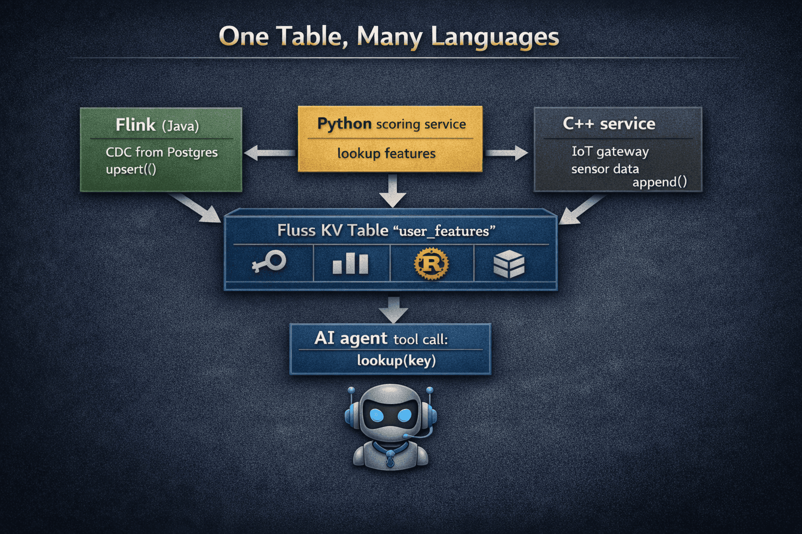
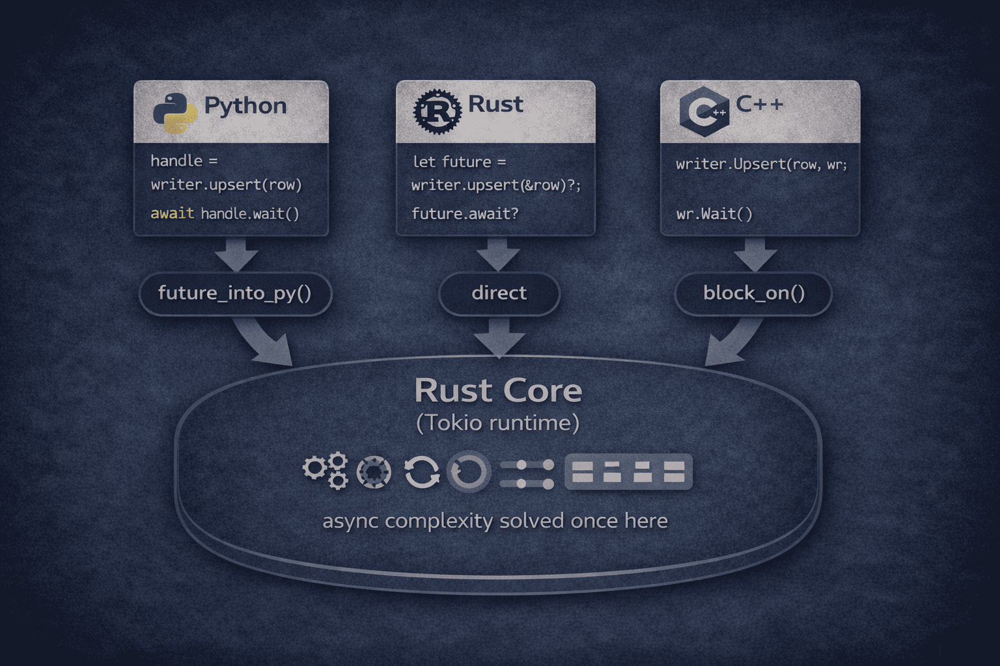

If you maintain a data system that only speaks Java, you will eventually hear from someone who doesn't. A Python team building a feature store. A C++ service that needs sub-millisecond writes. An AI agent that wants to call your system through a tool binding. They all need the same capabilities (writes, reads, lookups) and none of them want to spin up a JVM to get them.

Apache Fluss, streaming storage for real-time analytics and AI, hit this exact inflection point. The [Java client](/blog/fluss-java-client) works well for Flink-based compute, where the JVM is already the world you live in. But outside that world, asking consumers to run a JVM sidecar just to write a record or look up a key creates friction that compounds across every service, every pipeline, every agent in the stack.

We could have written a separate client for each language. Maintain five copies of the wire protocol, five implementations of the batching logic, five sets of retry semantics and idempotence tracking. That path scales linearly with languages and ends predictably: the Java client gets features first, the Python client gets them six months later with slightly different edge-case behavior, and the C++ client is perpetually "almost done."

We took a different path and tried to leverage the lessons of the great.

<!-- truncate -->

## The librdkafka Model

If you've worked with Kafka clients outside of Java, you've probably used [librdkafka](https://github.com/confluentinc/librdkafka) without knowing it. It's a single C library that powers `confluent-kafka-python`, `confluent-kafka-go`, and others. One core handles the wire protocol, batching, memory management, and delivery semantics. Each language binding is a thin wrapper, a glue on top of a battle-tested engine.

The model is elegant because it inverts the usual maintenance equation. Instead of N full client implementations that diverge over time, each developing its own bugs, its own subtle behavioral differences, its own backlog of features the Java client has but the Python client doesn't yet, you get one implementation and N thin bindings that stay in sync by construction. A bug gets fixed once, and every language picks it up on the next build.



The deeper benefit is correctness, not just code reuse. When you maintain three separate implementations of a client protocol, behavioral drift is inevitable. Edge cases in retry logic, subtle differences in how backpressure kicks in, inconsistencies in how idempotent writes handle sequence numbers. These are the bugs that don't show up in unit tests but surface in production under load, and they surface differently in each language.

We built fluss-rust on this same idea. A single Rust core implements the full Fluss client protocol (Protobuf-based RPC, record batching with backpressure, background I/O, Arrow serialization, idempotent writes, SASL authentication) and exposes it to three languages:

- **Rust**: directly, as the `fluss-rs` crate
- **Python**: via [PyO3](https://pyo3.rs), the Rust-Python bridge
- **C++**: via [CXX](https://cxx.rs), the Rust-C++ bridge



To give a sense of proportion: the Rust core is roughly 40k lines, while the Python binding is around 5k and the C++ binding around 6k. The bindings handle type conversion, async runtime bridging, and memory ownership at the language boundary, but all the protocol logic, batching, Arrow codec, and retry handling live in the shared core.

## Why Rust and Not C

C would have been the obvious choice. librdkafka already proves the model works at enormous scale, and the C ABI is the universal language of foreign function interfaces.

We chose Rust, and the reason is specific rather than philosophical: compile-time safety is a force multiplier for a small team maintaining a shared core that multiple languages depend on.

Getting memory safety right in C means manual lifetime tracking, careful code review, and years of experience knowing where the subtle bugs hide. Rust gives the same zero-overhead profile (no garbage collector, no runtime) but checks those invariants at compile time instead.

To make this concrete: the Fluss write path moves ownership from the caller through a concurrent map, into a background event loop, and back out to futures the caller may or may not still be holding. In C, getting that right is a matter of discipline, and getting it wrong means segfaults that only reproduce under production load. In Rust, the borrow checker and the `Send`/`Sync` traits catch those problems before the code ever runs.

We're not alone here. Polars, Apache OpenDAL, and delta-rs all chose Rust as a shared core with language bindings on top. Fluss's Rust SDK sits in that lineage.

## Relationship with the Java Client

The Java client remains the primary integration point for Flink, powering the SQL connector, the DataStream API, and the tightest path for JVM-based streaming compute. If your workload is Flink reading from and writing to Fluss, that's still the right client to use.

fluss-rust isn't trying to replace it. It exists for the consumers the Java client was never designed to serve: Python pipelines, C++ services, Rust applications, and anything else that doesn't want a JVM in the process. Both clients talk the same wire protocol and get the same server-side behavior. Most teams will end up using both, the Java client for Flink and fluss-rust for everything around it.

## What the Rust Core Covers

The Rust core implements the complete Fluss client protocol. Here's how the pieces fit together.

When you write a record, the call is synchronous: the record gets queued into a per-bucket batch without touching the network. A background sender task picks up ready batches and ships them as RPCs to the responsible TabletServers. This follows the same pattern as both the Fluss Java client and Kafka producers.

The caller gets back a `WriteResultFuture`. Await it to block until the server confirms, or drop it for fire-and-forget. The write proceeds through the background sender regardless, with the same retries and server-side durability (acks=all by default). In high-throughput pipelines you typically don't await every write individually, but collect futures for a batch of records and await them together before committing your source offset.



Batches ship automatically when they fill up or after a short timeout (100ms by default), so `flush()` isn't needed for data to reach the server. It's there for when you need to confirm that everything in flight has landed. If the write buffer fills up, new writes block until space frees up rather than silently consuming unbounded memory.

Fluss has two table types (primary key tables and log tables), and the Rust core has a writer for each. `UpsertWriter` handles keyed writes: full upserts, deletes, and partial updates where you send only the columns that changed. `AppendWriter` handles append-only log writes and can also accept Arrow `RecordBatch` directly if you already have columnar data. Both support idempotent delivery.

For reads, `LogScanner` provides streaming consumption with offset tracking. You can push column projection down to the server, so if you only need three columns out of twenty, only those three travel over the network. Each record also carries changelog metadata (offset, timestamp, and change type like `AppendOnly`, `Insert`, `UpdateBefore`, `UpdateAfter`, `Delete`), which is how Fluss exposes its CDC semantics to consumers outside of Flink.

`Lookuper` handles the other access pattern: point queries against primary key tables. You encode a key, and the client resolves the bucket, finds the leader, and returns the row. The response is compact binary, and the row is only deserialized when you first access a field.

The core also covers admin operations (creating and dropping databases and tables, schema management) and SASL/PLAIN authentication at the connection level.

## Arrow on the Wire

Arrow deserves its own section because it's the architectural decision that makes the multi-language model work end to end, not just at the API level but down to the bytes on the wire.

Fluss transmits data as Arrow IPC, compressed with ZSTD by default. When you write an Arrow `RecordBatch`, it goes straight into the wire format. When you scan, the response comes back as Arrow `RecordBatch`. The data stays in Arrow throughout, which means there's no serialization boundary between the Rust core and the caller.



This matters most at the language boundary. The Python binding already supports full Arrow interop in both directions: `poll_arrow()` returns scan results as a PyArrow Table, and `write_arrow_batch()` accepts a PyArrow RecordBatch for writes. Both cross the Rust-Python boundary without copying, because `arrow-pyarrow` shares the underlying memory buffers. A scan result goes straight from the Rust core into PyArrow, and from there into Pandas, Polars, or DuckDB with no conversion step.

On the C++ side, the Arrow C Data Interface handles the same zero-copy handoff for callers that export or import Arrow arrays.

Looking ahead, Arrow also makes [Apache DataFusion](https://datafusion.apache.org/) integration straightforward. DataFusion's table providers already expect Arrow, so wiring fluss-rust as a data source is a natural extension.

## What This Looks Like in Practice



Suppose a Flink job consumes CDC from Postgres, computes user features, and writes them into a Fluss primary key table. A Python scoring service needs to look up those features before running a model. With the Python binding, that's a few lines:

```python title="Python"
from fluss import FlussConnection, Config, TablePath

conn = await FlussConnection.create(Config({"bootstrap.servers": "fluss:9123"}))
table = await conn.get_table(TablePath("analytics", "user_features"))

lookuper = table.new_lookup().create_lookuper()

result = await lookuper.lookup({"user_id": request.user_id})
score = model.predict(result)
```

The lookup goes through the same Protobuf RPC and hits the same KV store on the TabletServer that the Java client would use. The Python service just doesn't need a JVM to get there.

On the write side, consider an IoT gateway written in C++ that pushes sensor readings into a Fluss log table. It can't afford to block on each record, so it queues them and lets the Rust core handle batching and delivery:

```cpp title="C++"
fluss::AppendWriter writer;
table.NewAppend().CreateWriter(writer);

for (const auto& event : events) {
    fluss::GenericRow row;
    // ... populate row from event ...
    writer.Append(row);               // queued in Rust, sent automatically
}
```

## When the Caller Is a Machine


The examples above involve humans writing Python or C++ code. But increasingly, the caller isn't a human at all. AI agents interact with data infrastructure through tool calls, and the way they use a client library is different from how a developer does.

An agent that needs to check a user's subscription tier or write back a recommendation doesn't read documentation or understand batching internals. It sees a tool definition: `lookup(table, key)`, `upsert(table, row)`, `flush()`. The smaller and more predictable that interface is, the more reliably the agent uses it. If you've worked with LLM tool-calling, you've seen how quickly reliability degrades as the number of functions or the complexity of their signatures grows.

This is where the single-core architecture pays off in a way we didn't originally design for. Because the Rust core hides all the protocol and batching complexity, the Python binding exposes a small set of straightforward functions. An agent calls `await lookuper.lookup(key)`, gets a dict back, and moves on. No JVM to manage, no sidecar to health-check, just a Python function that happens to run compiled Rust underneath.

More broadly, as we discussed in [What does Apache Fluss mean in the context of AI?](/blog/fluss-for-ai), real-time intelligent systems need fresh features, evolving context, and continuously updated state. Fluss fits naturally as a context store for these systems, and the Rust SDK is what makes that context store accessible outside the JVM world.

## How We Got Here

We didn't build everything at once. The Rust core came first with the protocol, batching, Arrow integration, writes, and scanning. We added [PyO3](https://pyo3.rs) for Python and [CXX](https://cxx.rs) for C++ once those paths were stable, and features like lookups landed later as the Rust API matured. If we'd started the bindings earlier, the FFI boundary would have been designed around a half-finished API, and we'd have spent more time reshaping glue code than building features.



Async was the most involved design problem. Rust runs on Tokio, Python on asyncio, and C++ callers expect synchronous returns. We decided early that all async complexity would stay inside the Rust core: Python spawns work on the shared Tokio runtime and gets back an asyncio-compatible future, while C++ blocks on Tokio and returns when the operation completes. That meant tricky problems like `WriteResultFuture` drop semantics (making sure a dropped future doesn't leak memory or leave a batch stuck in the accumulator) only had to be solved once.

We also underestimated how many bugs live at the language boundary rather than in the core. The Rust integration tests against a real Fluss cluster all passed, but when we ran the same scenarios through the Python and C++ bindings, new issues appeared. On the Python side, API errors from the server weren't being propagated through PyO3 at all, so operations would fail silently. On the C++ side, the row access layer had panics that required a significant rework, and the error handling for pointer-returning FFI methods was swallowing server errors instead of surfacing them. As a result, we now run full round-trip integration tests for all three languages in CI.

## What's Next

The core read and write paths work, but there are gaps to close before the Rust SDK reaches full parity with the Java client. Complex data types (Array, Map, Row) aren't supported yet, which limits what schemas you can work with. Limit scans and batch scanning are in progress, and once those land with Python and C++ bindings, the SDK becomes usable for a wider range of analytical workloads. We also want to support subscribing to primary key table changelogs, which would let non-Flink consumers track how keyed state evolves over time.

On the infrastructure side, we're adding client metrics so operators can monitor the SDK in production, and improving Python ergonomics with async iterator support for log scanning.

Beyond feature parity, there are four directions we're especially excited about.


The first is **DataFusion integration**. The Rust core already produces Arrow RecordBatches, which is exactly what DataFusion's table provider interface expects. Wiring the two together would let users run SQL queries directly over Fluss data from Rust or Python, without going through Flink.

The second is a **Go client**. The shared-core model extends naturally to Go via CGo or a similar FFI bridge. A Go client would unlock native log ingestion for the Go ecosystem, including integrations with tools like Filebeat, and is already something Fluss users have asked for.

The third is a **CLI for AI agent integration**. A command-line tool built on the Rust core that can look up keys, write records, and scan tables gives AI agents a natural way to interact with Fluss through tool-calling, without importing a library or managing a runtime. It's equally useful for operators debugging in production, shell scripts, and CI/CD pipelines.

The fourth is a **multiprotocol query gateway** built on top of the Rust core. A Rust-based gateway could expose Fluss through Flight SQL (accessible via ADBC), REST, and the PostgreSQL wire protocol. For SQL queries it delegates to DataFusion; for lookups and log writes it calls the Rust core directly.
On the project side, the community is working toward moving fluss-rust into the main Apache Fluss repository. This would unify the release process, simplify cross-repo coordination, and signal the project's long-term commitment to the multi-language SDK as a first-class part of Fluss.

If any of this is interesting to you, we welcome contributions, bug reports, and feedback.

---
And before you go 😊 don't forget to give some ❤️ via ⭐ on GitHub: [Apache Fluss](https://github.com/apache/fluss) and [Fluss Rust SDK](https://github.com/apache/fluss-rust)

