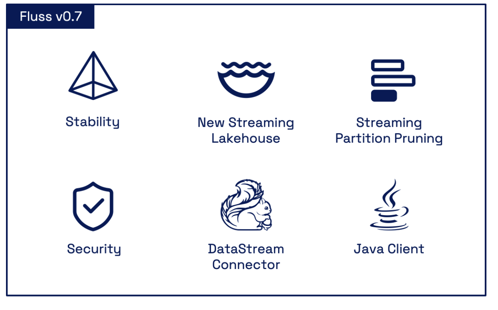
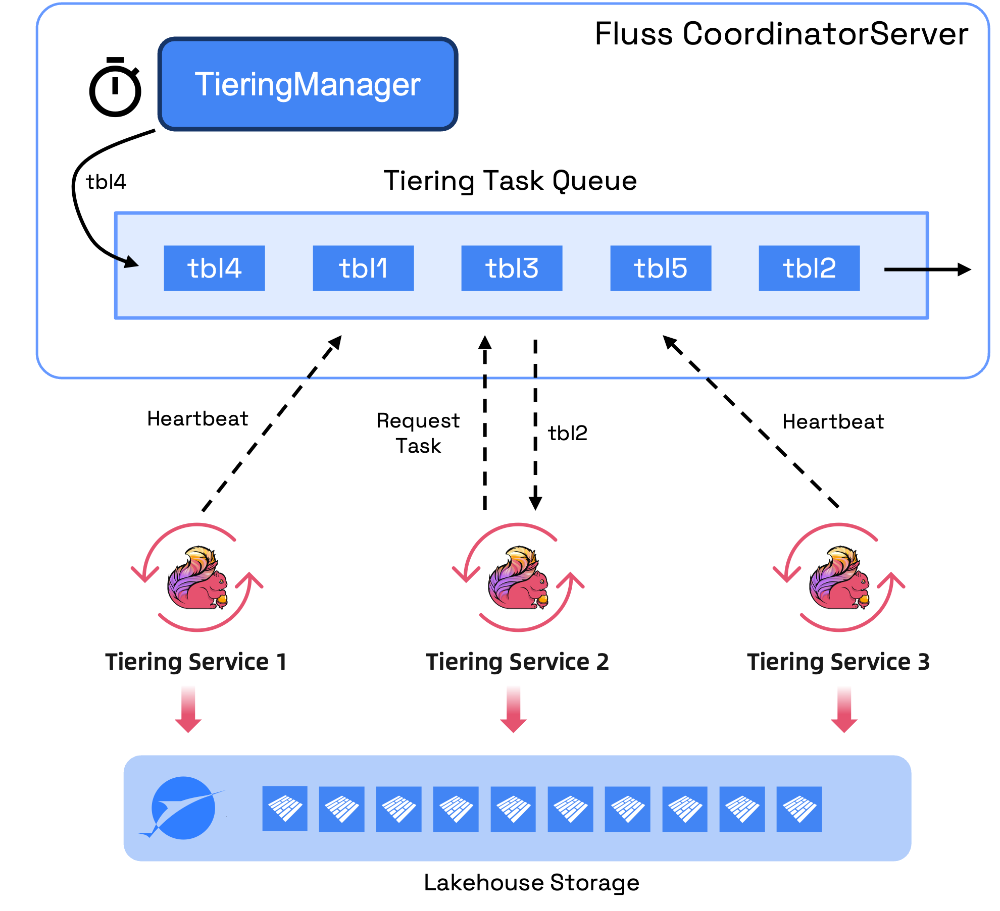
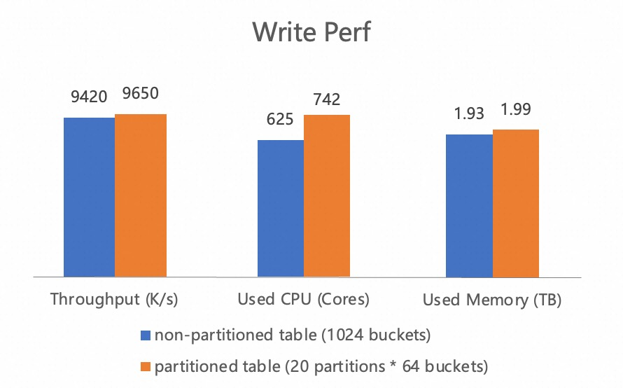
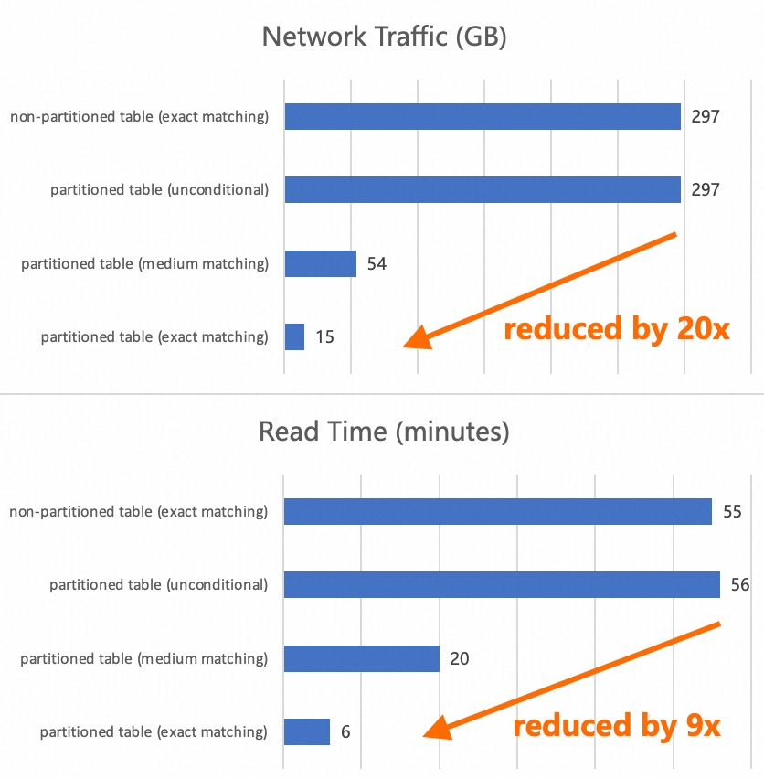

<!--
 Licensed to the Apache Software Foundation (ASF) under one
 or more contributor license agreements.  See the NOTICE file
 distributed with this work for additional information
 regarding copyright ownership.  The ASF licenses this file
 to you under the Apache License, Version 2.0 (the
 "License"); you may not use this file except in compliance
 with the License.  You may obtain a copy of the License at

      http://www.apache.org/licenses/LICENSE-2.0

 Unless required by applicable law or agreed to in writing, software
 distributed under the License is distributed on an "AS IS" BASIS,
 WITHOUT WARRANTIES OR CONDITIONS OF ANY KIND, either express or implied.
 See the License for the specific language governing permissions and
 limitations under the License.
-->


🌊 We are excited to announce the official release of **Fluss 0.7**!

This version has undergone extensive improvements in **stability**, **architecture**, **performance optimization**, and **security**, further enhancing its readiness for **production environments**. Over the past three months, we have completed more than **250 commits**, making this release a significant milestone toward becoming a mature, production-grade streaming storage platform.
<!-- truncate -->



## Stability Enhancements
In this release, we have dedicated significant effort to enhancing system stability. By building a comprehensive stability testing framework covering end-to-end processes and multi-scenario fault simulations, combined with large-scale stress testing using real business data, and through rigorous production-level stability validation in Alibaba, we have addressed and resolved over 50 issues. This has significantly improved the stability of Fluss' core modules and the overall robustness of the system. The major improvements include:

* **Online/Offline Node Optimization:** Refactored the ISR (In-Sync Replica) update mechanism and replica synchronization logic and enhanced idempotency guarantees. This significantly improves system stability and reduces the risk of data loss during node failures.
* **Server Metadata Caching:** Introduced a consistent metadata caching layer on the server side. Clients now fetch metadata from the local server cache instead of ZooKeeper, significantly reducing request latency and pressure on ZooKeeper.
* **Server Rack-Aware Support:** During replica assignment, the system automatically avoids placing multiple replicas within the same "rack", thereby significantly improving fault tolerance and high availability. This feature is especially beneficial in multi-AZ deployments and large-scale data center disaster recovery scenarios. You can configure the "rack" of the TabletServer via setting `tablet-server.rack` in `server.yaml`.
* **Accelerated Table Creation:** Leveraged batched metadata updates to reduce table initialization time. For example, the time for a table creation with 1024 buckets was reduced from minutes to milliseconds.
* **Optimized Read/Write Pipelines:**
  * Introduce bucket-id-based shuffle for primary key tables to improve write throughput. 
  * Dynamically estimate the batch size based on incoming traffic to optimize memory usage and throughput. 
  * Optimize the Arrow memory release logic to enhance job stability.

These enhancements make Fluss 0.7 ready for most production use cases.

## New Architecture of the Streaming Lakehouse
In Fluss 0.5, we first introduced the Streaming Lakehouse feature, with the powerful Union Read ability, we can significantly reduce the cost of streaming storage and improve the data freshness of Lakehouse.
> Note: Union Reads allows querying and combining the results from both Lakehouse (historical) and Fluss (real-time) data.

However, the initial implementation had architectural limitations affecting scalability and operability in production. In Fluss 0.7, we’ve completely re-architected the Streaming Lakehouse feature to address these challenges.

### Elastic Stateless Service
Previously, the lake tiering service was implemented as a Flink job encapsulating Fluss as a Source and Paimon as a Sink, storing sync offsets state in Flink’s State, this making it a stateful service. 
This led to several operational issues:
* **Single Point of Failure:** The lifecycle of each table is bound to a specific Flink job. Once a job fails, the synchronization of all tables hosted by the job will be blocked. 
* **Limited Scalability:** Could only scale vertically (increase job resources), not horizontally (start multiple jobs). 
* **Inflexible Scheduling:** Unable to prioritize tables and dynamically assign to dedicated Flink clusters.
* **Opaque State:** Flink State being a black box made monitoring and troubleshooting the offset difficult.

To address these challenges, we've re-architected the lake tiering service into a truly elastic and stateless component.
The sync offset is now persisted directly within Fluss metadata, with future plans for integration into Paimon v1.2 snapshot properties.
Furthermore, Flink jobs have transitioned from maintaining persistent table subscriptions to a more efficient model where they process one table at a time,
dynamically requesting the next table upon completion of the current one.




This optimization significantly reduces the load on Fluss and boosts batch processing efficiency. As a result, cluster operators gain:
* **Enhanced Service Robustness:** Operators can launch multiple Flink jobs to distribute workload and increase overall system resilience.
* **Flexible Resource Management:** The ability to stop idle jobs at any time allows for immediate reclamation of valuable cluster resources.
* **Dynamic Task Orchestration:** Sync tasks can now be dynamically scheduled across all active Flink jobs, optimizing resource utilization. 
* **Actionable Offset Visibility:** The offset state is now queryable, providing greater insight and control over data processing.

This design ensures end-to-end consistency across all operations.
Furthermore, this stateless design also decouples us from the tight Flink dependency, paving the way for future lightweight execution models, such as running on FaaS (Function as a Service).

### Pluggable Lake Format
The previous implementation had a tight coupling with Apache Paimon, which restricted our ability to integrate with other lake formats, such as Iceberg. 
With version 0.7, we have abstracted and modularized all lake format interfaces.
This enhancement enables easy, plugin-style support for Iceberg and other emerging formats.

### Native Flink Command Submission
Previously, users were limited to the `lakehouse.sh` script for initiating the lake tiering service, which submitted jobs to the Flink cluster.
While convenient, this approach restricted deployment flexibility, particularly when encountering diverse Flink deployment modes and internal product platforms. 
Fluss 0.7 now addresses this by supporting **native job submission via standard Flink commands** (`flink run`). 
This enhancement ensures broad compatibility with various deployment modes while significantly lowering learning and integration costs.
The following is an example of how to submit the lake tiering service using the native Flink command:

```bash
flink run /path/to/fluss-flink-tiering-0.7.0.jar \
    --fluss.bootstrap.servers localhost:9123 \
    --datalake.format paimon \
    --datalake.paimon.metastore filesystem \
    --datalake.paimon.warehouse /path/to/warehouse
```

See more details in the [Streaming Lakehouse documentation](/docs/maintenance/tiered-storage/lakehouse-storage/).

## Streaming Partition Pruning
Partitioning is a foundational technique in modern data warehouses and Lakehouse architectures for optimizing query performance by 
logically dividing datasets along meaningful dimensions (e.g., time, region, business line).

Fluss 0.7 introduces **streaming partition pruning**, enabling selective reading of relevant partitions based on query conditions. 
For example, if a query filters on `nation_key = 'US'`, the Fluss Source will only read matching partitions,
significantly reducing network I/O and compute overhead. 
Apart from that, we also support the following advanced partition features to make partition pruning adaptable and easy to use:
* **Multi-level Partitioning:** Supports nested partition strategies (e.g., `dt=20250617/region=US/business=sale`).
* **Dynamic Partition Creation:** Automatically creates required partitions based on incoming data, no manual pre-creation is required.
* **Automatic Partition Discovery:** Fluss source adds matched new partitions to the subscription in real-time.

Using real business data from **Taobao - the largest online shopping platform in China,** we tested the read and write performance between non-partitioned and partitioned tables (with 20 auto-created partitions). The write results show that the multi-level partition and dynamic partition creation mechanism do not have a significant impact on the write performance.


At the same time, under the same data scale, we tested the streaming read performance of non-partitioned tables and partitioned tables under three partition conditions: 
**unconditional**, **medium matching** (hitting five partitions), and **exact matching** (hitting one partition). 
From the results, we can observe that when the partition condition only matches 1/20 of the partitions,
**the network traffic is reduced by about 20x** and the **processing time is reduced by nearly 9x**, 
demonstrating the huge performance benefit of partition pruning in streaming reads.




Streaming partition pruning is the second pushdown feature introduced after streaming column pruning in Fluss.
Looking ahead, we plan to introduce **predicate pushdown with Arrow batch-level I/O pruning** to further enhance query efficiency.

## Enterprise-Grade Security
To meet enterprise-grade security requirements, Fluss 0.7 fully supports Authentication and Authorization mechanisms.

**Authentication** is the process of confirming the identity of the client. 
Fluss introduced a plugin-based authentication with built-in **SASL/PLAIN** support, compatible with **JAAS** (Java Authentication and Authorization Service) configuration for both client and server credentials.

**Authorization** controls which resources the identity can access and which operations it can perform after identity confirmation. 
Fluss implements fine-grained permission control through the **ACL** (Access Control List) mechanism, supporting multi-level access control at the Cluster, Database, and Table levels.


Additionally, we've integrated Flink SQL's `CALL` statements to ease ACL permission management for users.
For instance, granting read access to the `mydb` database for user `Tim` can now be accomplished with the following command:

```sql
CALL admin_catalog.sys.add_acl(
    resource => 'cluster.mydb', 
    permission => 'ALLOW',
    principal => 'User:Tim', 
    operation => 'READ',
    host => '*'
);
```

For details, please refer to the [Security documentation](/docs/security/overview/) and quickstarts.

## Flink DataStream Connector
Fluss 0.7 officially introduces the DataStream Connector, supporting both Source and Sink for reading and writing log and primary key tables. Users can now seamlessly integrate Fluss tables into Flink DataStream pipelines.

Here’s an example of reading data from a Fluss table into a Flink DataStream:
```java
FlussSource<Order> source = FlussSource.<Order>builder()
    .setBootstrapServers("localhost:9092")
    .setDatabase("mydb")
    .setTable("orders")
    // column pruning
    .setProjectedFields("orderId", "amount")
    .setStartingOffsets(OffsetsInitializer.earliest())
    .setDeserializationSchema(new OrderDeserializationSchema())
    .build();

DataStreamSource<Order> stream = env.fromSource(
    source,
    WatermarkStrategy.noWatermarks(),
    "Fluss Source"
);
```

For usage examples and configuration parameters, see the [DataStream Connector documentation](https://alibaba.github.io/fluss-docs/docs/engine-flink/datastream/).


## Fluss Java Client
In this version, we officially release the Fluss Java Client, a client library designed for developers working with structured stream tables. The client includes two core API modules:

* **Table API:** For table-based data operations, supporting streaming reads/writes, updates, deletions, and point queries.
* **Admin API:** For metadata management, including cluster management, table lifecycle, and access control.

The client supports forward and backward compatibility, ensuring smooth upgrades across Fluss versions. With the Fluss Java Client, developers can build online applications and data ingestion services based on Fluss, as well as enterprise-level components such as Fluss management platforms and operations monitoring systems. For detailed usage instructions, please refer to the official documentation: [Fluss Java Client User Guide](https://alibaba.github.io/fluss-docs/docs/apis/java-client/).

Fluss uses Apache Arrow as its underlying storage format, enabling efficient cross-language extensions. A **Fluss Python Client** is planned for future releases, leveraging the rich ecosystem of **PyArrow** to integrate with popular data analysis tools such as **Pandas** and **DuckDB**. 
This will further lower the barrier for real-time data exploration and analytics.

## Future Roadmap
In the next releases, we will continue to enhance system robustness and operational capabilities and plan to introduce **Rolling Upgrades** and **Cluster Rebalance**. 
In addition, with the new pluggable datalake format of the Streaming Lakehouse, we will further expand support for the mainstream datalake table formats, such as an **Apache Iceberg** integration. 
Meanwhile, we will explore the possibility of using Fluss in **multimodal AI** use cases, supporting ingestion of multimodal data, 
and integrating with **[Lance](https://github.com/lancedb/lance)** format in the Streaming Lakehouse architecture.

Fluss is under active development. Be sure to stay updated on the project, give it a try and if you like it, 
don’t forget to give it some ❤️ via ⭐ on [GitHub](https://github.com/alibaba/fluss).

## List of contributors
The Fluss community would like to express gratitude to all the contributors who made this release possible:

Benchao Li,  CaoZhen,  Feng Wang,  Giannis Polyzos,  HZY,  Hongshun Wang,  Jark Wu,  Junbo wang,  Kerwin,  Leonard Xu,  MehulBatra,  Michael Koepf,  Min Zhao,  Nicholas Jiang,  Radek Grebski,  Rohan Dubey,  Xiaojian Sun,  Yang Guo,  dao-jun,  gkatzioura,  luoyuxia,  majialong,  xiaozhou,  yunhong,  yuxia Luo,  yx9o,  zhangmang,  道君
