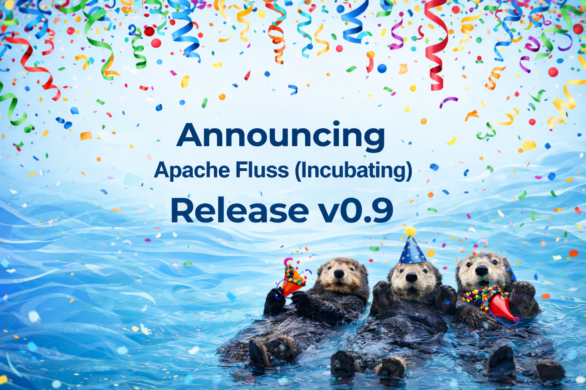
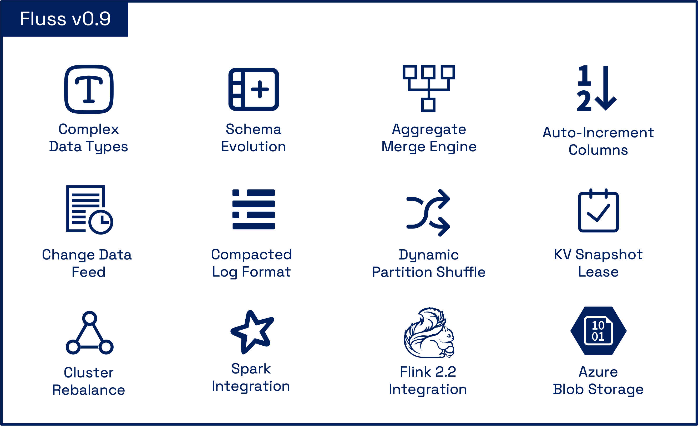
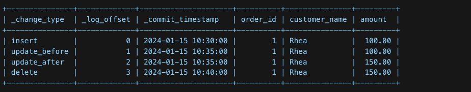
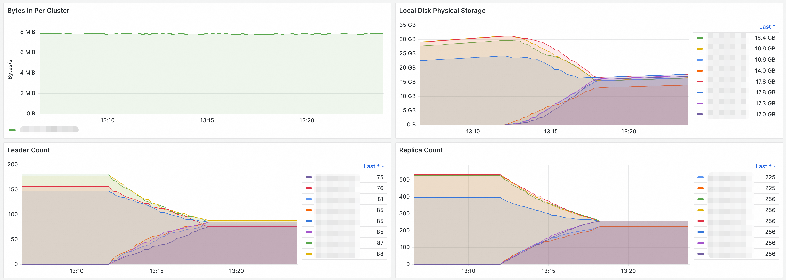

🌊 We are excited to announce the official release of **Apache Fluss (Incubating) 0.9**!

This release marks a major milestone for the project. Fluss 0.9 significantly expands Fluss’s capabilities as a **streaming storage system for real-time analytics, AI, and state-heavy streaming workloads**, with a strong focus on:

- Richer and more flexible data models
- Safe, zero-downtime schema evolution
- Storage-level optimizations (aggregations, CDC, formats)
- Stronger operational guarantees and scalability
- A more mature ecosystem and developer experience

Whether you’re building **unified stream & lakehouse architectures**, **real-time analytics**, **feature/context stores**, or **long-running stateful pipelines**, Fluss 0.9 introduces powerful new primitives that make these systems easier, safer, and more efficient to operate at scale.

---

### TL;DR: What Fluss 0.9 Unlocks



- **Zero-copy schema evolution** for evolving streaming jobs
- **Storage-level aggregations** that further enhances zero-state processing
- **Change data feed** for CDC, audit trails, point-in-time recovery, and ML reproducibility
- **Safer snapshot-based reads** with consumer-aware lifecycle management
- **Operationally robust clusters** with automatic rebalancing and safer maintenance workflows
- **Apache Spark integration**, enabling unified batch and streaming analytics on Fluss
- **First-class Azure support**, allowing Fluss to tier and operate seamlessly on Azure Blob Storage and ADLS Gen2


<!-- truncate -->

## 1. Richer Data Models & Schema Evolution

### Support for Complex Data Types
Apache Fluss 0.9 strengthens and extends support for **complex data types** with a focus on **deep nesting**, **safe schema evolution**, and new **ML-oriented use cases**.

Supported types now include `ARRAY`, `MAP`, `ROW`, and deeply nested structures. For example, complex schemas such as:
> `ARRAY<MAP<STRING, ROW<values ARRAY<FLOAT>, ts TIMESTAMP_LTZ(3)>>>`

are now fully supported in production. These nested structures are handled as **schema-aware** rows, not opaque payloads, ensuring **data correctness** and **type safety**.

Additionally, adding new columns does not affect existing jobs after clients upgrade to 0.9. Moreover, with support for the **Lance format**, Fluss can be used for the ingestion of **multi-modal data** and **vector storage**. Users can now store **embeddings** directly in tables using `ARRAY<FLOAT>` or `ARRAY<DOUBLE>`:

```sql
CREATE TABLE documents (
  doc_id BIGINT PRIMARY KEY,
  embedding ARRAY<FLOAT>
);
```

This enables new use cases where Fluss acts as the **source of truth for vector embeddings**, which can then be incrementally consumed by vector engines to maintain **ANN indexes**.

You can find the complete feature umbrella [here](https://github.com/apache/fluss/issues/816).


### Schema Evolution with Zero-Copy Semantics

**Schema evolution** is critical for evolving systems and use cases like **feature calculations**, and Fluss 0.9 delivers a major step forward in this area.

The release adds support for **altering table schemas** by appending new columns, fully integrated with **Flink SQL**. For example:


```sql
-- Add a single column at the end of the table
ALTER TABLE my_table ADD user_email STRING COMMENT 'User email address';

-- Add multiple columns at the end of the table
ALTER TABLE MyTable ADD (
    user_email STRING COMMENT 'User email address',
    order_quantity INT
);
```

For more information, see [Flink DDL support](https://fluss.apache.org/docs/0.9/engine-flink/ddl/#alter-table).

**Zero-copy schema evolution** means that existing data files are **not rewritten** when a schema changes. Instead, only **metadata is updated**.

Existing records simply do not contain the new column, and readers interpret missing fields as `NULL`. New records immediately include the new column without impacting historical data.

This approach **avoids downtime**, **eliminates expensive backfills**, and ensures **predictable performance** during schema changes. It is especially important for streaming pipelines that are expected to run continuously over long periods of time.

## 2. Storage-Level Processing & Semantics

### Aggregation Merge Engine
Apache Fluss now supports **storage-level aggregations** via a new **Aggregation Merge Engine**, enabling real-time aggregation to be pushed down from the compute layer into the **Fluss storage layer**.

Traditionally, real-time aggregations are maintained in Flink state, which can lead to:
* **Large and growing state size** 
* **Slower checkpoints and recovery** 
* **Limited scalability** for high-cardinality aggregations
  
With the **Aggregation Merge Engine**, aggregation state is **externalized to Fluss**, allowing Flink jobs to remain **nearly stateless** while Fluss efficiently maintains aggregated results.
```sql
CREATE TABLE campaign_uv (
    campaign_id STRING,
    uv_bitmap BYTES,
    total_events BIGINT,
    last_event_time TIMESTAMP,
    PRIMARY KEY (campaign_id) NOT ENFORCED
) WITH (
    'table.merge-engine' = 'aggregation',
    'fields.uv_bitmap.agg' = 'rbm64',
    'fields.total_events.agg' = 'sum',
    'fields.last_event_time.agg' = 'last_value_ignore_nulls'
);
```

Maintain **continuously updated metrics** (for example, order counts or model aggregated features) directly in Fluss tables, while Flink focuses only on event ingestion and lightweight processing.

The Aggregation Merge Engine is designed for **production use** and supports **end-to-end exactly-once semantics** when integrated with Flink.
In the event of either a Flink job or Fluss cluster failover, aggregation results remain **eventually consistent**, providing the same consistency guarantees as regular Primary Key Tables.
To achieve this, Fluss **does not** introduce complex distributed transactions for primary key tables, which would otherwise come **at the cost of throughput and latency performance**.
Instead, it effectively combines Flink checkpoints with the **changelog capability** of Fluss tables to implement an **undo log** mechanism during Flink Job failover.
This approach ensures **end-to-end exactly-once** processing while maintaining the **same read/write throughput and latency** as regular primary key tables.

The aggregation merge engine is another step towards Fluss’s [compute-storage separation](https://www.ververica.com/blog/introducing-the-era-of-zero-state-streaming-joins?hs_preview=cdhHvcIE-199898654106).

You can find more instructions about how to use the aggregation merge engine [here](https://fluss.apache.org/docs/0.9/table-design/merge-engines/aggregation/).

### Auto-Increment Columns for Dictionary Tables
This release introduces `AUTO_INCREMENT` columns in Fluss, enabling **Dictionary Tables**, a simple pattern for mapping long identifiers (such as strings or UUIDs) to **compact numeric IDs** in real-time systems.

`AUTO_INCREMENT` columns automatically assign a **unique numeric ID** when a row is inserted and no value is provided. The assigned ID is **stable** and never changes. In distributed setups, IDs may not appear strictly sequential due to parallelism and bucketing, but they are guaranteed to be **unique and monotonically increasing** per allocation range.

A **Dictionary Table** is a regular Fluss table that uses an `AUTO_INCREMENT` column to map long business identifiers to compact integer IDs. 
In simple terms, it gives every unique value a short number and always returns the same number for the same value.

```sql
CREATE TABLE uid_mapping (
    uid STRING,
    uid_int64 BIGINT,
    PRIMARY KEY (`uid`) NOT ENFORCED
) WITH (
    'auto-increment.fields' = 'uid_int64'
);

INSERT INTO uid_mapping (user_id) VALUES ('user1');
INSERT INTO uid_mapping (user_id) VALUES ('user2');
INSERT INTO uid_mapping (user_id) VALUES ('user3');
INSERT INTO uid_mapping (user_id) VALUES ('user4');
INSERT INTO uid_mapping (user_id) VALUES ('user5');

SELECT * FROM uid_mapping;

| uid   | uid_int64 |
|-------|-----------|
| user1 |     1     |
| user2 |     2     |
| user3 |     3     |
| user4 |     4     |
| user5 |     5     |
```

Dictionary Tables are commonly used to answer operational questions such as:
* **Unique Counting**: How many unique users, devices, or sessions have we seen so far? 
* **First-Seen Detection**: Is this the first time we are seeing this identifier? 
* **Event Deduplication**: Have we already processed this event?
* **Active Entity Tracking**: What is the current set of active entities/sessions?

They also help keep **identity-related state** manageable over long periods and provide a **shared, consistent ID mapping** that can be reused across systems.

By combining **auto-increment columns** with the **Aggregation Merge Engine** and **RoaringBitmap-based aggregation functions** such as `rbm32` and `rbm64`,
you can maintain real-time counts of unique users or sessions without managing large state in Flink.
A typical usage pattern involves creating a dictionary table that maps raw identifiers, such as strings or sparse IDs, to compact dense integer IDs via an auto-increment column.
These dense IDs are then aggregated into a **RoaringBitmap** using `rbm32` for 32-bit IDs or `rbm64` for 64-bit IDs within the Aggregation Merge Engine.
Finally, end users can efficiently compute cardinality directly from RoaringBitmap results and perform union, intersection, and difference operations during roll-up aggregations.
This enables **highly efficient count-distinct computations** both at the storage layer and during query execution.

You can find more instructions about how to use the auto-increment feature and dictionary tables [here](https://fluss.apache.org/docs/0.9/table-design/table-types/pk-table/#auto-increment-column).

### Change Data Feed
Apache Fluss 0.9 introduces virtual tables `$changelog` and `$binlog` for change data feed, providing access to **metadata** and **change data** without storing additional data. By simply appending `$changelog` to any table name, users can access a complete **audit trail** of every data modification.

#### Access the changelog of any table
```sql
SELECT * FROM `orders$changelog`;
```


Each changelog record includes metadata columns prepended to the original table columns:
- **`_change_type`**: The type of change operation (`insert`, `update_before`/`update_after`, `delete` for Primary Key Tables; only `insert` for Log Tables).
- **`_log_offset`**: The position in the log for **tracking and replay**.
- **`_commit_timestamp`**: The exact timestamp when the change was committed.

#### Flexible Startup Modes
Users can control where reading begins using startup modes: `earliest` (full history), `latest` (new changes), or `timestamp` (specific point in time). These modes are essential for **Point-in-Time Recovery** and **ML Backtesting**.

#### Binlog Virtual Table
For Primary Key Tables, Fluss also provides a `$binlog` virtual table that presents change data in a binlog format. Unlike `$changelog`, which shows individual change records, `$binlog` provides both **before and after images** in a single record with nested `before` and `after` row structures. This format is particularly useful for change data capture (CDC) integrations and systems that need to process both states of a row in a single operation.

The `$changelog` virtual table unlocks critical use cases for regulatory and advanced analytics environments.

#### Compliance, Audit Trails, and AI Reproducibility
For regulatory environments, Fluss provides a complete, atomic audit trail of all data modifications. 
Every change, such as a user profile update or a transaction status change is captured with precision, proving **data lineage** and change attribution. 

Beyond compliance, this is critical for **AI/ML Reproducibility** and **Decision Tracking**. By providing a high-fidelity record of the exact data state at the moment a model made a prediction or a decision was triggered, Fluss enables **full model audibility** and simplifies debugging complex autonomous systems. It ensures **trustworthy AI** by allowing teams to reconstruct the exact environment behind every automated decision.

Storage-level CDC means no extra compute overhead; changes are already materialized, with just run️:
```sql
SELECT * FROM orders$changelog;
```

You can find more instructions about how to use virtual tables and the changelog feature [here](https://fluss.apache.org/docs/0.9/table-design/virtual-tables/).

### Compacted Log Format
By default, Fluss uses **Apache Arrow–based columnar storage**, which is ideal for analytical workloads with selective column access. However, some workloads do not benefit from columnar layouts, especially when **all columns are read together**.

Fluss 0.9 introduces support for a **Compacted (row-oriented) LogFormat** to address these cases. This format is designed for tables such as **aggregated result tables** and **large vector or embedding tables**, where **full-row reads** are the dominant access pattern. In these scenarios, columnar storage provides limited benefit and can introduce unnecessary overhead.

The **Compacted LogFormat** stores rows in a tightly packed, compact representation on disk, resulting in:
* **Reduced disk footprint** for wide rows
* **More efficient full-table and wide-row scans**
* **Better storage efficiency** for derived and materialized tables

Arrow remains the default and preferred choice for column-pruned analytical workloads, while the **Compacted LogFormat** provides a more efficient option for full-row, compacted datasets.

You can find more information [here](https://fluss.apache.org/docs/0.9/table-design/data-formats/).


### Dynamic Sink Shuffle for Partitioned Tables

Flink Sink supports typical strategies when shuffling data to the Sink node, such as shuffle-by-bucket and round-robin.
While effective, these can encounter bottlenecks or high metadata overhead in certain scenarios, especially with **uneven traffic distribution** in multi-partition tables.

The newly introduced **Dynamic Sink Shuffle** dynamically detects traffic distribution across partitions at runtime. It allocates write nodes proportionally based on traffic levels:
- **High-traffic partitions** are assigned more sink nodes.
- **Low-traffic partitions** are allocated fewer nodes.

This ensures that each sink is responsible for writing to an optimal number of buckets, significantly enhancing **batching efficiency**. Even with skewed traffic, the write load remains balanced, ensuring **optimal performance** and reducing the number of active connections.

## 3. Operational Safety & Scalability

### KV Snapshot Lease
Apache Fluss now supports **KV Snapshot Lease**, improving the reliability of **snapshot-based reads** for streaming and batch workloads.

Fluss tables periodically generate **KV snapshots** that are used by readers (e.g., Flink jobs) as a consistent starting point before continuing with incremental changelog consumption. Previously, snapshot cleanup was driven solely by **retention policies** and was unaware of whether a snapshot was actively being read. As a result, snapshots could be deleted while a job was still reading them, leading to **job failures** and making clean restarts impossible.

With **KV Snapshot Leases**, snapshot lifecycle management becomes **consumer-aware**. Readers explicitly acquire a lease when they start reading a snapshot, which prevents that snapshot from being deleted while it is in use. Leases are periodically renewed during long-running reads, and snapshots are only eligible for cleanup once all associated leases have been released or have expired.

This ensures snapshots remain available for the full duration of a read, while still allowing automatic cleanup if a reader crashes. This feature makes snapshot-based reads **safe and predictable**, enabling reliable **large table bootstrapping** and **long-running snapshot scans**.

**More Information:** [FIP-22: Support Kv Snapshot Lease](https://cwiki.apache.org/confluence/display/FLUSS/FIP-22+Support+Kv+Snapshot+Lease)

### Cluster Rebalance
Apache Fluss now supports **cluster rebalancing**, enabling **automatic redistribution** of buckets and leaders across TabletServers to maintain **balanced load** and efficient resource utilization.

#### Highlights
* **On-demand rebalancing** for common operational scenarios:
  * **Scaling** the cluster up or down
  * **Decommissioning** TabletServers 
  * **Planned maintenance** 
  * **Resolving load imbalance**
* **Goal-driven rebalance** with prioritized objectives:
  * `REPLICA_DISTRIBUTION`: Balances replicas across the cluster.
  * `LEADER_DISTRIBUTION`: Balances leadership roles to distribute write/read pressure.
* **Server-aware rebalancing** using tags:
  * `PERMANENT_OFFLINE`: For graceful decommissioning.
  * `TEMPORARY_OFFLINE`: For maintenance scenarios.
* **Operational visibility and control**:
  * Track rebalance **progress and status**.
  * **Cancel** an in-progress rebalance if needed.
  * Ensures **exclusive execution** (one rebalance at a time per cluster).



The first image shows the cluster’s write throughput, demonstrating **stable performance throughout the rebalancing process**. 
The other three images display the local disk usage, leader count, and replica count before and after rebalancing. 
Following the rebalancing operation, **all metrics are evenly distributed** across the nodes.

This feature simplifies cluster operations, improves **stability** during topology changes, and ensures **consistent performance** as Fluss clusters scale. 

**Documentation:** [Cluster Rebalance Operations](https://fluss.apache.org/docs/0.9/maintenance/operations/rebalance/)

## 4. Ecosystem & Developer Experience

### Apache Spark Engine Integration
Fluss 0.9 significantly matures its integration with the Apache Spark ecosystem. This release introduces support for **Spark Catalogs**, enabling seamless metadata management. Additionally, users can now perform both **stream and batch reads and writes**, allowing Spark to act as a powerful processing engine for Fluss-backed data lakes and real-time streams.

You can get started with the Spark engine [here](https://fluss.apache.org/docs/0.9/engine-spark/).

### Apache Flink 2.2 Integration
Fluss stays ahead with support for **Apache Flink 2.2**. This integration unlocks expanded query patterns for **Delta Join**, and both communities will collaborate to drive further improvements in upcoming versions. In this release, we have also introduced **enhanced DDL capabilities**, such as the ability to dynamically adjust **datalake freshness** settings via `ALTER TABLE`. This ensures that Fluss remains a first-class citizen in the Flink ecosystem, supporting the latest improvements in streaming SQL and table management.

### Native Azure Filesystem Support
With the addition of the **Azure File System (Azure FS)** plugin, Fluss extends its cloud-native storage capabilities to Microsoft Azure. Users can now leverage **Azure Blob Storage (WASB/WASBS)** and **Azure Data Lake Storage Gen2 (ABFS/ABFSS)** for tiering data to the lake, ensuring cost-effective and scalable long-term storage across all major cloud providers.

You can find more information [here](https://fluss.apache.org/docs/0.9/maintenance/filesystems/azure/).

### Java Client POJO Support
To improve the developer experience for Java users, Fluss now supports **Plain Old Java Objects (POJOs)**. This allows for more intuitive data handling by enabling direct mapping between Fluss table rows and Java classes, reducing boilerplate code and making it easier to integrate Fluss into existing Java-based microservices and applications.
```java
TablePath path = TablePath.of("my_db", "users_log");
try (Table table = conn.getTable(path)) {
    TypedAppendWriter<User> writer = table.newAppend().createTypedWriter(User.class);
    
    writer.append(new User(1, "Alice", 30));
    writer.append(new User(2, "Bob", 25));
    
    writer.flush();
}
```
You can find more information [here](https://fluss.apache.org/docs/0.9/apis/java-client/#java-typed-api).

## 5. More Improvements
- [Support `COUNT(*)` direct on log tables and primary key tables](https://fluss.apache.org/docs/0.9/engine-flink/reads/#aggregations)
- [Support `sys.set_cluster_configs` CALL procedure to dynamically update cluster-level configurations](https://fluss.apache.org/docs/0.9/engine-flink/procedures/#set_cluster_configs)
- [Fix correctness issue in union reads of Paimon tables with deletion vectors](https://github.com/apache/fluss/pull/2326)
- [Improve stability for large datalake enabled tables with more than 10K buckets](https://github.com/apache/fluss/issues/2224)
- [Support WAL (write-ahead-log) mode changelog images of primary key tables to reduce the changelog footprint](https://fluss.apache.org/docs/0.9/table-design/data-formats/#compacted-with-wal-changelog-image)
- [Report rich RocksDB metrics for debugging and production-ready usage](https://fluss.apache.org/docs/0.9/maintenance/observability/monitor-metrics/#rocksdb)


## Upgrade Notes

The Fluss community is committed to delivering a smooth upgrade experience. This 0.9 release maintains compatibility at the levels of network protocols and storage formats, with full bidirectional compatibility between clients and servers:

However, we changed some default behavior and added new features that may require adjustments in your applications and operational practices. Please refer to the [upgrade notes](https://fluss.apache.org/docs/0.9/maintenance/operations/upgrade-notes-0.9/) for a comprehensive list of adjustments to make and issues to check during the upgrading process.

For a detailed list of all changes in this release, please refer to the [release notes](https://github.com/apache/fluss/releases/tag/v0.9.0-incubating).

## List of contributors
The Apache Fluss community would like to express gratitude to all the contributors who made this release possible:

> Aditya, Anton Borisov, CaoZhen, David, Eduard Tudenhoefner, Evan, ForwardXu, Giannis Polyzos, Giovanny Gutiérrez, HONGGEUN JI, Harsh Mehta, Hongshun Wang, Jackeyzhe, Jacopo Gardini, Jark Wu, Junbo Wang, Junfan Zhang, Keith Lee, Kerwin, Knock.Code, Leonard Xu, Liebing, Madhur Chandran, MehulBatra, Michael Koepf, Muhammet Orazov, Nikhil Negi, Paritosh, Pei Yu, Prajwal banakar, Priya Manjare, Rion Williams, Sergey Nuyanzin, SeungMin, Xuyang, Yang Guo, Yang Wang, Yang Zhang, Yann Byron, Yuxia Luo, Zübeyir Eser, binary-signal, buvb, forwardxu, gkatzioura, nhuantho, ocean.wy, vamossagar12, xiaozhou, xuyang, xx789, yunhong, yuxia, yuxia Luo, zhan7236, zhaomin1423, 白鵺

Apache Fluss is under active development. Be sure to stay updated on the project, give it a try and if you like it,
don’t forget to give it some ❤️ via ⭐ on [GitHub](https://github.com/apache/fluss).