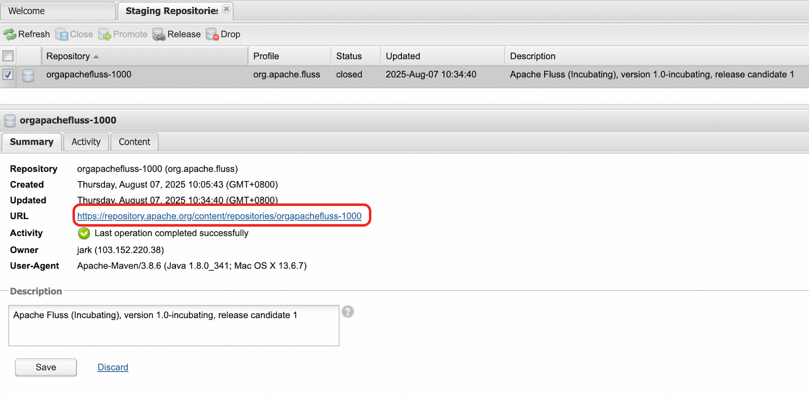

import Tabs from '@theme/Tabs';
import TabItem from '@theme/TabItem';

# Creating a Fluss Release

:::note
This is based on the release guide of the [Apache Flink project](https://cwiki.apache.org/confluence/display/FLINK/Creating+a+Flink+Release).
:::

The Apache Fluss (Incubating) project periodically declares and publishes releases. A release is one or more packages of the project artifact(s) that are approved for general public distribution and use. The Fluss community treats releases with great importance. They are a public face of the project and most users interact with the project only through the releases. Releases are signed off by the entire Fluss community in a public vote.

Each release is executed by a Release Manager, who is selected/proposed by the Fluss PPMC members. This document describes the process that the Release Manager follows to perform a release. Any changes to this process should be discussed and adopted on the dev@ mailing list.

Please remember that publishing software has legal consequences. This guide complements the foundation-wide [Product Release Policy](https://www.apache.org/legal/release-policy.html) and [Release Distribution Policy](https://infra.apache.org/release-distribution.html).

## Overview


The release process consists of several steps:

1. [Decide to release](#decide-to-release)
2. [Prepare for the release](#prepare-for-the-release)
3. [Build a release candidate](#build-a-release-candidate)
4. [Vote on the release candidate](#vote-on-the-release-candidate)
5. [If necessary, fix any issues and go back to step 3](#fix-any-issues)
6. [Finalize the release](#finalize-the-release)
7. [Promote the release](#promote-the-release)

## Decide to release

Deciding to release and selecting a Release Manager is the first step of the release process. This is a consensus-based decision of the entire community.

Anybody can propose a release on the dev@ mailing list, giving a solid argument and nominating a committer as the Release Manager (including themselves). There’s no formal process, no vote requirements, and no timing requirements. Any objections should be resolved by consensus before starting the release.

In general, the community prefers to have a rotating set of 3-5 Release Managers. Keeping a small core set of managers allows enough people to build expertise in this area and improve processes over time, without Release Managers needing to re-learn the processes for each release. That said, if you are a committer interested in serving the community in this way, please reach out to the community on the dev@ mailing list.

**Checklist to proceed to the next step**
- Community agrees to release
- Community selects a Release Manager

## Prepare for the release

### 0. One-time Release Manager setup

Before your first release, you should perform one-time configuration steps. This will set up your security keys for signing the release and access to various release repositories. Please check the **[Release Manager Preparation](release-manager-preparation.md)** guide for details.

To prepare for each release, you should audit the project status in the GitHub issue tracker, and do necessary bookkeeping. Finally, you should create a release branch from which individual release candidates will be built.

### 1. Create a new Milestone in GitHub

When contributors resolve an issue in GitHub, they are tagging it with a release milestone that will contain their changes. With the release currently underway, new issues should be resolved against a subsequent future release. Therefore, you should create a new milestone item for this subsequent release, as follows:

In [GitHub Milestones](https://github.com/apache/fluss/milestones) page, add a new milestone: choose the next minor version number compared to the one currently underway. For example, add `v0.9` milestone if current version is `v0.8`. We only track the major and minor version, so no need to create milestone for bugfix versions, e.g., `v0.9.1`.

(Note: Only PMC members have access to the project administration. If you do not have access, ask on the mailing list or Slack for assistance.)

### 2. Triage release-blocking issues in GitHub

There could be outstanding release-blocking issues, which should be triaged before proceeding to build a release candidate. We track them by assigning a specific Fix version field even before the issue resolved.

The list of release-blocking issues is available at the [issue page](https://github.com/apache/fluss/issues?q=is%3Aissue%20state%3Aopen%20milestone%3Av0.8) (please update the `milestone` condition to the current version name). Triage each unresolved issue with one of the following resolutions:

- If the issue has been resolved and issue was not updated, resolve it accordingly.
- If the issue has not been resolved and it is acceptable to defer this until the next release, update the `Milestone` field to the new version you just created. Please consider discussing this with stakeholders and the dev@ mailing list, as appropriate. Use the "Bulk Change" functionality of GitHub Issue to update a batch of unresolved issues to new milestone version.
- **If the issue has not been resolved and it is not acceptable to release until it is fixed (i.e., blocker issues), the release cannot proceed.** Instead, work with the Fluss community to resolve the issue. Add `priority=blocker` label to such issues.
- Documentation issues for new supported features are treated as **blocker issues**.

### 3. Add Milestone for all resolved issues

Use the [issue filter](https://github.com/apache/fluss/issues?q=is%3Aissue%20state%3Aclosed%20reason%3Acompleted%20no%3Amilestone%20(-label%3Aduplicate%20AND%20-label%3Ainvalid%20AND%20-label%3Aquestion%20AND%20-label%3Awontfix%20AND%20-label%3A%22help%20wanted%22%20)) to list all the closed issues without tagging Milestone during this version.

Then, review each issue and apply labels (`invalid` or `question` or `wontfix` or `help wanted`) to those that were not actually resolved in this version (e.g., closed as non-issues or support requests). For the remaining genuinely resolved issues, use the “Bulk Change” feature to assign them to the current release milestone.

This ensures the milestone accurately reflects all the issues delivered in the release.

### 4. Verify Java and Maven Version

Run `mvn -v` and `java -version` on your local machine. All of the following steps require to use **Maven 3.8.6** and **Java 11**. Modify your `PATH` environment variable accordingly if needed.


### 5. Clone Fluss into a fresh workspace

Clone the Fluss repository into a fresh workspace. This is important to ensure that you are working with a clean state.

```bash
git clone git@github.com:apache/fluss.git
```

### 6. Setup local environment variables

Set up a few environment variables to simplify commands that follow. (We use bash Unix syntax in this guide.)

```bash
RELEASE_VERSION="0.8.0-incubating"
SHORT_RELEASE_VERSION="0.8"
CURRENT_SNAPSHOT_VERSION="$SHORT_RELEASE_VERSION-SNAPSHOT"
NEXT_SNAPSHOT_VERSION="0.9-SNAPSHOT"
SHORT_NEXT_SNAPSHOT_VERSION="0.9"
```

### 7. Create a release branch

<Tabs groupId="release-tabs">
  <TabItem value="major" label="Major release" default>
Create a release branch from the `main` branch in the cloned Fluss repository. This branch will be used to build the release candidate.

```bash
$ git checkout main
$ git checkout -b release-${SHORT_RELEASE_VERSION}
$ git push origin release-${SHORT_RELEASE_VERSION}
```

Update the version in the Helm Chart in:
- `helm/Chart.yaml`
- `helm/values.yaml`
- `helm/README.md`

For example, if you are releasing a major version `0.8.0-incubating`, you should replace all the previous version `0.7.0-incubating` to the release version `0.8.0-incubating`.


And commit/push the version bump:

```bash
$ git commit -m "[helm] Bump helm version to x.y.z" helm/Chart.yaml helm/values.yaml helm/README.md
$ git push origin release-${SHORT_RELEASE_VERSION}
```

  </TabItem>

  <TabItem value="bugfix" label="Bugfix release">
If you're creating a new bugfix release (e.g., 0.9.1 instead of 0.9.0), you do not need to create a release branch. You can skip this step can check out the the already existing branch for that version:

```bash
$ git checkout release-$SHORT_RELEASE_VERSION
```

Update the version in the Helm Chart in:
- `helm/Chart.yaml`
- `helm/values.yaml`
- `helm/README.md`

For example, if you are releasing a bugfix version `0.8.1-incubating`, you should replace all the previous version `0.8.0-incubating` to the new version `0.8.1-incubating`.


And commit/push the version bump:

```bash
$ git commit -m "[helm] Bump helm version to x.y.z" helm/Chart.yaml helm/values.yaml helm/README.md
$ git push origin release-${SHORT_RELEASE_VERSION}
```

  </TabItem>
</Tabs>


### 8. Updates for the main branch

<Tabs groupId="release-tabs">
  <TabItem value="major" label="Major release" default>
**(1) Bump version for the main branch**

After creating the release branch, you should bump the version of the main branch to the next version. This is important to ensure that the next development cycle starts with the correct version.

```bash
$ cd tools
tools $ git checkout main
tools $ OLD_VERSION=$CURRENT_SNAPSHOT_VERSION NEW_VERSION=$NEXT_SNAPSHOT_VERSION releasing/update_branch_version.sh
tools $ git push origin main
```

**(2) Create Upgrade Notes for the next version**

Besides, in the `main` branch, create a new "Upgrade Notes" markdown file for the next version. The file name should be `upgrade-notes-x.y.md` (replace the `x.y` to the next version number, e.g., `0.9`) under path `website/docs/maintenance/operations/` with following initial content.

```
---
title: Upgrade Notes
sidebar_position: 3
---

# Upgrade Notes from v0.x to v0.y
```

Additionally, for the upgrade notes page of the version currently being released (e.g., `upgrade-notes-0.8.md`), add `sidebar_class_name: hidden` front matter to hide it from the sidebar.

Commit the documentation changes, and push to the official repository.

```bash
$ git commit -m "[docs] Create upgrade notes for $NEXT_SHORT_VERSION" .
$ git push origin main
```

**(3) Add version item in fluss-versions.json**

Next, add a new version item for the current release version in the `website/fluss-versions.json` file on the `main` branch. The new version item should have the following fields and values (releasing `0.8.0` as an example):

```json
{
  "versionName": "version-0.8",
  "fullVersion": "0.8.0-incubating",
  "shortVersion": "0.8",
  "dockerVersion": "0.8.0-incubating-rc1",
  "released": false
}
```

Additionally, update the `fullVersion`, `shortVersion`, and `dockerVersion` fields for the `next` version entry to reflect the next release version.

Commit the documentation changes, and push to the official repository.

```bash
$ git commit -m "[docs] Add version item for $RELEASE_VERSION in fluss-versions.json
$ git push origin main
```

**(4) Upgrade Helm Charts version on main branch**

Update the version in the Helm Chart in:
- `helm/Chart.yaml`
- `helm/values.yaml`
- `helm/README.md`

For example, if the next major version is `0.9.0-incubating`, you should replace all the previous version `0.8.0-incubating` to the next release version `0.9.0-incubating`.

And commit/push the version bump:

```bash
$ git commit -m "[helm] Bump helm version to x.y.z" helm/Chart.yaml helm/values.yaml helm/README.md
$ git push origin main
```

  </TabItem>

  <TabItem value="bugfix" label="Bugfix release">
If you're creating a new bugfix release, you can skip this step.
  </TabItem>
</Tabs>

### 9. Pull Requests for Release Blog and Downloads

<Tabs groupId="release-tabs">
  <TabItem value="major" label="Major release" default>

Create a pull request for the release announcement blog for this version, see the [previous release blogs](https://fluss.apache.org/blog/tags/releases/).

We usually include the commit number and the names of all contributors in the announcement blog post. Use the following command to get the commit number and the list of contributors:


```bash
# first line is required to make sort first with uppercase and then lower
export LC_ALL=C
export FLUSS_PREVIOUS_RELEASE_BRANCH={previousReleaseBranch}
export FLUSS_CURRENT_RELEASE_BRANCH={currentReleaseBranch}
# e.g.
# export FLUSS_PREVIOUS_RELEASE_BRANCH=release-0.7
# export FLUSS_CURRENT_RELEASE_BRANCH=release-0.8

# get contributor list
git log $FLUSS_PREVIOUS_RELEASE_BRANCH..$FLUSS_CURRENT_RELEASE_BRANCH --pretty=format:"%an" | sort -u | paste -sd "," - | sed 's/,/, /g'
# get total number of commits
git log $FLUSS_PREVIOUS_RELEASE_BRANCH...$FLUSS_CURRENT_RELEASE_BRANCH --pretty=oneline | wc -l
```

Besides, Create a pull request to add download links for the release on the Download page `website/src/pages/downloads.md`.


  </TabItem>

  <TabItem value="bugfix" label="Bugfix release">
Create a pull request to update the download links on the Downloads page (`website/src/pages/downloads.md`) to point to the newly released bugfix version.
  </TabItem>
</Tabs>

**Don’t merge the PRs before finalizing the release.**


-------------


**Checklist to proceed to the next step**

- Release Manager’s GPG key is published to [dist.apache.org](https://dist.apache.org/repos/dist/release/incubator/fluss/KEYS)
- Release Manager’s GPG key is configured in git configuration
- Release Manager's GPG key is configured as the default gpg key.
- Release Manager has `org.apache.fluss` listed under `Staging Profiles` in [Apache Nexus repository](https://repository.apache.org/).
- Release Manager’s Nexus User Token is configured in `settings.xml`
- There are no release blocking GitHub issues
- Update compatibility table between versions (`website/docs/maintenance/operations/upgrading.md`).
- (major only) Update upgrade notes for the current and next version (`website/docs/maintenance/operations/upgrade-notes-x.y.md`)
- (major only) Release branch (`release-x.y`) has been created and pushed
- (major only) Main branch has been updated to the next version and pushed
- (major only) Pull request for the release announcement blog
- Pull request for updating download links

## Build a release candidate

The core of the release process is the build-vote-fix cycle. Each cycle produces one release candidate. The Release Manager repeats this cycle until the community approves one release candidate, which is then finalized.

### 1. Create RC branch and tag

Set up a few environment variables to simplify Maven commands that follow. This identifies the release candidate being built. Start with `RC_NUM` equal to 1 and increment it for each candidate.

```bash
RC_NUM="1"
TAG="v${RELEASE_VERSION}-rc${RC_NUM}"
```

Now, checkout from the release branch, and create a release candidate local branch:

```bash
$ git checkout release-${SHORT_RELEASE_VERSION}
$ git checkout -b release-${RELEASE_VERSION}-rc${RC_NUM}
$ cd tools
tools $ OLD_VERSION=$CURRENT_SNAPSHOT_VERSION NEW_VERSION=$RELEASE_VERSION releasing/update_branch_version.sh
```

Tag the release commit:

```bash
git tag -s ${TAG} -m "${TAG}"
```

### 2. Create source release files

First, we build the source release:

```bash
tools $ RELEASE_VERSION=$RELEASE_VERSION releasing/create_source_release.sh
```

This command creates a source tarball and signs it under `tools/releasing/release` directory.


### 3. Create binary release files

Then, we create the binary convenience release files:

```bash
tools $ RELEASE_VERSION=$RELEASE_VERSION releasing/create_binary_release.sh
```

This command creates a binary tarball and signs it under `tools/releasing/release` directory.

### 4. Create Helm Chart package

Then, we create the Helm Chart packages:

```bash
tools $ RELEASE_VERSION=$RELEASE_VERSION RELEASE_CANDIDATE=$RC_NUM releasing/create_helm_packages.sh
```

Now, we should already created the source distribution, binary distribution, and Helm Chart packages for the release candidate.
Run the `tree releasing/release/` command under the `tools` directory to verify the created files.

Example output for release version `0.8.0-incubating` and RC number `1`:

```bash
tools $ tree releasing/release
releasing/release
├── fluss-0.8.0-incubating-bin.tgz
├── fluss-0.8.0-incubating-bin.tgz.asc
├── fluss-0.8.0-incubating-bin.tgz.sha512
├── fluss-0.8.0-incubating-src.tgz
├── fluss-0.8.0-incubating-src.tgz.asc
├── fluss-0.8.0-incubating-src.tgz.sha512
└── helm-chart
    ├── 0.8.0-incubating-rc1
    │     ├── fluss-0.8.0-incubating.tgz
    │     ├── fluss-0.8.0-incubating.tgz.asc
    │     ├── fluss-0.8.0-incubating.tgz.prov
    │     ├── fluss-0.8.0-incubating.tgz.prov.asc
    │     ├── fluss-0.8.0-incubating.tgz.prov.sha512
    │     └── fluss-0.8.0-incubating.tgz.sha512
    └── index.yaml

3 directories, 13 files
```


### 5. Stage source & binary & helm releases


Next, copy the source and binary release files to the dev repository of dist.apache.org.

(1) If you have not already, check out the Fluss section of the dev repository on dist.apache.org via Subversion. In a fresh directory (e.g., `tools/target`):

```bash
tools $ mkdir target
tools $ cd target
tools/target $ svn checkout https://dist.apache.org/repos/dist/dev/incubator/fluss --depth=immediates
```

(2) Make a directory for the new release:

```bash
tools/target $ mkdir fluss/fluss-${RELEASE_VERSION}-rc${RC_NUM}
```

(3) Copy fluss source and binary distributions, hashes, and GPG signature:

```bash
tools/target $ mv ../releasing/release/fluss-* fluss/fluss-${RELEASE_VERSION}-rc${RC_NUM}
```

(4) Make a directory for the new helm packages:

```bash
tools/target $ mkdir -p fluss/helm-chart
```

(5) Copy fluss helm packages, hashes, and GPG signature:

```bash
tools/target $ mv ../releasing/release/helm-chart/* fluss/helm-chart
```

(6) Add and commit all the files.

```bash
tools/target $ cd fluss
tools/target/fluss $ svn add fluss-${RELEASE_VERSION}-rc${RC_NUM}
tools/target/fluss $ svn add helm-chart
tools/target/fluss $ svn commit -m "Add fluss-${RELEASE_VERSION}-rc${RC_NUM}"
```

(7) Verify the files are present: https://dist.apache.org/repos/dist/dev/incubator/fluss/


### 6. Stage maven artifacts


Next, we stage the maven artifacts:

```bash
tools $ releasing/deploy_staging_jars.sh
```

Review all staged artifacts in the staging repositories(https://repository.apache.org/#stagingRepositories). They should contain all relevant parts for each module, including pom.xml, jar, test jar, source, test source, javadoc, etc. Carefully review any new artifacts.

Close the staging repository on Apache Nexus. When prompted for a description, enter `Apache Fluss (Incubating), version X, release candidate Y`. You can find the staging repository URL (`https://repository.apache.org/content/repositories/orgapachefluss-[STAGING_ID]/`) once the staging repository is closed successfully.



### 7. Stage Docker images

:::note
Make sure that you are authenticated with your Docker ID, and that your Docker ID has access to `apache/fluss`: `docker login -u <username>`. If you do not have access, you should seek help via the dev mailing list.

If you can't login Docker ID in your region because of network issues, you can find a cloud machine that can access Docker Hub, and perform the following steps there.
:::

Next, we need to build and push Docker images for the release candidates. This will enable users to easily test the new functionality using the Quickstart guide in the [Fluss documentation](https://fluss.apache.org/docs/quickstart/flink/) improving accessibility and feedback during the release validation phase.

From the root directory of the source code, run the following commands to build and push the fluss Docker image.

```bash
$ rm -rf docker/fluss/build-target/
$ mkdir docker/fluss/build-target/
$ cp -r build-target/* docker/fluss/build-target

$ cd docker/fluss
docker/fluss $ docker buildx build --push --platform linux/arm64/v8,linux/amd64 --tag apache/fluss:${RELEASE_VERSION}-rc${RC_NUM} .
```

Then, run the following commands to build and push the flink — a customized Apache Flink image that includes all necessary libraries and JARs for the Fluss Quickstart guide:

```bash
docker/fluss $ cd ../quickstart-flink
docker/quickstart-flink $ ./prepare_build.sh
docker/quickstart-flink $ docker buildx build --push --platform linux/arm64/v8,linux/amd64 --tag apache/fluss-quickstart-flink:1.20-${RELEASE_VERSION}-rc${RC_NUM} .
```

Verify the RC images are present:
- https://hub.docker.com/r/apache/fluss/tags
- https://hub.docker.com/r/apache/fluss-quickstart-flink/tags

Then, update the `dockerVersion` field for the current release RC version in the `website/fluss-versions.json` file on the `main` branch to the value of `${RELEASE_VERSION}_RC${RC_NUM}` (which includes the RC suffix, e.g., `0.8.0-incubating-rc1`). This update should be committed and pushed to the `main` branch.

This ensures that the **Quickstart guide** in the documentation references the correct Docker image for the release candidate. This will help developers to easily test the new release candidate using the Quickstart guide.

### 8. Push the RC tag

```bash
git push origin $TAG
```

-------------

**Checklist to proceed to the next step**

- Source & binary & helm-chart distribution deployed to the dev repository of [dist.apache.org](https://dist.apache.org/repos/dist/dev/incubator/fluss/)
- Maven artifacts deployed to the staging repository of [repository.apache.org](https://repository.apache.org/content/repositories/)
- RC Docker images pushed to [DockerHub](https://hub.docker.com/r/apache/fluss/tags)
- RC tag pushed to the [official repository](https://github.com/apache/fluss/tags)
- Updated `dockerVersion` in `fluss-versions.json` on `main` branch


## Vote on the release candidate

Once you have built and individually reviewed the release candidate, please share it for the community-wide review. Please review foundation-wide [voting guidelines](https://www.apache.org/foundation/voting.html) for more information.

Fluss is an incubating project, so the release requires a [two-phase vote](https://incubator.apache.org/cookbook/#two_phase_vote_on_podling_releases), first by the Fluss community, and then by the Incubator PMC.

### Fluss Community Vote

Start the review-and-vote thread on the dev@ mailing list. Here’s an email template; please adjust as you see fit.

```
From: Release Manager
To: dev@fluss.apache.org
Subject: [VOTE] Release Fluss 0.8.0-incubating (RC1)

Hi everyone,

Please review and vote on the release candidate #1 for the Apache Fluss version 0.8.0-incubating, as follows:
[ ] +1, Approve the release
[ ] -1, Do not approve the release (please provide specific comments)


The complete staging area is available for your review, includes:

The official source release and binary convenience releases to be deployed to:
* https://dist.apache.org/repos/dist/dev/incubator/fluss/x.y.z

Helm charts are available on:
* https://dist.apache.org/repos/dist/dev/incubator/fluss/helm-chart
(NB: you have to build the Docker images locally with the version 0.8.0-incubating in order to test Helm charts)

All the files are signed with the key with fingerprint FFFFFFFF, you can find the KEYS file here:
* https://dist.apache.org/repos/dist/release/incubator/fluss/KEYS

All artifacts to be deployed to the Maven Central Repository:
* https://repository.apache.org/content/repositories/orgapachefluss-<ID>/

Git tag for the release:
* https://github.com/apache/fluss/releases/tag/v0.8.0-incubating-rc1

Git commit for the release:
* https://github.com/apache/fluss/commit/<COMMIT>

Website pull request for the release announcement blog post
* https://github.com/apache/fluss/pull/<ID>

Website pull request for listing the new release on the download page
* https://github.com/apache/fluss/pull/<ID>

Upgrade note for the new release: 
* https://github.com/apache/fluss/blob/release-0.8/website/docs/maintenance/operations/upgrade-notes-0.8.md

Docker images for the release candidate:
* fluss
* quickstart

Please download, verify and test. To learn more about how to verify: 
https://fluss.apache.org/community/how-to-release/verifying-a-fluss-release/


The vote will be open for at least 72 hours. It is adopted by majority approval, with at least 3 PPMC affirmative votes.

Thanks,
Release Manager
```

**If there are any issues found in the release candidate**, reply on the vote thread to cancel the vote. There’s no need to wait 72 hours. Proceed to the [Fix Issues](#fix-any-issues) step below and address the problem. However, some issues don’t require cancellation. For example, if an issue is found in the website pull request, just correct it on the spot and the vote can continue as-is.

For cancelling a release, the release manager needs to send an email to the release candidate thread, stating that the release candidate is officially cancelled. Next, all artifacts created specifically for the RC in the previous steps need to be removed:

- Delete the staging repository in Nexus
- Remove the source / binary RC files from dist.apache.org

**If there are no issues**, reply on the vote thread to close the voting. Then, tally the votes in a separate email. Here’s an email template; please adjust as you see fit.

```
From: Release Manager
To: dev@fluss.apache.org
Subject: [RESULT][VOTE] Release Fluss 0.8.0-incubating (RC1)

I'm happy to announce that we have unanimously approved this release.

There are XXX approving votes, XXX of which are binding:
* approver 1
* approver 2
* approver 3
* approver 4

There are no disapproving votes.

Thanks everyone!

A new vote is starting in the Apache Incubator general mailing list.
```

### Incubator PMC Vote

Once the Fluss community has approved the release candidate, the release manager should start a vote on the general@incubator.apache.org mailing list to get the approval from the Incubator PMC. Here’s an email template; please adjust as you see fit.

```
From: Release Manager
To: general@incubator.apache.org
Subject: [VOTE] Release Apache Fluss 0.8.0-incubating (RC1)

Hi everyone,

The Apache Fluss community has voted and approved the release of
Apache Fluss 0.8.0-incubating (RC1). We now kindly request the IPMC
members to review and vote for this release.

Apache Fluss (Incubating) - A streaming storage built for real-time analytics which can serve as the real-time data layer for Lakehouse architectures.

Fluss community vote thread:
* https://lists.apache.org/thread/<VOTE THREAD>

Vote result thread:
* https://lists.apache.org/thread/<VOTE RESULT>

The release candidate:
* https://dist.apache.org/repos/dist/dev/incubator/fluss/fluss-0.8.0-incubating-rc1/

The helm chart release package:
* https://dist.apache.org/repos/dist/dev/incubator/fluss/helm-chart/0.8.0-incubating-rc1/

Git tag for the release:
* https://github.com/apache/fluss/releases/tag/v0.8.0-incubating-rc1

Git commit for the release:
* https://github.com/apache/fluss/commit/<COMMIT>

Maven staging repository:
* https://repository.apache.org/content/repositories/orgapachefluss-<ID>/

The artifacts signed with PGP key [FFFFFFFF], corresponding to
[jark@apache.org], that can be found in keys file:
https://downloads.apache.org/incubator/fluss/KEYS

Please download, verify and test.

Please vote in the next 72 hours.

[ ] +1 approve
[ ] +0 no opinion
[ ] -1 disapprove with the reason

To learn more about Apache Fluss, please see https://fluss.apache.org/

Checklist for reference:

[ ] Download links are valid.
[ ] Checksums and signatures.
[ ] LICENSE/NOTICE files exist
[ ] No unexpected binary files
[ ] All source files have ASF headers
[ ] Can compile from source

Thanks!

Regards,
Release Manager
```

Binding votes are the votes from the IPMC members. Similar to the previous vote, send the result on the Incubator general mailing list:

```
From: Release Manager
To: general@incubator.apache.org
Subject: [RESULT][VOTE] Release Apache Fluss 0.8.0-incubating (RC1)

I'm happy to announce that we have unanimously approved this release.

There are XXX approving votes, XXX of which are binding:
* approver 1
* approver 2
* approver 3
* approver 4

There are no disapproving votes.

Thanks everyone!
```

-------------

**Checklist to proceed to the finalization step**
- Community votes to release the proposed candidate, with at least three approving PPMC votes
- Incubator votes to release the proposed candidate, with at least three approving IPMC votes


## Fix any issues

Any issues identified during the community review and vote should be fixed in this step.

Code changes should be proposed as standard pull requests to the `main` branch and reviewed using the normal contributing process. Then, relevant changes should be **cherry-picked into the release branch**. The cherry-pick commits should then be proposed as the pull requests against the release branch, again reviewed and merged using the normal contributing process.

Once all issues have been resolved, you should go back and build a new release candidate with these changes.

Before build a new release candidate, remove the old release candidates from https://dist.apache.org/repos/dist/dev/incubator/fluss using Subversion.

```bash
svn checkout https://dist.apache.org/repos/dist/dev/incubator/fluss --depth=immediates
cd fluss
svn remove fluss-${RELEASE_VERSION}-rc*
svn remove helm-chart
svn commit -m "Remove old release candidates for Apache Fluss ${RELEASE_VERSION}"
```

**Checklist to proceed to the next step**
- Issues identified during vote have been resolved, with fixes committed to the release branch.

## Finalize the release

Once the release candidate has been reviewed and approved by the community, the release should be finalized. This involves the final deployment of the release candidate to the release repositories, merging of the website changes, etc.

### 1. Deploy artifacts to Maven Central Repository

Use the [Apache Nexus](https://repository.apache.org/) repository to release the staged binary artifacts to the Maven Central repository. In the `Staging Repositories` section, find the relevant release candidate `orgapachefluss-XXX` entry and click `Release`. Drop all other release candidates that are not being released.

### 2. Deploy source & binary & helm releases

Copy the source and binary releases from the dev repository to the release repository at dist.apache.org using Subversion.

```bash
svn move -m "Release Apache Fluss ${RELEASE_VERSION}" https://dist.apache.org/repos/dist/dev/incubator/fluss/fluss-${RELEASE_VERSION}-rc${RC_NUM} https://dist.apache.org/repos/dist/release/incubator/fluss/fluss-${RELEASE_VERSION}
svn move -m "Release Apache Fluss Helm Chart ${RELEASE_VERSION}" https://dist.apache.org/repos/dist/dev/incubator/fluss/helm-chart/${RELEASE_VERSION}-rc${RC_NUM} https://dist.apache.org/repos/dist/release/incubator/fluss/helm-chart/${RELEASE_VERSION}
```
(Note: Only PPMC members have access to the release repository. If you do not have access, ask on the mailing list for assistance.)

Then, update the Helm Chart repository index on https://dist.apache.org/repos/dist/release/incubator/fluss/helm-chart/index.yaml:

```bash
svn checkout https://dist.apache.org/repos/dist/release/incubator/fluss/helm-chart fluss-dist-release-helm-chart
cd fluss-dist-release-helm-chart
helm repo index .
svn add index.yaml
svn commit -m "Update Helm index for Apache Fluss ${RELEASE_VERSION} release"
````

### 3. Remove old release candidates from dist.apache.org

Remove the old release candidates from https://dist.apache.org/repos/dist/dev/incubator/fluss using Subversion.

```bash
svn checkout https://dist.apache.org/repos/dist/dev/incubator/fluss --depth=immediates
cd fluss
svn remove fluss-${RELEASE_VERSION}-rc*
svn remove helm-chart
svn commit -m "Remove old release candidates for Apache Fluss ${RELEASE_VERSION}"
```

### 4. Git tag

Create and push a new Git tag for the released version by copying the tag for the final release candidate, as follows:

```bash
git tag -s "v${RELEASE_VERSION}" refs/tags/${TAG}^{} -m "Release Fluss ${RELEASE_VERSION}"
git push origin refs/tags/v${RELEASE_VERSION}
```

### 5. Publish Docker Images

:::note
Make sure that you are authenticated with your Docker ID, and that your Docker ID has access to `apache/fluss`: `docker login -u <username>`. If you do not have access, you should seek help via the dev mailing list.
:::

```bash
docker buildx imagetools create apache/fluss:${RELEASE_VERSION}-rc${RC_NUM} --tag apache/fluss:${RELEASE_VERSION}

docker buildx imagetools create apache/fluss-quickstart-flink:1.20-${RELEASE_VERSION}-rc${RC_NUM} --tag apache/fluss-quickstart-flink:1.20-${RELEASE_VERSION}
```

### 6. Update `fluss-versions.json`

Update the `released` field to `true` and `dockerVersion` to `$RELEASE_VERSION` (without the RC number) for the current release version in the `website/fluss-versions.json` file on the `main` branch. This update should be committed and pushed to the `main` branch.
This will refresh the documentation website to reflect that the new version has been officially released.

```json
{
  "versionName": "version-0.8",
  "fullVersion": "0.8.0-incubating",
  "shortVersion": "0.8",
  "dockerVersion": "0.8.0-incubating-rc1", // ==> "0.8.0-incubating"
  "released": false // ==> true
}
```

### 7. Mark the Milestone as released in GitHub

In [GitHub Milestones](https://github.com/apache/fluss/milestones), mark the current release milestone as close.

(Note: Only PMC members have access to the project administration. If you do not have access, ask on the mailing list for assistance.)


------------

**Checklist to proceed to the next step**
- Maven artifacts released and indexed in the Maven Central Repository (usually takes about a day to show up)
- Source & binary distributions available in the release repository of https://dist.apache.org/repos/dist/release/incubator/fluss/
- Helm Chart package available in the release repository of https://dist.apache.org/repos/dist/release/incubator/fluss/helm-chart/
- Dev repository https://dist.apache.org/repos/dist/dev/incubator/fluss/ is empty
- Release tagged in the source code repository
- Docker images for the release pushed to [DockerHub](https://hub.docker.com/r/apache/fluss/tags)
- Milestone marked as released in GitHub

## Promote the release

### Merge website pull request

Merge the website pull requests for the release blog and download page that were created in the [Prepare for the release](#9-pull-requests-for-release-blog-and-downloads) step.

### Apache mailing lists

Once the release has been finalized, the last step of the process is to promote the release within the project and beyond. Please wait for 24h after finalizing the release in accordance with the [ASF release policy](https://www.apache.org/legal/release-policy.html#release-announcements).

Announce on the dev@ mailing list that the release has been finished.

Announce on the release on the user@ mailing list, listing major improvements and contributions.

Announce the release on the announce@apache.org mailing list.

```
From: Release Manager
To: dev@fluss.apache.org, user@fluss.apache.org, announce@apache.org
Subject: [ANNOUNCE] Apache Fluss 0.8.0-incubating released

The Apache Fluss community is very happy to announce the release of Apache Fluss 0.8.0-incubating.

Apache Fluss is a streaming storage built for real-time analytics which can serve as the real-time data layer for Lakehouse architectures.

The release is available for download at:
https://downloads.apache.org/incubator/fluss/fluss-0.8.0-incubating/

Maven artifacts for Fluss can be found at:

https://central.sonatype.com/search?q=g%3Aorg.apache.fluss&smo=true

Please check out the release blog post for an overview of this release:
https://fluss.apache.org/blog/releases/0.8/

We would like to thank all contributors of the Apache Fluss community who made this release possible!

Feel free to reach out to the release managers (or respond to this thread) with feedback on the release process. Our goal is to constantly improve the release process. Feedback on what could be improved or things that didn't go so well are appreciated.

Regards,
Release Manager
```

### Recordkeeping

Use [reporter.apache.org](https://reporter.apache.org/addrelease.html?fluss) to seed the information about the release into future project reports.

(Note: Only PMC members have access report releases. If you do not have access, ask on the mailing list for assistance.)

-------------------------

***Checklist to declare the process completed***
- Release announced on the dev@ and user@ mailing list.
- Release recorded in reporter.apache.org.
- Completion declared on the dev@ mailing list.
- Release blog post published.
- Download page updated.

## Improve the process

It is important that we improve the release processes over time. Once you’ve finished the release, please take a step back and look what areas of this process and be improved. Perhaps some part of the process can be simplified. Perhaps parts of this guide can be clarified.

If we have specific ideas, please start a discussion on the dev@ mailing list and/or propose a pull request to update this guide. Thanks!