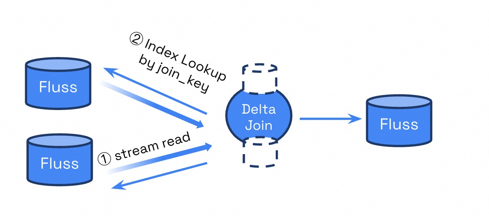

# The Delta Join
Beginning with **Apache Flink 2.1**, a new operator called [Delta Join](https://cwiki.apache.org/confluence/display/FLINK/FLIP-486%3A+Introduce+A+New+DeltaJoin) was introduced.
Compared to traditional streaming joins, the delta join operator significantly reduces the amount of state that needs to be maintained during execution. This improvement helps mitigate several common issues associated with large state sizes, including:

- Excessive computing resource and storage consumption
- Long checkpointing durations
- Extended recovery times after failures or restarts
- Heavy state bootstrap overhead after changing job logic

Starting with **Apache Fluss 0.8**, streaming join jobs running on **Flink 2.1 or later** will be automatically optimized into **delta joins** whenever applicable. This optimization happens transparently at query planning time, requiring no manual configuration.

## How Delta Join Works

Traditional streaming joins in Flink require maintaining both input sides entirely in state to match records across streams. Delta join, by contrast, uses a **index-key lookup mechanism** to transform the behavior of querying data from the state into querying data from the Fluss source table, thereby avoiding redundant storage of the same data in both the Fluss source table and the state. This drastically reduces state size and improves performance for many streaming analytics and enrichment workloads.



## Example: Delta Join in Flink 2.1

Below is an example demonstrating a delta join query supported by Flink 2.1.

#### Create Source and Sink Tables

```sql title="Flink SQL"
USE CATALOG fluss_catalog;
```

```sql title="Flink SQL"
CREATE DATABASE my_db;
```

```sql title="Flink SQL"
USE my_db;
```

#### Create Left Source Table
```sql title="Flink SQL"
CREATE TABLE `fluss_catalog`.`my_db`.`left_src` (
  `city_id` INT NOT NULL,
  `order_id` INT NOT NULL,
  `content` VARCHAR NOT NULL,
  PRIMARY KEY (city_id, order_id) NOT ENFORCED
) WITH (
    -- prefix key
    'bucket.key' = 'city_id',
    -- in Flink 2.1, delta join only support append-only source
    'table.merge-engine' = 'first_row'
);
```

#### Create Right Source Table
```sql title="Flink SQL"
CREATE TABLE `fluss_catalog`.`my_db`.`right_src` (
  `city_id` INT NOT NULL,
  `city_name` VARCHAR NOT NULL,
  PRIMARY KEY (city_id) NOT ENFORCED
) WITH (
    -- in Flink 2.1, delta join only support append-only source
    'table.merge-engine' = 'first_row'
);
```

#### Create Sink Table
```sql title="Flink SQL"
CREATE TABLE `fluss_catalog`.`my_db`.`snk` (
    `city_id` INT NOT NULL,
    `order_id` INT NOT NULL,
    `content` VARCHAR NOT NULL,
    `city_name` VARCHAR NOT NULL,
    PRIMARY KEY (city_id, order_id) NOT ENFORCED
);
```

#### Explain the Join Query
```sql title="Flink SQL"
EXPLAIN 
INSERT INTO `fluss_catalog`.`my_db`.`snk`
SELECT T1.`city_id`, T1.`order_id`, T1.`content`, T2.`city_name` 
FROM `fluss_catalog`.`my_db`.`left_src` T1
Join `fluss_catalog`.`my_db`.`right_src` T2
ON T1.`city_id` = T2.`city_id`;
```

If the printed plan includes `DeltaJoin` as shown below, it indicates that the optimizer has successfully transformed the traditional streaming join into a delta join.

```title="Flink Plan"
== Abstract Syntax Tree ==
LogicalSink(table=[fluss_catalog.my_db.snk], fields=[city_id, order_id, content, city_name])
+- LogicalProject(city_id=[$0], order_id=[$1], content=[$2], city_name=[$4])
   +- LogicalJoin(condition=[=($0, $3)], joinType=[inner])
      :- LogicalTableScan(table=[[fluss_catalog, my_db, left_src]])
      +- LogicalTableScan(table=[[fluss_catalog, my_db, right_src]])

== Optimized Physical Plan ==
Sink(table=[fluss_catalog.my_db.snk], fields=[city_id, order_id, content, city_name])
+- Calc(select=[city_id, order_id, content, city_name])
   +- DeltaJoin(joinType=[InnerJoin], where=[=(city_id, city_id0)], select=[city_id, order_id, content, city_id0, city_name])
      :- Exchange(distribution=[hash[city_id]])
      :  +- TableSourceScan(table=[[fluss_catalog, my_db, left_src]], fields=[city_id, order_id, content])
      +- Exchange(distribution=[hash[city_id]])
         +- TableSourceScan(table=[[fluss_catalog, my_db, right_src]], fields=[city_id, city_name])

== Optimized Execution Plan ==
Sink(table=[fluss_catalog.my_db.snk], fields=[city_id, order_id, content, city_name])
+- Calc(select=[city_id, order_id, content, city_name])
   +- DeltaJoin(joinType=[InnerJoin], where=[(city_id = city_id0)], select=[city_id, order_id, content, city_id0, city_name])
      :- Exchange(distribution=[hash[city_id]])
      :  +- TableSourceScan(table=[[fluss_catalog, my_db, left_src]], fields=[city_id, order_id, content])
      +- Exchange(distribution=[hash[city_id]])
         +- TableSourceScan(table=[[fluss_catalog, my_db, right_src]], fields=[city_id, city_name])
```

## Understanding Index Keys

Delta Join relies on performing lookups by the join key (e.g., the `city_id` in the above example) on the Fluss source tables. This requires that the Fluss source tables are defined with appropriate index on the join key to enable efficient lookups.

Currently, Fluss only supports to defines a single index key per table, which is also referred to as the **prefix key**. The general secondary index which allows define multiple indexes with arbitrary fields is planned to be supported in the near future releases.

A prefix key defines the portion of a table’s primary key that can be used for efficient key-based lookups or index pruning.

In Fluss, the option `'bucket.key' = 'city_id'` specifies that data is organized (or bucketed) by `city_id`. When performing a delta join, this allows Flink to quickly locate and read only the subset of records corresponding to the specific prefix key value, rather than scanning or caching the entire table state.

For example:
- Full primary key: `(city_id, order_id)`
- Bucket key: `city_id`

This yields an **index** on the prefix key `city_id`, so that you can perform [Prefix Key Lookup](/engine-flink/lookups.md#prefix-lookup) by the `city_id`.

In this setup:
* The delta join operator uses the prefix key (`city_id`) to retrieve only relevant right-side records matching each left-side event. 
* This eliminates the need to hold all records for every city in Flink state, significantly reducing state size.

Prefix keys thus form the foundation for efficient lookups in delta joins, enabling Flink to scale join workloads efficiently even under high throughput.

## Flink Version Support

The delta join feature is introduced since Flink 2.1 and still evolving, and its optimization capabilities vary across Flink versions.

Refer to the [Delta Join Issue](https://issues.apache.org/jira/browse/FLINK-37836) for the most up-to-date information.

:::warning
There is a known issue ([FLINK-38399](https://issues.apache.org/jira/browse/FLINK-38399)) in Flink ≤ 2.1.1 that prevents certain queries from being translated into delta joins. This has been fixed in Flink 2.1.2 and Flink 2.2.
:::

### Flink 2.1

#### Supported Features

- Support for optimizing a dual-stream join in the straightforward pattern of `insert only source -> join -> upsert sink` into a delta join.

#### Limitations

- The primary key or the prefix key of the tables must be included as part of the equivalence conditions in the join.
- The join must be a INNER join.
- The downstream node of the join must support idempotent updates, typically it's an upsert sink and should not have a `SinkUpsertMaterializer` node before it.
  - Flink planner automatically inserts a `SinkUpsertMaterializer` when the sink’s primary key does not fully cover the upstream update key.
  - You can learn more details about `SinkUpsertMaterializer` by reading this [blog](https://www.ververica.com/blog/flink-sql-secrets-mastering-the-art-of-changelog-events).
- All join inputs should be INSERT-ONLY streams.
  - This is why the option `'table.merge-engine' = 'first_row'` is added to the source table DDL.
- All upstream nodes of the join should be `TableSourceScan` or `Exchange`.

### Flink 2.2

#### Supported Features

- Support for optimizing a dual-stream join from CDC sources that do not include delete messages into a delta join.
  - Disable delete on the source table to guarantee there is no delete message in the table, by adding the option `'table.delete.behavior' = 'IGNORE'` or `'DISABLE'` on the table.
  - The source table is no more required to be a `first_row` merge engine table since this version.
- Support `Project` and `Filter` between source and delta join.
- Support cache in delta join.

#### Limitations

- The primary key or the prefix key of the tables must be included as part of the equivalence conditions in the join.
- The join must be a INNER join.
- The downstream node of the join must support idempotent updates, typically it's an upsert sink and should not have a `SinkUpsertMaterializer` node before it.
  - Flink planner automatically inserts a `SinkUpsertMaterializer` when the sink’s primary key does not fully cover the upstream update key.
  - You can learn more details about `SinkUpsertMaterializer` by reading this [blog](https://www.ververica.com/blog/flink-sql-secrets-mastering-the-art-of-changelog-events).
- Since delta join does not support to handle update-before messages, it is necessary to ensure that the entire pipeline can safely discard update-before messages. That means when consuming a CDC stream:
  - The join key used in the delta join must be part of the primary key.
  - The sink's primary key must be the same as the upstream update key.
  - All filters must be applied on the upsert key.
- Neither filters nor projections should contain non-deterministic functions.

## Future Plan

The Fluss and Flink community are actively working together on enhancing delta join. Planned improvements include:
- Support for additional join types, such as LEFT JOIN and FULL OUTER JOIN.
- Support for multi-way joins involving more than two streams. This also requires Fluss to support defining multiple secondary index keys on a single table.
- Support for more complex query patterns to optimize a wider range of join scenarios.